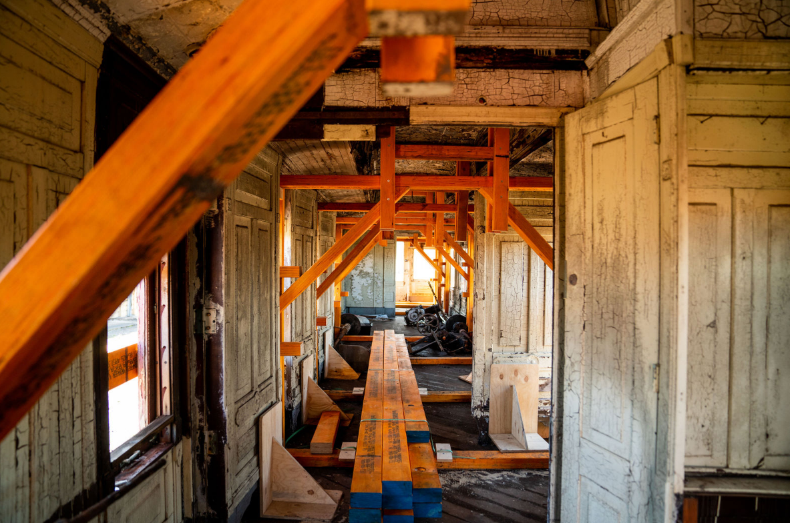

**Blueridge Woodworks have been engaged by THNSW to stabilise 1880s timber car BAM1, in preparation for its relocation from Broadmeadow to the Chullora Heritage Hub later this year.**

**Stabilisation took the form of a series of frames that were jacked into place to support the clerestory roof and extended out through the windows, acting as screw points for longitudinal bracing on the exterior of the car.**

Beginning life as sleeping car No. 8 and named *Lady Parkes*, BAM 1 is today the more original of the two Davis Palace Sleeping Cars purchased by the NSW Railways.

This stabilisation work is the first step in preserving the car, with a view to long-term reconstruction to display condition.

