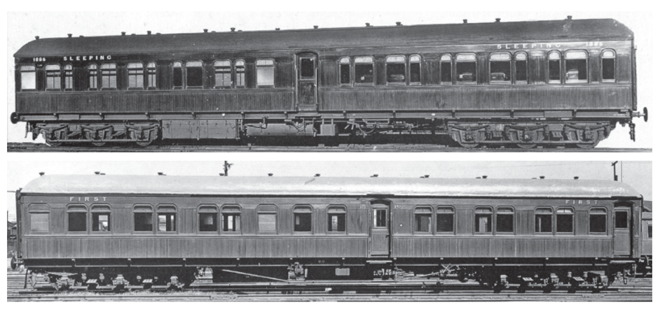

**Sleeping carriage MAM 907 has been faithfully restored by THNSW volunteers at the NSW Rail Museum.**

**MAM 907 Service History**

**During 1911, the NSW Government Railways realised that in order to meet growing traffic demand, new carriages would be required. Various proposals were evaluated until a design was established that would become the standard for the next 25 years. This design came to be known as the 72'6" cars.**

The design was developed by Chief Mechanical Engineer E.E. Lucy and the new carriages were coded TAM for the sleeper, CAM for the composite sleeper, TBC for the first-class sitting car, and TFX for the second-class sitting car. Of these, the TAM would be the only car that was produced in any numbers with 51 being placed in service over a period of 24 years.

Two TAM sleepers were placed in service in 1913 on each of the Melbourne Limited Express trains. The three Brisbane Limited Express trains each included one sleeping carriage and they entered service in September 1914. In 1923, another three TAM sleepers were built at Eveleigh to enable up to four sleeping cars for the Melbourne Limited Express. In 1926-27, Eveleigh built a further twelve, allowing two to be placed on the Brisbane Limited Express, one on the Brisbane Mail and one on the Melbourne Limited Express. Sleeping Car TAM 907 formed part of this order and entered service in April 1927. Between 1927 and 1937, a TAM, generally attached to the Melbourne Limited Express between Albury and Goulburn, was provided for politicians and public servants travelling to Canberra.

In 1942, TAM 907 and TBC 555, while in service on the No.1 Melbourne Limited Express, were burnt out in a fire near Kubura, between The Rock and Yerong Creek. A shop order was issued in August 1942 for the construction of two MAM sleeping car bodies on these under frames. These cars were rebuilt as MAM in 1943 and returned to service as sleepers on the Melbourne Limited Express, marshalled on either side of the KAM composite lounge and sleeping car. The MAM differed from the standard TAM sleeping car, as the lower berths were fixed in the sleeping position. There was no provision for the lower berths to be used as daylight seating and the sleeping compartments had only one window each, compared to two in the TAM.

*TAM 1886 was one of the original TAM Sleeping cars (top) and TBC 575 (bottom). Both the cars damaged in the accident would have been in a similar condition as shown. NSW Railway Archives*

When the Southern Aurora took over this service in 1962, the MAM cars were transferred to the Nos 3/4 Brisbane Limited Express, but were generally removed from the trains at Casino as the fixed lower berths made them unsuitable for daylight travel. In 1972, they were displaced by the MAL sleepers and afterwards saw little service. Carriage MAM 907 was condemned in August 1978. It was transferred to the then NSW Rail Transport Museum in 1981 for use as volunteer sleeping accommodation and later, preservation. The carriage was not cared for very well during this period which ultimately added to the amount of work needed during the restoration.

**The restoration**

Work commenced on MAM 907 in mid-2010 while the carriage was still located in the general exhibit area of the Great Train Hall. This team was led by Geoff Allerton with team members John Fisher, Paul Morcom, Larry Mackison, and Ken McRoire. John and Geoff continued with the main team after the carriage was relocated to the restoration area.

This team commenced by exposing all of the exterior body panel wood screws, as these had rusted over the years with many requiring replacement. These screw heads were treated before the holes filled and sanded back. A number of sections of the letterboards had rotten sections. The damage was either cut out and new timber sections inserted, or the rot was removed with body filler applied to the remaining hole, sanded over and undercoated.

All of the carriage windows were removed, repaired and repainted. There were a number of windows with broken glass, wood rot and broken latch fittings.

The two toilet compartments and the guard’s compartment were refurbished and repainted. The corridor and vestibule ceilings were repainted. The access door to compartment 11/12 was damaged with the wooden louvre panel in the lower section of the door being kicked in. A new replacement panel was manufactured using matching timbers found in Dick’s Shed store. The replacement was fitted to the door and matched with the remaining panels perfectly.

Following the successful completion of the Arnott’s biscuit van ABV 7604 restoration, the opportunity was taken to relocate MAM 907 and RBX 647 from Road 4 to the southern end of Road 5. These spaces were set up as work areas allowing the restoration of these two carriages to continue.

The restoration team from the ABV project transferred to working on the MAM project where they continued with the external repairs to the body and letterboards.

Further inspection revealed that apart from some minor deterioration on the roof covering near the ends, the roof was generally in very good condition. After repairs were made, the roof was coated with the Ormanoid aluminised bituminous paint.

Once the body repairs were completed, the body was sanded and undercoated. This was the start of painting problems. The team’s preference was to paint the carriage using traditional oil based paints applied by hand brushing. Unfortunately, the suppliers of the traditional paints had altered the composition of the paints to speed up the drying time of the oil-based enamels to match the quick drying propertied of the water based acrylic paints. This meant that the paint was drying almost as soon as it left the brush. The result was that brush marks could not be painted out and missed spots could not be touched up. The painted surfaces were sanded back a number of times, but the end result was still the same. The decision was then taken to spray the paint. A search was then made for a suitable spray paint to apply to the carriage. The Museum’s colour specialist Garry Saunders (author of the recently released book *New South Wales Railways in Colour 1855―1957*), recommended the use of a specialist marine premium paint manufactured by Norglass. The use of this paint has proved to be very satisfactory.

While exterior works continued, Rod Hawkes joined the team and elected to refurbish the first four sleeping compartments. Because the team was not familiar with the traditional methods of varnishing the timber work with shellac, we had to devise ways of achieving the desired result. All of the compartments had many coats of shellac applied over the years of service. This finish had degraded and was almost black with age, covering the natural finish of the timber underneath. The use by volunteers for accommodation over a number of years had damaged the varnished surfaces by the use of stickers or electric blankets. It was first thought that the old varnish could be removed by dry scraping, but this was very laborious and time consuming. Rod then tried ironing strips of newspaper to the varnish surface and pulling the paper off before it solidified again. This was partially successful but left a large amount of residue that had to be cleaned up before work could continue. This required the use of steel wool and methylated spirits to remove and smooth out the residue to form a suitable surface for re-varnishing. Rod managed to complete the first four compartments using these methods. He also refurbished the timber panels along the corridors.

While the external restoration was underway, the underframe and bogie side frames and fittings were all subjected to the removal of dirt, grease and rust, and were given a coat of black metal shield paint. Towards the completion of the project, it was necessary to apply a second coat of black enamel to the underframe and end headstocks.

By this time, the external surfaces of the body had been prepared for spraying, so the team moved indoors to work on the remaining compartments. The first compartment worked on by this team was 11/12 and the work methods used were what was used in the first four compartment restorations. When work moved to compartment 9/10, the prospect of hand scraping and ironing newspaper for the varnish removal was looking very daunting. Peter Dudgeon then came up with the idea of using a heat gun to soften the varnish before removing it with a hand scraper. This proved to be very efficient and successful and actually reduced the time spent on each compartment by at least 6 weeks. The final compartment 1/2, was left unrestored to illustrate the pre-restored condition of the carriage interior.

To commence work on a compartment, the upper bunk, wardrobe and compartment doors, water bottle compartment door, bunk drop down tables, compartment table and seat, mirror, lower reading light and all metal hinges and fittings were removed for external restoration. The drop-down wash basin was left in position as it was too difficult to remove these without causing great problems. This left the compartment clear for the varnish removal and restoration. The wardrobe interior and luggage space above the corridor were repainted as part of the refurbishment.

The carriage window shutters and external doors were all removed for restoration.

The final re-assembly of the carriage saw the fitting of all external components following their individual restorations. These included the carriage handrails and carriage lamp brackets on each of the carriage ends. After the roof was cleaned of dust, it was found that the painted surface had discoloured so the roof was given a final coat of Silver Metalshield paint.

The carriage has since been completed with a gloss clear coat to the exterior timber panels and ready to be relocated for display and a dedication ceremony in the near future.

The author would like to thank and acknowledge all volunteers who participated in the project over its ten-year duration. Thanks also to Heritage & Collections Manager, Jennifer Edmonds and Property & Facilities Manager, Gordon Strachan for their invaluable assistance during the term of the project. Those who worked on the carriage following its relocation to the restoration area, the author, Rod Hawkes, Peter Dudgeon, David Gray, Arthur Hill, Evan Rees, Aaron Hobson, John Walker, John Fisher, Geoff Allerton and the author.

*This article was published in the Autumn 2020 edition of the Roundhouse and was written by THNSW Life Member and Volunteer, Allan Leaver, who led the MAM 907 carriage restoration project.*
