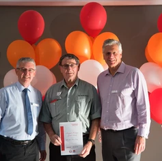

**Recipients of the 2019 Transport Heritage Grants were announced at a special ceremony at the National Innovation Centre on Saturday 26 October.**

The Transport Heritage Grants Program is a NSW Government funded program administered by the Royal Australian Historical Society (RAHS) and supported by THNSW. It aims to help the NSW community rediscover the culture, events and people that shaped transport over the past 160 years, as well as assist with the restoration and conservation of NSW’s valuable heritage assets.

Congratulations to the following organisations:

**Goulburn Crookwell Heritage Railway**

Replacement of painted timber boundary fence at Crookwell Station

Amount awarded: $3,080

**New England Antique Machinery Club**

Applying rubber to traction engine wheel.

Amount awarded: $6,160

**Sydney Tramway Museum**

Restoration to original Sydney R1 Class tram.

Amount awarded: $7,913

**Zig Zag Railway**

Restoration, painting and interpretation of signals at bottom points.

Amount awarded: $9,423

Restoration, painting and interpretation of signals at top points.

Amount awarded: $14,800

**Sydney Bus Museum**

Restoration of Albion 1921.

Amount awarded: $15,000

**Robertson Heritage Railway Station**

Repaint of Robertson Main Station Building.

Amount awarded: $15,000

**The Rail Motor Society**

Railmotor CPH1 ends repairs.

Amount awarded: $20,309.95

**Illawarra Light Railway Museum**

Perry Boiler Restoration.

Amount awarded: $38,421.82

**Lachlan Valley Railway Society Co-op**

Restoration of Rosie (Locomotive 5367).

Amount awarded: $50,000

Images of the grants ceremony and recipients below by Steve Burrows.

THNSW CEO, Andrew Moritz

Ian Wallace, Roberston Heritage Railway Station

Carolyn Dumont, Illawarra Light Railway Museum

Bruce Agland, The Rail Motor Society

Ian Cameron, Lachlan Valley Railway

Howard Clarke OAM, Sydney Tramway Museum

Daniel Howard, Sydney Bus Museum

Michael Marriott-Statham and Cameron McGinty, Zig Zag Railway

Peter Simpson, Goulburn Crookwell Heritage Railway

2019 Transport Heritage Grants recipients

2019 Transport Heritage Grants recipients
