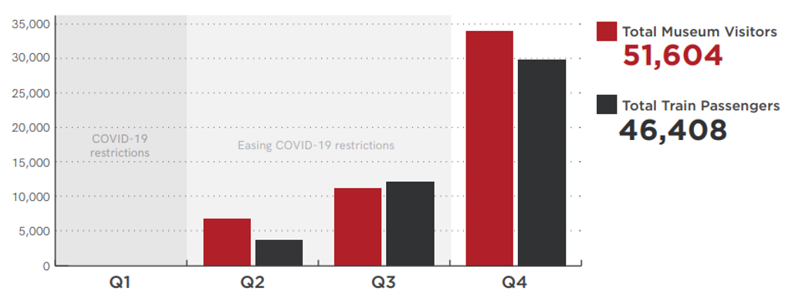

**The Transport Heritage NSW Annual Report for 2021-22 is now available to view on the [THNSW website](https://www.thnsw.com.au/reports-plans).**

The report details THNSW activities and results during a period of fluctuating COVID-19 restrictions, as well as impacts to our operating program due to severe weather events.

**2021-22 Visitor & Passenger Results**

Despite these challenges, Transport Heritage NSW welcomed more than 49,000 visitors to the NSW Rail Museum, 2,500 to the Valley Heights Locomotive Depot Heritage Museum and almost 5,000 passengers on the main line, demonstrating the public’s eagerness to re-engage with our events and experiences.

You can view the 2021-22 Annual Report at the [THNSW Reports & Plans page](https://www.thnsw.com.au/reports-plans).
