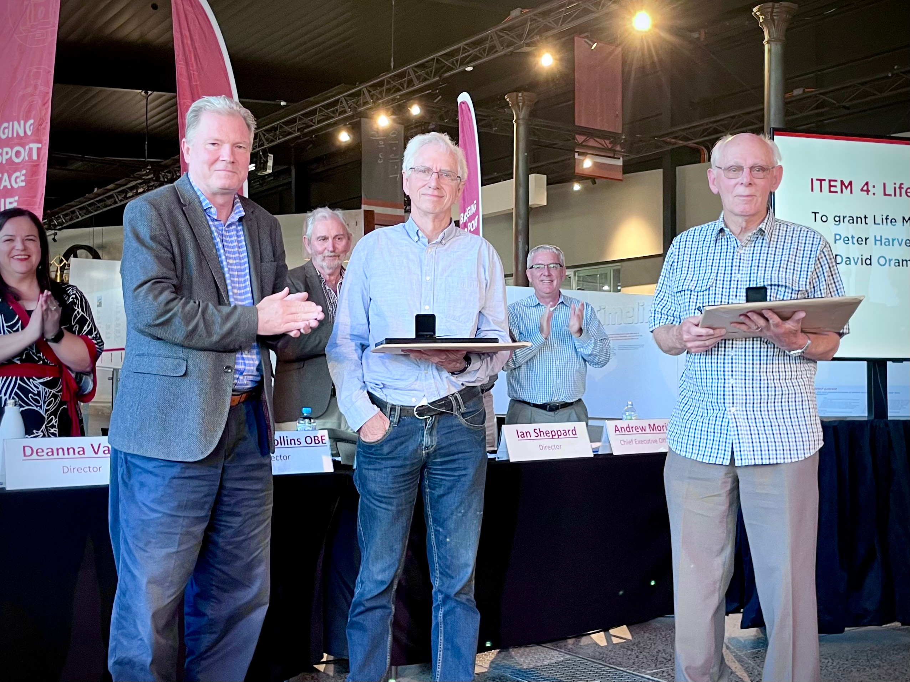

**The 10th Annual General Meeting (AGM) of Transport Heritage NSW (THNSW) was held on Saturday 18 November 2023.**

**The AGM took place off the back of a very successful year which saw a record 91,000 passengers carried over the financial year, as well as a record of almost 79,000 visitors to the NSW Rail Museum, as well as another record of almost 5,000 visitors to the Valley Heights Locomotive Depot Heritage Museum.**

This year, THNSW Members Peter Harvey and David Oram were recognised for their significant volunteering contributions over many years, with the awarding of life membership. THNSW congratulates Peter and David!

*David Oram (middle) and Peter Harvey (right) receive their life memberships.*

THNSW Chair, The Hon. Nathan Rees, announced the appointment of Janelle Middleton to the Board of Directors. Janelle works as the Manager Museums at Bathurst Regional Council and brings a strong background in museums, managing and caring for collections and the NSW regional visitor economy. We are excited to welcome Janelle aboard!

On behalf of the Board, membership and everyone at THNSW, the Chair thanked outgoing Director Andrea Plawutsky for her dedication, contribution and commitment to THNSW whilst volunteering as a Board Director. Thank you and all the very best to Andrea!

It was also announced Alex Claassens had been reappointed to the Board for an additional three-year term. Congratulations Alex!

Prior to the AGM, members enjoyed a special members only tour of our Operational Fleet Maintenance Workshop and Roundhouse at the Museum. There, they were walked through current projects, including the restoration of carriage HFS 2017 and works on vintage diesel locomotive 4001.

You can read more on THNSW’s record year in the 2022-23 Annual Report, [available on the THNSW website.](https://www.thnsw.com.au/reports-plans)

*A compilation of highlights from the 2022-23 financial year as presented at the AGM.*
