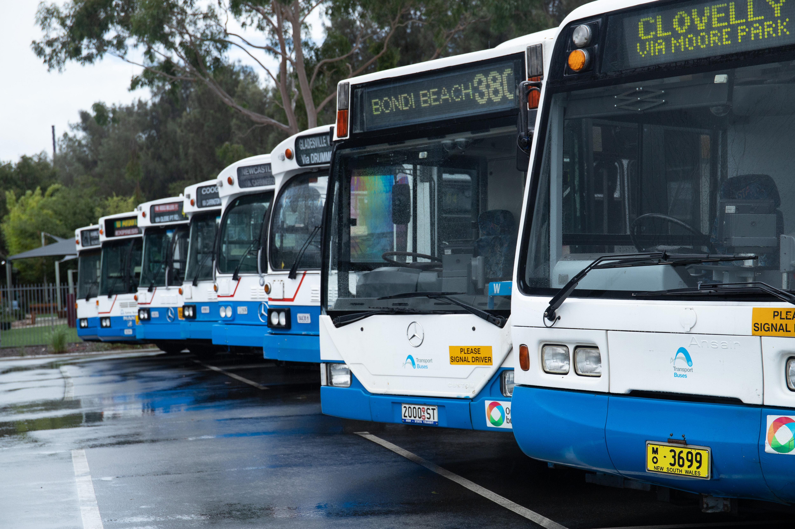

**This year marks the 30th anniversary since the formation of the State Transit Authority (STA) of NSW.**

On Sunday 17 March, during one of their regular open days, the Sydney Bus Museum ran an additional service using former STA vintage buses and showcased an enhanced display of STA era buses at the museum.

On top of the regular half hourly vintage double-decker service to the Queen Victoria Building, volunteers ran single-deck, former STA buses to Huntleys Point. A variety of Mercedes and MAN buses from the 80s and 90s were also displayed at the event.

Thank you to all the visitors who joined us for this special open day.

**About STA**

STA is one of the largest and most modern bus transport providers in Australia. As the only government bus company in NSW, STA proudly moves 200 million passengers per year around Sydney, getting them to their desired destination as quickly and safely as possible.

The STA fleet lined up. -Sydney Bus Museum

*This article was originally published in the autumn 2019 edition of the sector report.*
