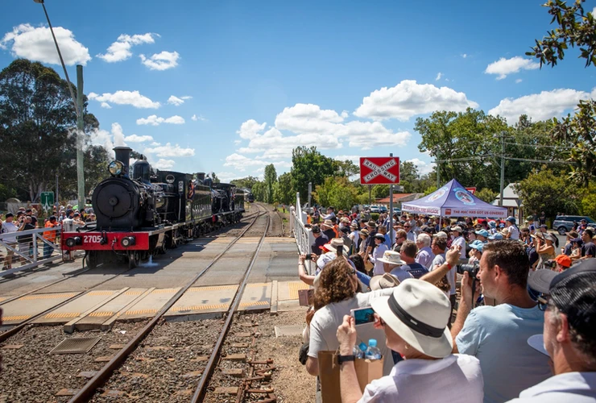
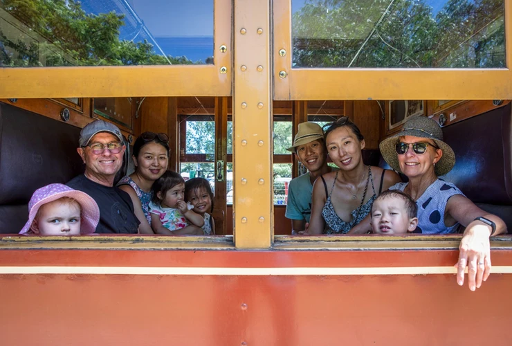

**Thousands visited the NSW Rail Museum and township of Thirlmere on 2–3 March for the 30th anniversary of the Thirlmere Festival of Steam.**

Five historic locomotives featured at the two-day event. Locomotives 2705, 3016, 3265 and 3526 took passengers on a ride back in time along the Thirlmere Heritage Railway to Buxton or Picton and return. Beloved 3642 was in light steam and on static display within the museum grounds for cab visits and photos.

Other NSW Rail Museum activities included mini train rides, ‘The Little Engine That Could’ performances, live steam model trains and educational documentaries. A steam and vintage park display by the Campbelltown Steam & Machinery Museum featured full-size and miniature steam traction engines, portable engines, oil engines and pumps. Visitors were also invited to learn more about the locomotives, carriages and other historic objects in the museum collection during brief spotlight talks provided by volunteer museum guides.

While NSW Rail Museum activities were available both days, the township came to life with a village fair on Sunday 3 March.

More than 180 market stalls were set up throughout the streets of Thirlmere, complimented by a vintage car display, steam vehicles and machinery, amusement rides and more.

Crowds gathered for a grand parade, which was led by His Excellency General The Honourable David Hurley AC DSC (Ret’d), Governor of New South Wales, and Mrs Linda Hurley.

Finally, live entertainment was provided by Missy Lancaster, the Steampunk Vagabonds and local schools throughout the day.

**Visitor Comments**

Here’s what some of our visitors had to say about the festival:

*“We love the steam engines. Brings back wonderful memories. We were most impressed with the manner in which volunteers spoke to, assisted and generally helped the public.”*

*“First time visiting the museum and it was absolutely fantastic! The festival itself was well organised and event staff were very helpful.”*

*“Thoroughly enjoyed the weekend. The community goodwill was warm, welcoming and very much appreciated. Did not hear an unkind word from anyone. It was wonderful to see so many folks turn up to enjoy the atmosphere.”*

*“A wonderful event. Well organised and lots of fun for all. The trains are awesome!”*

This event was proudly presented by the Rotary Club of Picton and NSW Rail Museum. Congratulations to the staff, volunteers and event partners for making this event a huge success.

Crowds gather to watch the run around of locomotives 2705 and 3265. -Trys Eddy Photos

Smiles all around as passengers prepare to head off on a ride back in time. -Trys Eddy Photos

*This article was originally published in the autumn 2019 edition of Roundhouse magazine. Written by Tatianna Lazowski, Marketing & Communications Officer.*
