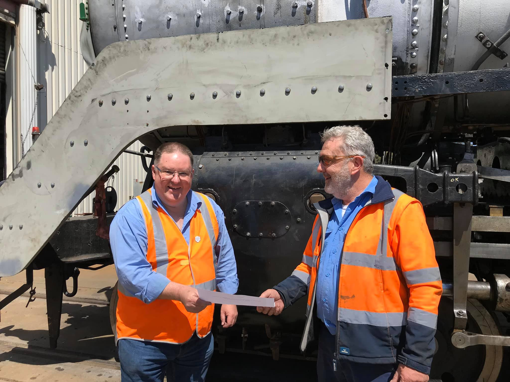

**Following several weeks of extensive testing, locomotive 3801’s boiler was today officially certified for operation.**

The boiler can now be pressured to 245 psi, its original operating pressure.

Here’s 3801 Project Manager, Craig Mackey accepting the boiler certificate and the team.

