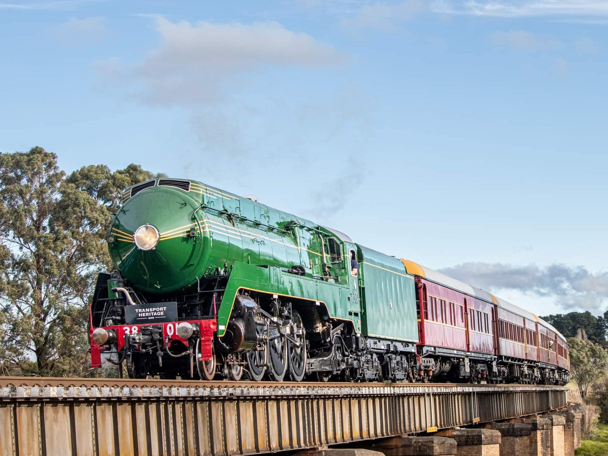

**Transport history will come alive next month with Australia’s most famous steam locomotive, Locomotive 3801, crossing the Sydney Harbour Bridge for the very first time.**

The public will have an unique opportunity to ride the steam train, as well as other vintage modes of transport, at the Transport Heritage Expo, in Sydney’s CBD from 1–3 October 2022.

Minister for Transport, Veterans and Western Sydney David Elliott said the iconic train crossing Sydney Harbour would be a memorable moment in history as no other train has captured hearts quite like 3801.

“Seeing this historic train, known as ‘a legend of steam’, on the Harbour Bridge will be a spectacular sight, and one that I’m sure will be embraced by the community,” Mr Elliott said.

“This locomotive was a game-changer for our State, and today evokes a sense of pride and nostalgia for the golden age of rail travel. It is the epitome of style and substance, with its steam power and sleek art deco style.”

Locomotive 3801 was designed and built in NSW in 1943 and has been in preservation since its retirement in 1962, making a triumphant return to passenger service last year. It made history as the only steam train to have travelled to all mainland Australian states and territories.

Minister for Environment and Heritage James Griffin said the Transport Heritage Expo’s return to Sydney is the perfect opportunity to see our State’s transport history in person.

“It’s a great time to be getting out and about in our beautiful Harbour City. The Transport Heritage Expo is a fantastic event for people to enjoy on the October long weekend, giving them a chance to journey back in time and immerse themselves in our State’s rich history,” Mr Griffin said.

“There will be vintage train, bus and steamboat rides as well as fun heritage experiences, like touring the Central Station clock tower. It’s great to see Sydney back in action with events like this, which is expected to draw more than 10,000 people into the CBD over the long weekend.”

Locomotive 3801 will travel across the Sydney Harbour Bridge on Sunday 25 September, ahead of the Transport Heritage Expo to be held at Sydney’s Central Station from 1-3 October.

Tickets will be on sale from midday Thursday 25 August at [www.transportheritageexpo.com](https://aus01.safelinks.protection.outlook.com/?url=http%3A%2F%2Fwww.transportheritageexpo.com%2F&data=05%7C01%7CStephanie.Bowe%40transport.nsw.gov.au%7Caa5f2a28a39c49372d5e08da80eeb758%7Ccb356782ad9a47fb878b7ebceb85b86c%7C0%7C0%7C637964060019324070%7CUnknown%7CTWFpbGZsb3d8eyJWIjoiMC4wLjAwMDAiLCJQIjoiV2luMzIiLCJBTiI6Ik1haWwiLCJXVCI6Mn0%3D%7C3000%7C%7C%7C&sdata=80zhlyJv73e6SYdhbdmGF4OC4yxkF297TqHZWoKJ6%2B4%3D&reserved=0)

People who purchased tickets to ride 3801 for the Harbour Bridge’s 90th birthday in March this year, before extreme weather prevented it from making its journey, will be contacted in the coming days to re-book their ride.
