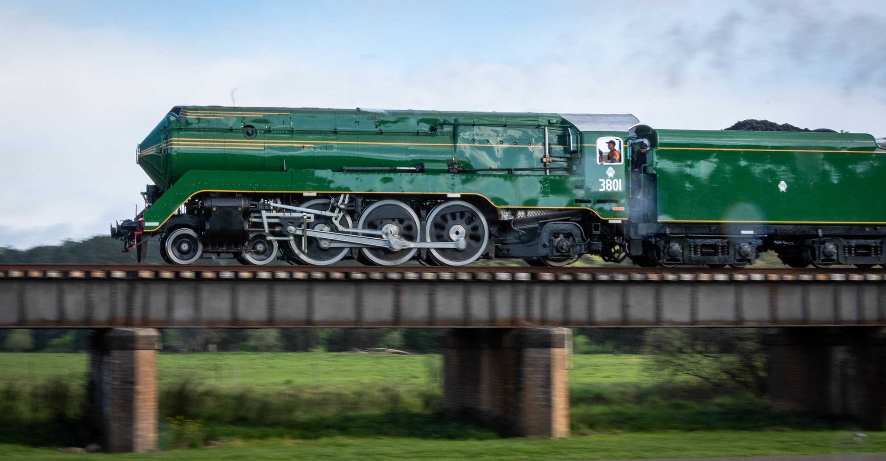

**Legend of steam locomotive 3801 was put through its paces last week, with six days of continuous operations through the Southern Highlands.**

The operation was undertaken for the dual purposes of further mechanical trials, as well as locomotive crew training and competency management.

“This intense training was critically important to ensure our skilled team of drivers, firemen and support crews are familiar and competent with operating 3801,” said THNSW CEO, Andrew Moritz.

“I’m delighted to report the training went successfully and we achieved all the goals we had planned for the operation.”

Hundreds of lineside spectators gathered each day to catch a glimpse of the locomotive hauling a 422-tonne train to passenger running times and travelling a total 1,440km during the six-day operation.

“3801 hasn’t travelled this extensively for over a decade, so it was reassuring to see interest in the engine is as strong as ever!”

“I’d like to congratulate our team of staff and volunteers for a very successful operation and thank *ARTC*, *CFAP Goulburn*, the *Goulburn Roundhouse Preservation Society* and *NSW TrainLink* for their support.”

We look forward to being able to operate the locomotive on passenger services in the future when Covid 19 restrictions allow.

*THNSW mainline operations remain suspended as a result of COVID-19 restrictions. Further details about future 3801 events and tours will be announced as soon as restrictions ease.*

**Facts & Figures:**

✅ Operation covered six days on a 24-hour roster

✅ Total distance travelled: 1,440km

✅ First time 3801 has travelled south of Moss Vale to Goulburn in 13 years

✅ Hundreds of lineside spectators each day, building renewed interest in 3801

✅ No significant network / operational incidents or delays

The workers:

⏰ Total rostered shifts: 93

⏰ Train Crew / Safeworking: 54 shifts

⏰ Operational Fleet Support: 39 shifts

⏰ Individual rostered workers involved: 42

⏰ Total rostered hours: 749, most of which were volunteered

⏰ Train Crew / Safeworking: 398 hours

⏰ Operational Fleet Support: 351 ½ hours

Competency outcomes:

👷‍♂‍ Re-familiarised drivers: 6

👷‍♂‍ Steam drivers assessed: 3

👷‍♂‍ Re-familiarised fireman: 3

👷‍♂‍ Steam firemen assessed: 2

👷‍♂‍ Steam firemen in training: 3

👷‍♂‍ Diesel crews assessed: 3

Images courtesy [Steve Burrows / SJB Photography](https://www.facebook.com/SJBImage)
