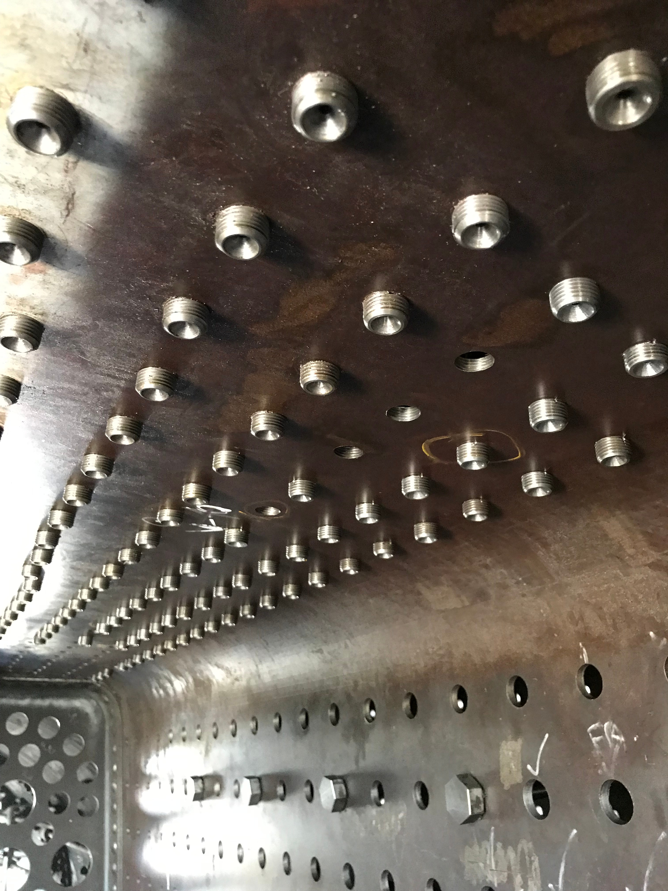

**Locomotive 3801’s boiler is nearing completion. The following images provide a photo update of the project works as of late March 2019.**

Completion of 3801’s boiler is getting very close. Work resumed soon after New Year with the installation of rigid wall stays. Within the first few weeks, almost all the side rigid-stays were screwed in and the seats for the flexible side stays countersunk.

Riveting of the front tube plate was almost complete and this allowed the longitudinal and diagonal stays to be finally fitted.

Swaging of the firebox ends of the 5-1/4 inch flues was completed (36 in total) and the 142 x 2-1/4 inch boiler tubes were cut to length and the ends annealed.

With the boiler laid over on the fireman’s side, it was time to weld flexible stay cups to the driver’s side of the firebox. 167 of these are fitted to each side of the firebox, 40 to the backhead and 110 on the throatplate. The ball end of the flexible stay bears against a spherical seat and cal rotate, accommodating expansion and movement of the inner firebox. Each stay is sealed against steam pressure with a copper washer and screwed in cap. From the inside, the flexible stays look the same as the rigid stays and will all be beaded over as well.

Stages in applying stays to the throatplate. The final image was taken in late March, showing progress with beading over the rigid wall stays.

With the majority of wall stays screwed in, it was then possible to make a start with the crown stays. These require a similar number of operations to the wall stays – rough and finish ream, then rough and finish tap to prepare the holes. 322 are tapered head rigid wall stays. The tapered thread requires special care to ensure the stays screws in far enough, but not too far to allow proper tightening. After screwed in tight by hand, there must be a gap of 1/8 inch between the hex head and the crown plate. We used a test stand to practice the process and carefully adjust the tooling before tapping the actual boiler plates.

By the beginning of March, nearly all the tapered head crown stays were in. A number of these stays also screw through the safety valve and steam turret seatings. The first three rows of crown stays are flexible and have cups with spherical seats. By the end of March, the cups were tack-welded to the crown sheet.

With the boiler rotated 180 degrees, those last few tubeplate rivets, which were previously inaccessible, could be reached with the hydraulic riveter. This stage of the work is now complete.
