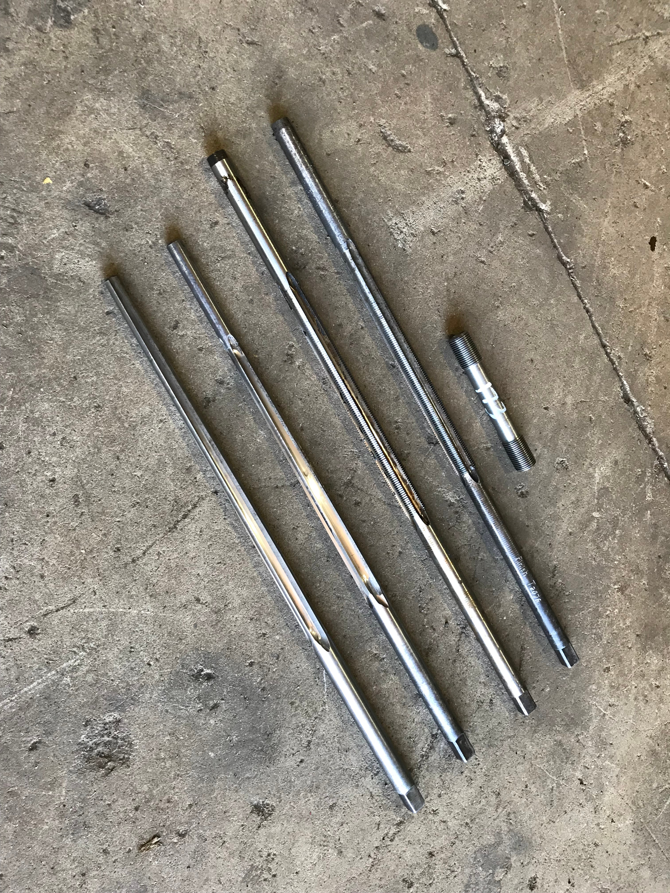

\*\*The following images provide a photo update of recent works on the 3801 project.\*\*

This 3801 update will concentrate on repairs to 3801’s current boiler (No.3819). In early October, the new firebox was installed in the boiler casing. 38 class fireboxes were specially designed to be ‘removable’ from the boiler to allow for repairs and / or replacements.

With the firebox in permanently, the foundation ring was riveted. The corners are held steam-tight with a combination of through-rivets and patch screws.

The new front or smokebox tubeplate has been presented up to the angle-iron ring on the boiler barrel to prepare it for riveting. One hundred rivets are required to attach the tubeplate to the boiler. Each of the holes must be reamed through to ensure a clean rivet hole. Additionally, the rear of the holes must be countersunk. The interior of the barrel will be abrasive blasted to remove scale and painted with an anti-corrosive paint before the tubeplate is riveted on.

Other sundry repairs are being attended to. The outside throatplate has had several flexible stay cups replaced and welded back on. The firebox backhead is being prepared for the forty flexible stay cups, which will soon be welded into position. The flexible stay cups shown here are ‘UN’ type and seat into a countersunk bored into the firebox plates.

As well as stays, there are numerous steam-tight studs that are screwed in various locations to attach bracket and components to the boiler. The old side sheets are being used as a reference to ensure the new stud holes are correctly located.

This official Mechanical Branch image shows the various types of stay used on a C38 class boiler. The threads on stays for all-steel boilers (engines classed D.57, C.38, D.58, AD.60) were screwed 11 threads per inch. At the top left is a rigid wall stay (1,300 odd in the boiler). These also have tell-tale holes drilled in each end. The top right is a flexible wall stay (492 of these). The ball end allows the flexible stay to rotate and accommodate movement of the firebox plates when they expand on heating. In the middle, there is a tapered-head rigid crown stay (306) and at the bottom is a parallel-thread crown stay, which may have a ball threaded on the point to allow it to act flexibly (42) or a nut applied to make it rigid (14).

The threads at each end of the stays must be in pitch within 0.002 of an inch. A thread pitch comparator is used to check this important feature.

The fitting of steel stays to a NSW locomotive boiler involves quite a number of separate operations. The holes are firstly ‘rough’ reamed, followed by a finishing reamer to produce an accurately sized hole for tapping. Then, a ‘roughing’ tap cuts an initial thread form, followed by a ‘finishing’ tap that, if correctly handled, produces a thread with the correct size to suit the stay. The stay itself is machined to gauges so that the stay has the correct fit in the stay holes.

One of the most important operations to ensure successful staying of our boiler is to ensure a plentiful supply of sharp tools. A long-time contractor to the 3801 project, Jef Piper, has been of great assistance providing services to sharpen the many boiler reamers and taps involved in this project.

Retired NSWGR boilermaker and boiler inspector Don French OAM has taken a keen interest in the activities at Goulburn and his advice has been very helpful and valuable!

The rigid stays are screwed in with a prescribed amount protruding from the hole and are finally beaded-over to seal against the edges of the plate. This is performed by a rotating beading tool in an air hammer.

These two images are the most recent at time of writing in mid-December 2018.  They show a box of rigid wall stays newly delivered from a CNC machine shop and the progressive screwing in of stays on the firebox walls. The stays are ordered in batches with lengths to suit the distance between the inner and outer firebox plates.

*This article was originally published in the summer 2019 edition of Roundhouse magazine.*
