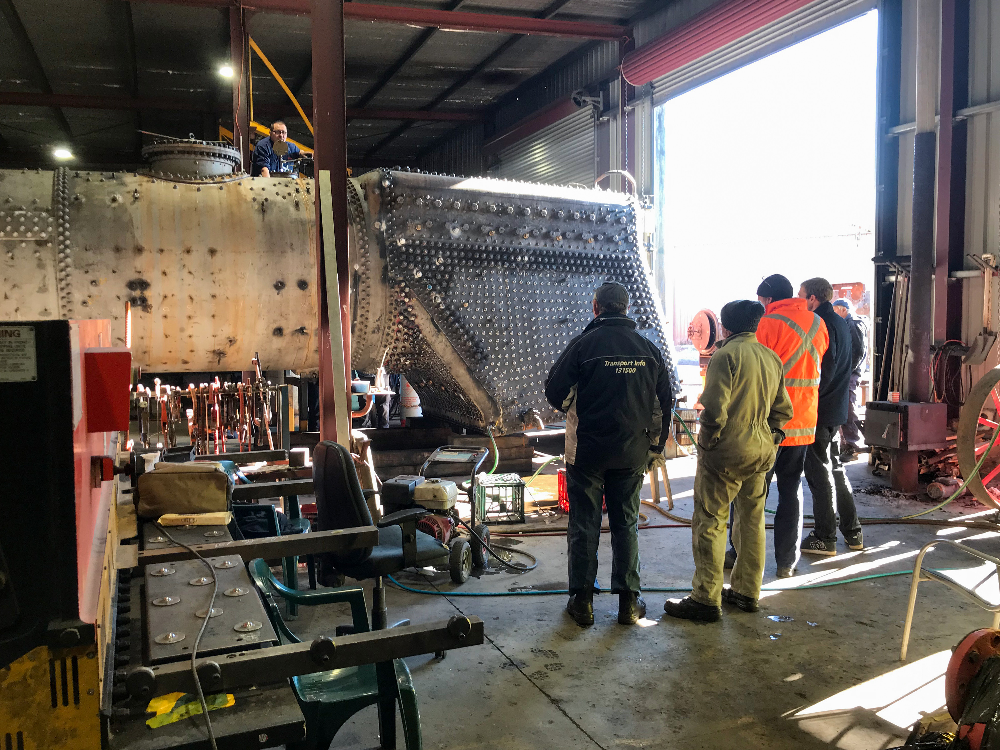
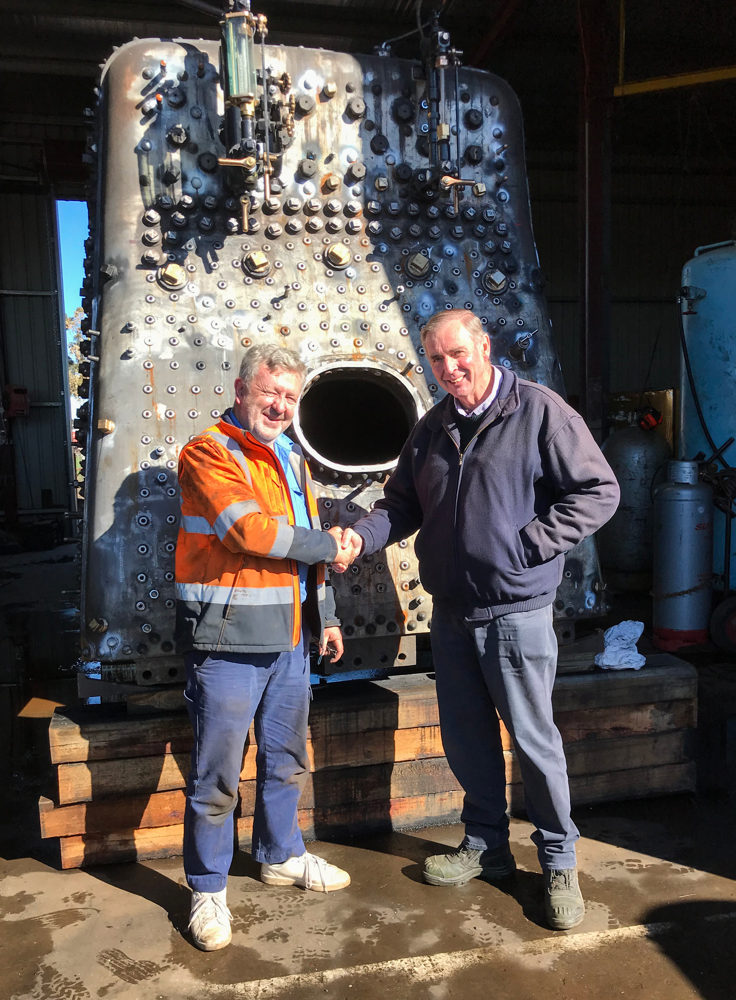
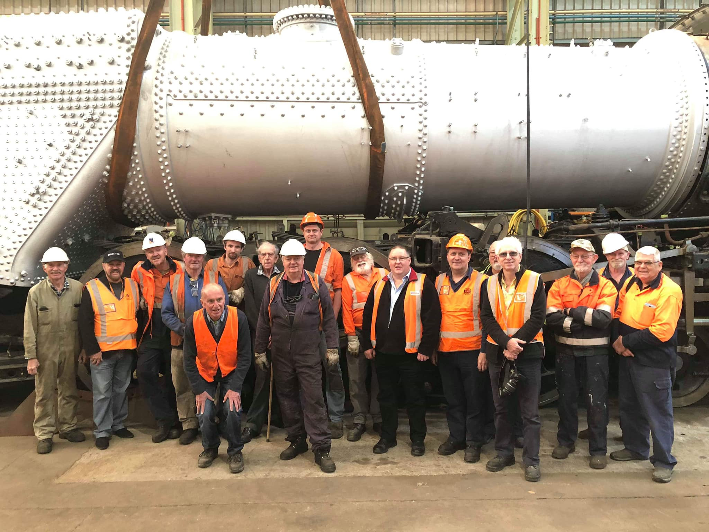

**The 3801 project has reached a significant milestone – the boiler has been completed and passed its hydrostatic test. The boiler was returned to Chullora on 1 July and work is now underway to reunite the boiler with the locomotive’s frame.**

A job well done to the staff and volunteers involved in this important achievement.

The following images provide a photo update of recent project progress.

Work on the boiler has steadily progressed through April, May and June. By the end of April, all 378 crown stays were installed and tightened. Additionally, the 1,350-odd rigid wall stays were screwed in and beaded over. The more than 480 flexible stays in the side sheets and throatplate were also installed and beaded-over on the fire side of the firebox. This monumental task required smooth cooperation between K & H Ainsworth’s staff and our THNSW team to result in satisfactory completion.

With the Boiler Inspector’s approval, the team installed the bottom rows of 2-1/4 inch OD boiler tubes at various times when the boiler was standing upright, after sufficient wall and crown stays were in to stabilise the firebox.

The boiler was rotated at each stage of the work, so it was oriented at the most convenient angle to suit the work (i.e. to maximise stay beading with the rivet gun pointing downwards). Similarly, riveting of the firehole was done in stages so that the riveter was held in the vertical.

By mid May, it was time to rotate the boiler into its final up-right position to prepare it for hydrostatic testing.

This image shows the boiler sealed up and water filled. The water gauge glasses are fitted, and all washout and arch-tube plugs are screwed in. Blanking plates have been installed over the various seatings for the other boiler fittings not required to be tested. Finally, the dome cover has been bolted down.

Hydrostatic testing requires the boiler to be filled with ‘warm’ water, so some means is required to heat it. At K & H Ainsworth Engineering, the simplest way to achieve this was to fire up a portable engine and circulate heated water through the boiler until it reached the desired temperature. In this example, no attempt was made to produce steam, simply to heat the water. Heating was applied gradually, taking a shift of around eight hours to bring the water temperature up to around 60 degrees C at the highest point on the boiler. To minimise delays, we rostered volunteers on a night-shift operation to ensure the boiler was warm by the start of the following day.

On cold Goulburn winter nights, the best place for night-shift workers was either tending to the fire in the portable engine or perched on the barrel of the locomotive boiler. Volunteers Pursehouse and Hope can be seen checking the temperature of the boiler with some very sensitive instruments.

A number of preliminary water fills and pressurisations were performed until we had confidence to arrange for the boiler inspector to conduct the formal test. The process is a gradual one, raising the pressure to increasing levels and noting where drips and dribbles of water occur. Once they have all been noted, the pressure is released and each of the problem areas is dealt with and caulked. In riveted boiler making, a caulking chisel is used to knock down the seams, stays or rivets more tightly together and improve water tightness. We were delighted that none of the boiler tubes or flues showed any indication of a leak.

The big test of the work done on the boiler came on Saturday 22 June when it was hydrostatically tested and witnessed by our Boiler Inspector, Greg Shipton. The hydrostatic test was performed at 1.25x boiler working pressure. Inspector Shipton decided that since (apart from the barrel) the boiler was almost a new construction, the test pressure would be 1.5x working pressure = 367.5 p.s.i. per requirements of the boiler code.

Greg Shipton congratulates Ken Ainsworth at the conclusion of the successful hydrostatic boiler test. Having achieved this important milestone, the boiler can now be transported back to Chullora and be fitted to the engine frame and steam tested. Also in Goulburn on this important day were long-time 3801 volunteers and staff.

With testing complete, the boiler was abrasive blasted on external services and given a coating of high temperature paint.

The boiler is lowered into the frame of 3801 at Chullora on 1 July 2019.

The team of volunteers stand in front of the boiler at Chullora following its return from Goulburn.
