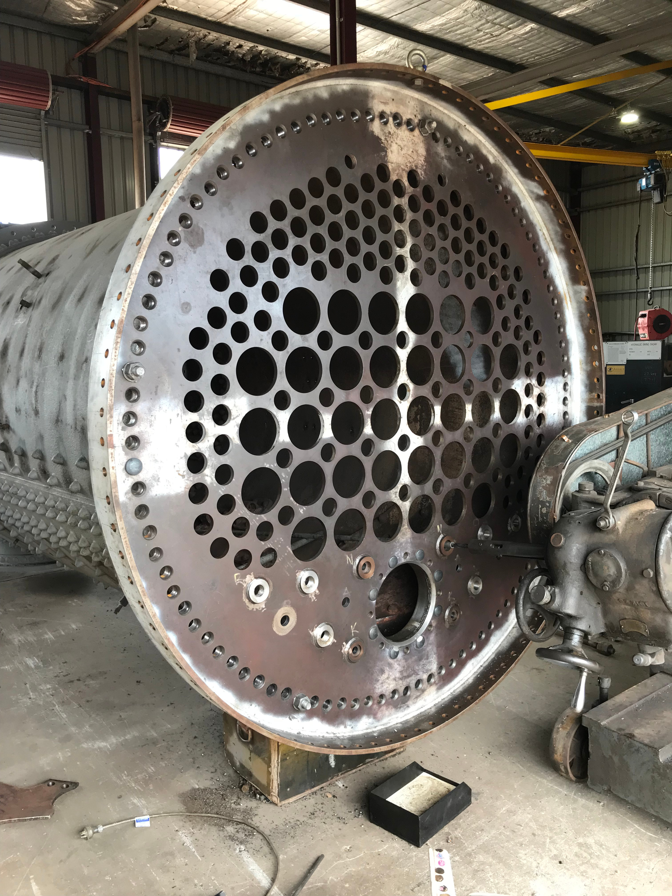

**Following the successful fitting of the inner firebox to the boiler in October, our contractor at Goulburn has now reached a detailed stage involving fitting of remaining parts to complete the boiler’s repair.**

The team is currently reaming and tapping the outer firebox holes of the boiler, including riveting the foundation ring, mounting the smokebox tubeplate and completing the firehole door.

Meanwhile, at Chullora, worn axle boxes are being built up for the tender and two new axles are currently being manufactured. Machining of all new collars has commenced for the bearings, which are being replaced as previously reported.

Work to fit the ICE radio onto the tender has also begun.

Once hydrostatic testing of the boiler is completed, we will be in a position to announce when steam trials may begin.

Firebox foundation ring riveting nearly complete.

Internal view showing firebox riveted in place.

Preparing new smokebox tubeplate for riveting.

Firehole sleeve fitted and drilled.
