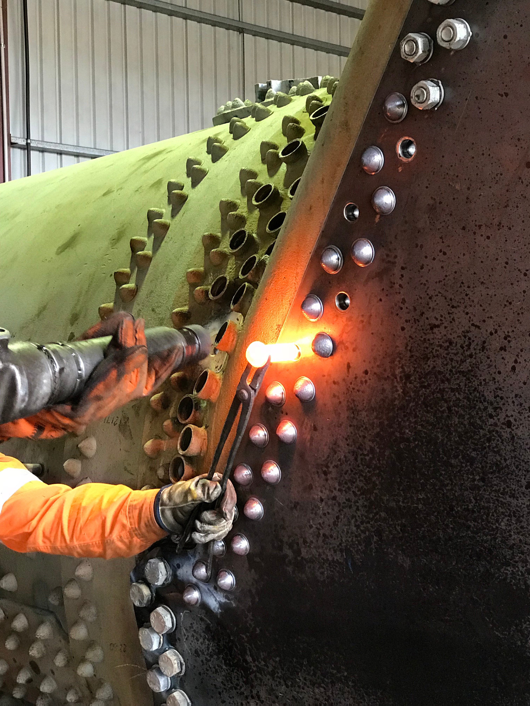
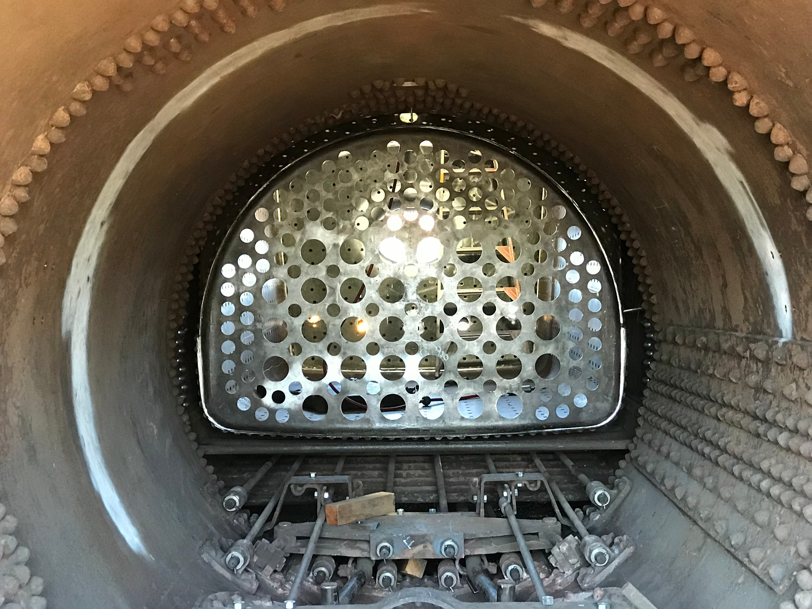
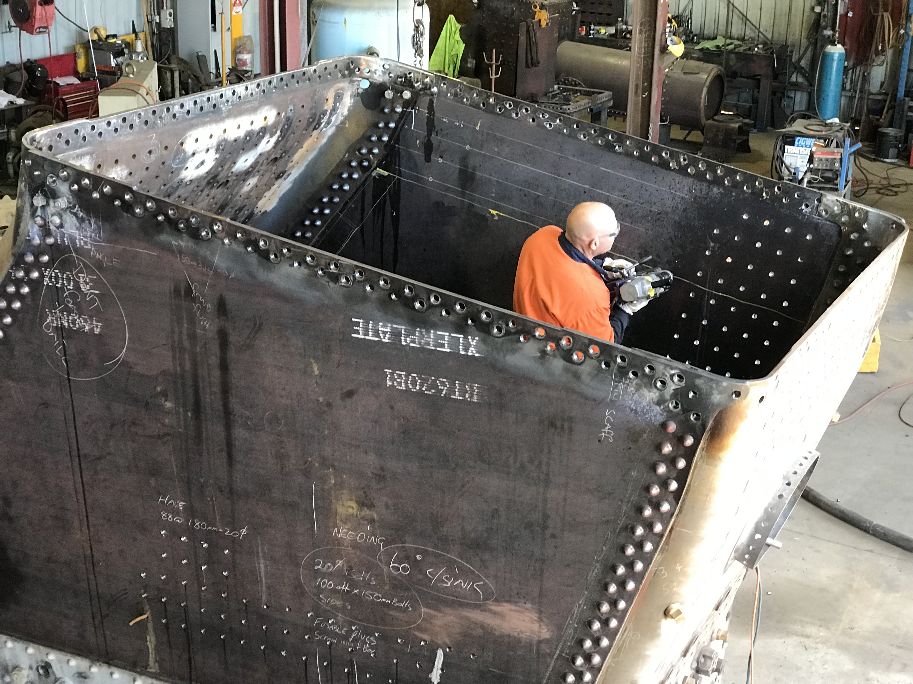
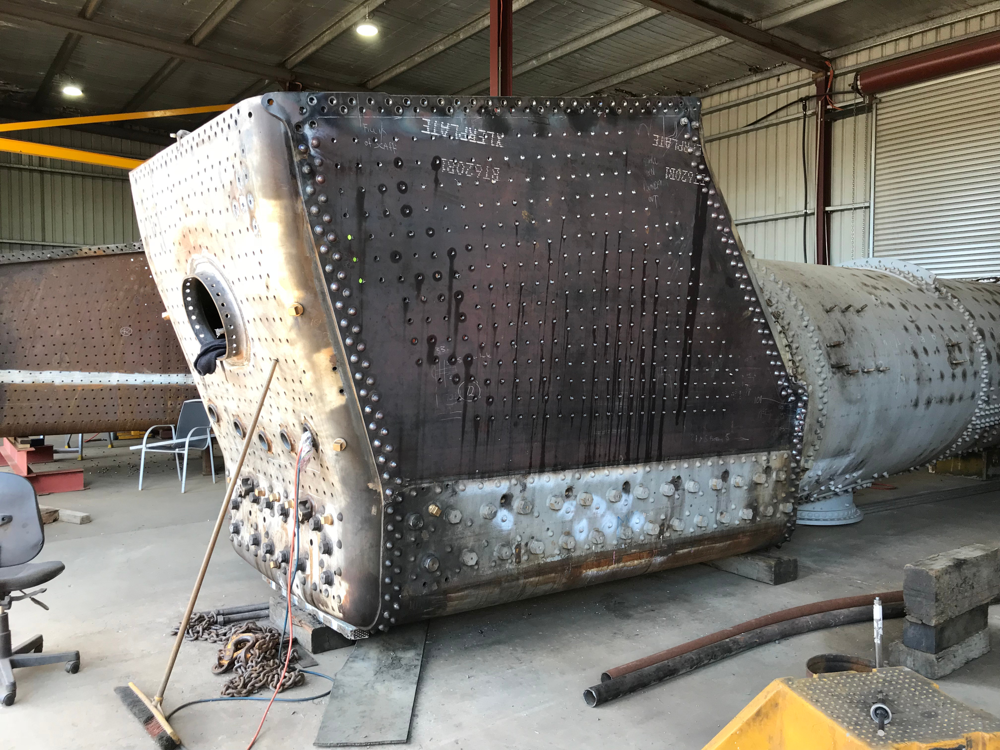
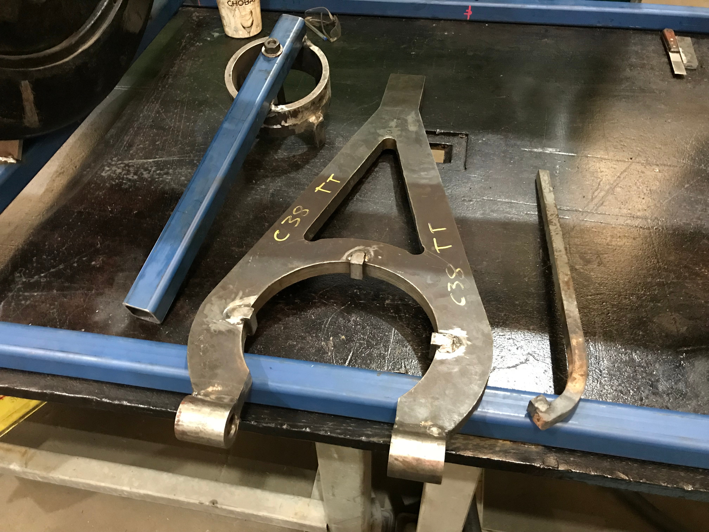
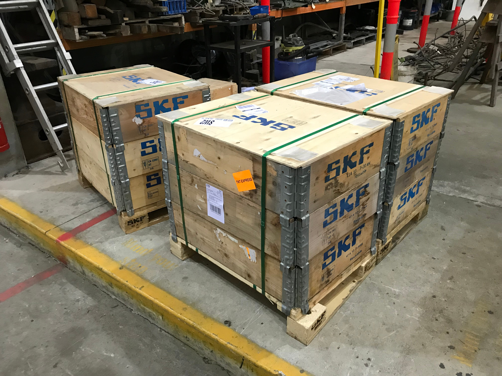
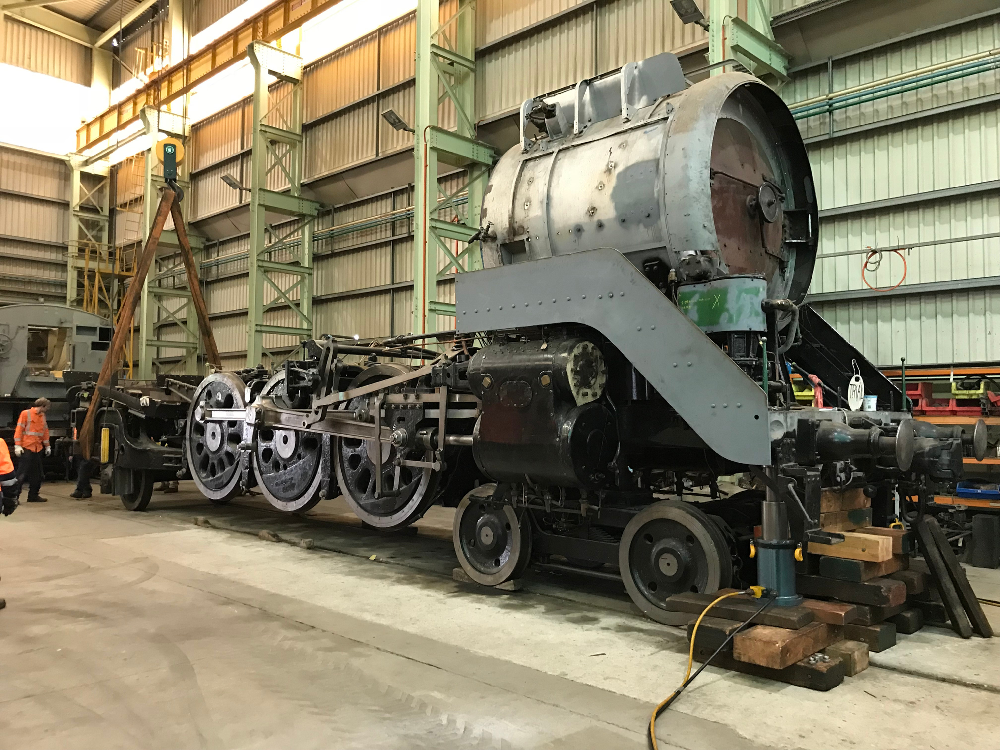
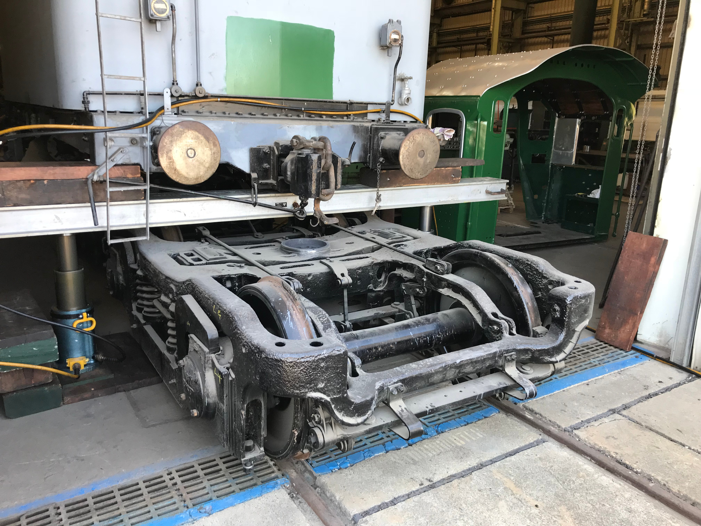
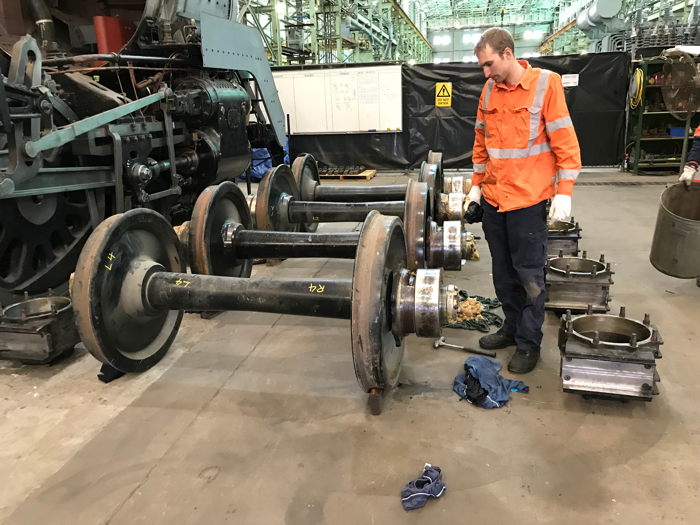

**The following images provide a snapshot of recent works on the 3801 project at both Goulburn and Chullora.**

The inner firebox is about to be fitted to the boiler. The following images provide a snapshot of works leading up to this point.

The new outer-casing side sheets have been fitted between the throat-plate and back-head and riveted in place.

The inner firebox has been test fitted into the boiler casing to check position and alignment. At the same time, the positions of the stay holes were transfer-punched to mark the side sheets.

With they stay locations centre-pop marked, each stay location was drilled through the side sheet. These have been drilled under size (pilot holes) and will be reamed to size later.

A view of the boiler casing with holes for rigid wall stays drilled. On the floor one of the new and old arch tubes can be seen side by side. These are bent to a 10 ft. radius and are expanded at each end in holes located in the inner throatplate and inner backhead. Five arch tubes are fitted and they allow improved circulation of water in the boiler as well as acting as a framework to support the all important brick arch.

A variety of tools manufactured at Chullora for dismounting and remounting roller bearings on the trailing truck axle and tender bogie axles.

3801’s new tender bogie roller bearings have been received into store at Chullora Workshop.

The Sydney Trains Breakdown Crew provided expert assistance to lift 3801 so the trailing truck axle could be removed for bearing change. The rear end of the frame was suspended from the 30-tonne overhead crane. The front of the engine was lifted using the breakdown crew’s hydraulic jacks.

A general view of the Chullora Workshop just after the engine lift showing the axle with roller bearings exposed.

The Sydney Trains Breakdown Crew also came to the rescue when it was time to remove the tender bogies. This time, the tender tank and underframe was lifted with four hydraulic jacks and the two bogies were rolled out into the yard.

The four tender bogie axles with the axleboxes removed, showing the roller bearings.

*This article was originally published in the spring 2018 edition of Roundhouse magazine.*
