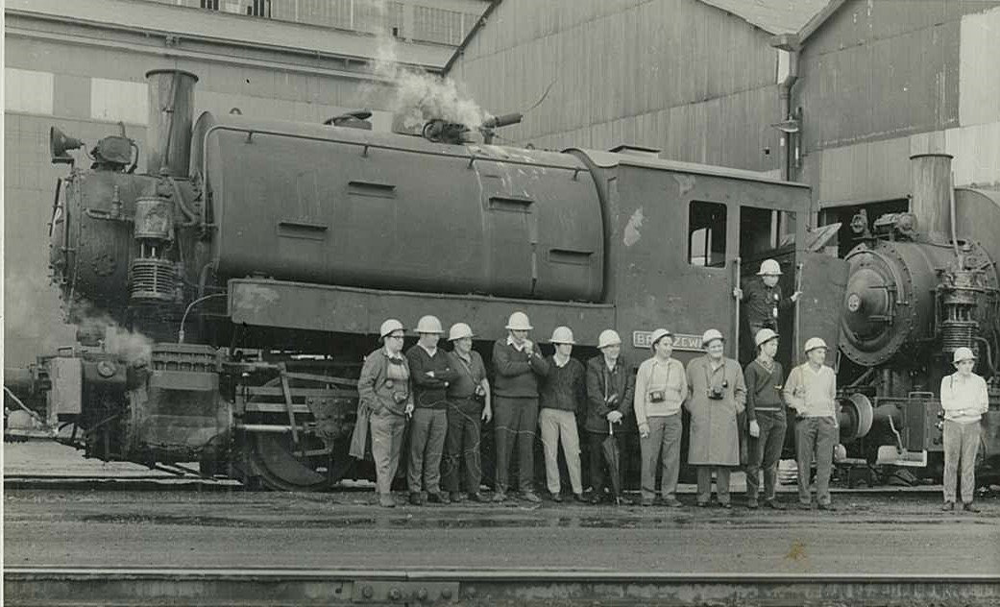

**The year 1968 was an exciting time to be a railway enthusiast. While steam was rapidly disappearing from the railway scene, that which remained was tracked down and photographed by keen devotees. Steam tour trains to various regions of the state ran frequently and were well patronised. Enthusiasts were becoming members of the NSW Rail Transport Museum (NSWRTM), now the NSW Rail Museum, which was founded in 1963 to establish an ambitious railway museum at the Enfield Locomotive Depot. Some of these members were from the Illawarra region of NSW.**

Terry Bolton (NSWRTM member No.4) gathered together 15 Illawarra members to a foundation meeting on 7 August 1968 to form the then Illawarra Group of the NSWRTM. This marked the group’s official start and a local committee was appointed, comprising of: Terry Bolton, President (District Representative to the main NSWRTM Executive Committee); Roger Prott, Secretary; Keith Roberts, Treasurer; Jim Costigan, Services Officer.

A subsequent meeting was held on 30 August 1968. The fledgling Illawarra Group was encouraged by the attendance of key members of the NSWRTM Executive Committee, including President John Reeves and Secretary Graham Ahern. The third meeting was held on Tuesday 1 October 1968. The Illawarra Group continues to hold meetings on the first Tuesday of each month (excluding January); a long tradition.

Meetings in the early years were a place for enthusiasts to gather to share news, participate in photo competitions, be entertained (often by movies or slides from expeditions to places with operating steam, such as the Port Kembla Steelworks), purchase books and suggest tour ideas (some of which actually occurred).

Members of the fledgling Illawarra Group organised a visit to the Port Kembla Steelworks in early 1969 to inspect the eight operating Porter class saddle-tank engines still in operation. This group photo was taken with locomotive Bronzewing, later to be saved by the Illawarra Group for restoration and preservation at Thirlmere. -Keith Roberts

The first Illawarra Group rail tour ran to Goulburn and return via Wollongong on 22 June 1969 with locomotive 3652. Members began to volunteer for work parties at Petersham and then Enfield. Membership had grown to around 60 by 1970, when Terry Bolton stepped down as President due to a job transfer away from the area.

Over the last 50 years, eight Presidents have led the Illawarra Group. They were:

* Terry Bolton (1968―1970)
* Keith Roberts (1970―1974)
* Arthur Tubby (1975―1979)
* Ian Sheppard (1979―1980, 1982―1985, 2002 to present)
* Maurie Shaw (1981)
* Bruce Merrett (1986―1987)
* Gary Woodward (1988―1998)
* Phil Howchin (2000)

Transport Heritage NSW (THNSW) that we know today is the result of the contribution of numerous individuals, groups and organisations over the many years of its existence. The contribution of Illawarra Group members has been impressive.

From January 1972, the Illawarra Group had their own restoration project at the fledgling Enfield museum site, being the static restoration of ex-Public Works Department (PWD) locomotive No.79. This was most appropriate as PWD 79 had spent most of its life shunting at Port Kembla. Soon the project was interrupted with the news that the museum would be relocated to Thirlmere.

Restoration of ex-PWD locomotive No.79 commences at Enfield No.3 shed by Illawarra Group members alongside other exhibits under restoration, such as locomotives 5711, 6040 and 2410. -Keith Roberts

Illawarra Group work parties then assisted with packing and preparing exhibits for transfer to Thirlmere. Members worked at Thirlmere from 1974, helping prepare the site, establish drainage, lay track, install a PA system and, once they arrived in 1975, unpack and store parts. Somewhere in all this, work commenced on the first Illawarra Group publication, Steam on the Illawarra, which was published in 1979. The second publication, Illawarra 100 Years, was published in 1988 to commemorate the centenary of the opening of the railway from Sydney to Illawarra.

In 1976, following an approach by the Illawarra Group, Australian Iron and Steel at Port Kembla donated the Porter locomotive Bronzewing. It arrived at Thirlmere in 1977, which is when Illawarra Group members tidied and re-painted the exhibit. Once things settled down at Thirlmere, work continued on PWD 79 and restoration was completed in early 1983. Following an approach by the Illawarra Group, now BHP Steel at Port Kembla donated English Electric diesel electric shunting locomotive D1. It subsequently arrived at the Thirlmere museum on 25 May 1983, where it continues to operate today as a reliable and powerful shunting locomotive.

Soon after arriving at Thirlmere, Bronzewing was given a two-day cosmetic restoration by the Illawarra Group. The cosmetic restoration is well underway on the morning of 1 June 1977. -Bruce Merret

The Illawarra Group has had a major involvement with the Thirlmere diesel fleet, contributing countless volunteer hours. This began with a survey of 4001 when it arrived at Thirlmere in 1976. From there, members moved onto servicing, repair, maintenance and restoration of the diesels following the arrival of 4102 in 1977. Other diesels soon arrived in Thirlmere ― 4306 in 1980; D1 and 4201 in 1983; 7921 in 1988; 7006 in 1993; 4490 and 4520 in the mid-1990s; and 44211, 4803 and 4916 in 1999. Many of these locos have seen extensive tour use over the years and Illawarra Group members have completed pre-tour servicing and post-tour repairs. Keeping the fleet active requires spare parts. The same volunteers who serviced the locos tracked down parts that were still available and, as these arrived over the years, organised their storage at Thirlmere.

A few Illawarra members discovered a number of Alco 244H diesel engines in the scrapyard at the AI&S steelworks at Port Kembla in 1978. These were quickly checked and arrangements were made to secure the best one. The Illawarra Group raised $508 for the engine purchase and arranged its transfer to Thirlmere. This forward-looking acquisition allowed 4001 to be restored as an operating unit. Given the significance of 4001 as an exhibit, the importance of this initiative cannot be overrated.

When the time came for 4001 to be returned to operation, Illawarra Group members were responsible for the overhaul of the engine that had been rescued from the scrapyard around 25 years earlier.

One major diesel project for the Illawarra group was the restoration of 4306, which was carried out at the Electricity Commission switchyard at Yallah from 1987 to 1995. Body repairs and mechanical overhaul were completed over eight years at Yallah, and the engine re-started for the first time in 16 years on 29 April 1995.

ALCo-GE diesel electric 4306 under restoration to operational condition at Yallah by Illawarra Group members during 1995. -Gary Woodward

In between, extensive work was also completed on 7006 at Yallah. In May 1995, 4306 was towed to Chullora for traction motor installation, painting and re-commissioning. Illawarra Group volunteers also travelled to Chullora to complete further jobs on 4306.

Apart from the diesel fleet, Illawarra Group volunteers have been active in many other areas, including carriage attendants on Thirlmere Loop Line services and mainline tours, sales and refreshments on tours, Day Out with Thomas, Thirlmere Festival of Steam, Sydney Model Railway Exhibition (Liverpool), NSWRTM mail newsletter edits, recovery of redundant signal equipment after the Illawarra Line was re-signalled along with electrification in the mid-1980s (more signal equipment was recovered later from Bargo, Harden and Moss Vale Junction,) and obtained and dismantled Coalcliff South and Burrawang station buildings, as well as Summit Tank signal box in order to establish a station precinct at Buxton.

In May 1993, Illawarra Group members completed the full restoration of Caterpillar powered diesel hydraulic shunting locomotive 7006 to operating condition at Yallah. -Gary Woodward

Further, members obtained exhibits and equipment from Illawarra industry sources, such as the donations of a 70 tonne rail breakdown crane from Bluescope Steel and a Shell rail tank car from Corrimal Coke Works (now on display at Valley Heights).

Equipment sourced included compressors, forklift, front-end loader and lifting jacks. Members also used industry contacts to arrange specialist overhaul and repair of components and equipment, often on generous terms. Besides all this, members have assisted with various restoration projects including ongoing carriage restoration, servicing and preparations for tours.

The Illawarra Group has been able to celebrate 50 years of existence and service thanks to a core group of members who have volunteered copious amounts of time to the activities described above, as well as served on the Illawarra Group committee. While it is not possible to name all these stalwart members, Ḁve Illawarra Group members have been rewarded with Life Membership of THNSW: Arthur Tubby (1985), Don Estell (1989), Allan Leaver (2008), Ian Sheppard (2017) and Gary Woodward (2017).

The late Arthur Tubby also served as President of NSWRTM from 1979 to 1981 and then became the Ḁrst General Manager from 1989 to 1996. Don Estell is widely known as an author and NSW passenger rolling stock expert, but he also serves the Illawarra Group committee as Treasurer, which he has done for 44 years!

THNSW members and visitors are always welcome at Illawarra Group meetings. They’re held on the first Tuesday of every month (except January) at the Australian Industry World Visitors Centre, alongside the Bluescope Steel Northgate entrance, Springhill Road, Coniston, commencing at 7.45pm. For more information, email [illawarra@transportheritagensw.com.au](mailto:illawarra@transportheritagensw.com.au).

*This article was originally published in the winter 2018 edition of Roundhouse magazine. Written by member Ian Sheppard.*
