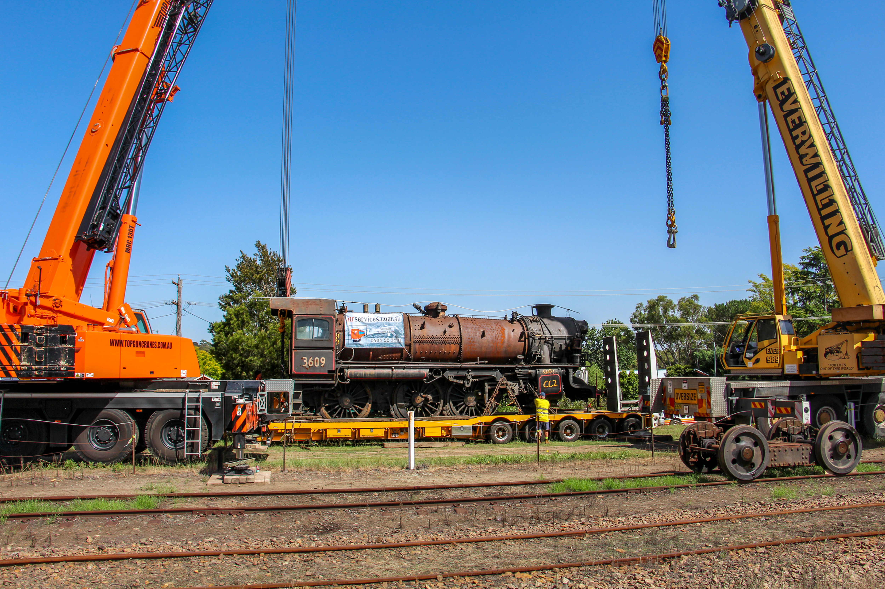
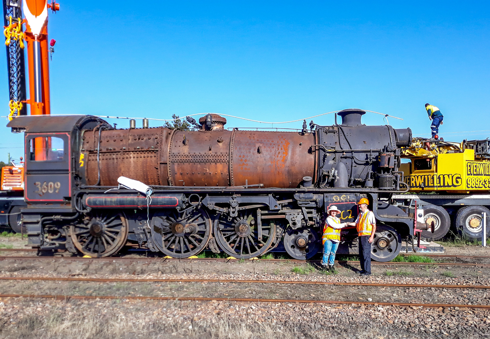
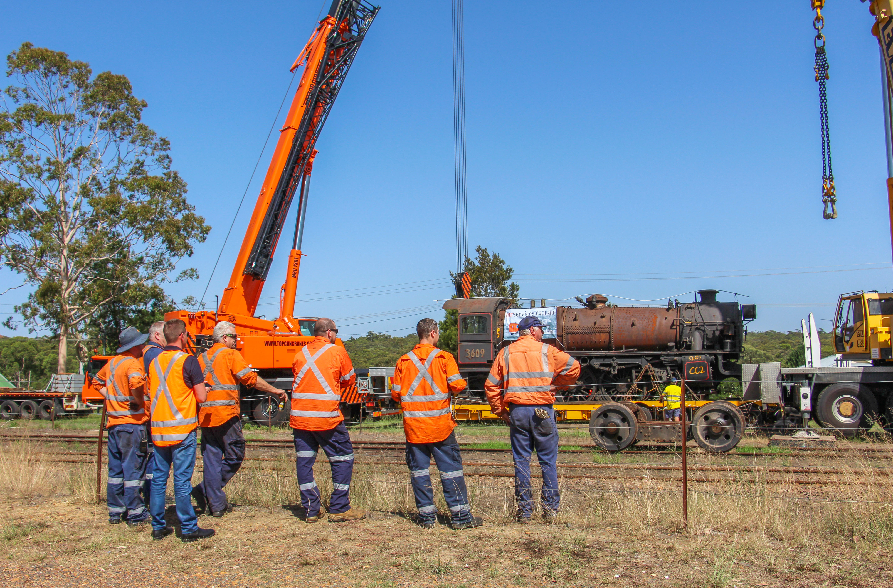
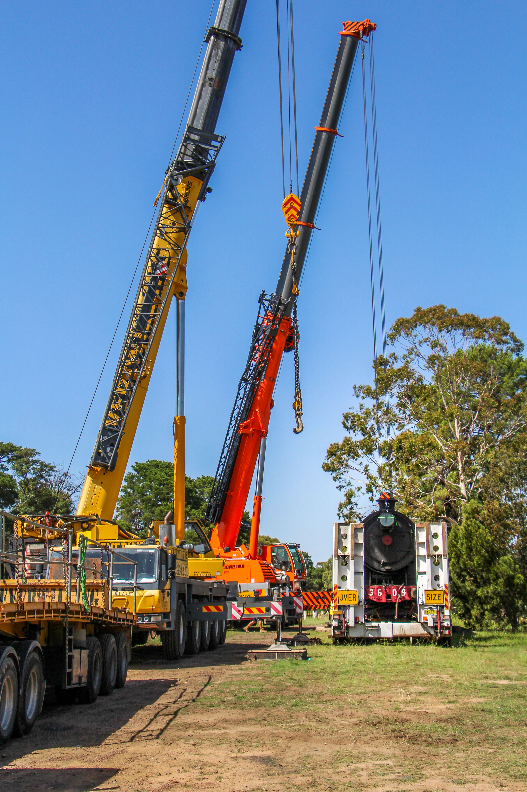
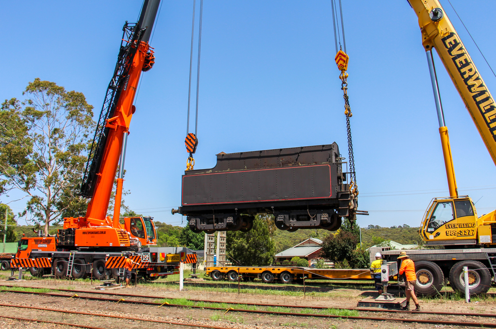

**A historic 90-year-old steam locomotive built by the NSW Government Railways has today embarked on an epic journey by road from Thirlmere to Junee.**

The 110-tonne steam locomotive ‘3609’ is set to become a permanent feature at its former base, the Junee Roundhouse, which today operates as a railway museum.

The engine was one of 75 of its type to be built in NSW during the 1920s and one of only three to survive in preservation today.

“This is somewhat of a homecoming for 3609,” said Transport Heritage NSW CEO, Andrew Moritz.

“36-class steam locomotives regularly worked the railway line between Sydney and Albury on trains travelling to and from Melbourne and as such a number were allocated to Junee.”

“Thanks to the funding we receive from the NSW Government, we can now return a 36 class to Junee as a way of interpreting the region’s significant transport history.”

The locomotive will be transported by road from the NSW Rail Museum at Thirlmere using three separate trucks and is expected to arrive into Junee sometime Wednesday afternoon before being unloaded at the Junee Roundhouse Railway Museum Thursday morning.

“We’re most grateful to Transport Heritage NSW for lending us this significant piece of NSW railway history,” said Regional Heritage Transport Association Curator, Ron Ison.

“We can’t wait to spend the time refurbishing the engine so she’s in a condition to be displayed as a key attraction for the museum for years to come.”

THNSW Heritage & Collections Manager, Jennifer Edmonds, with Junee Roundhouse Railway Museum Curator, Ron Ison.

