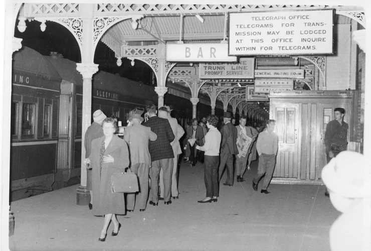
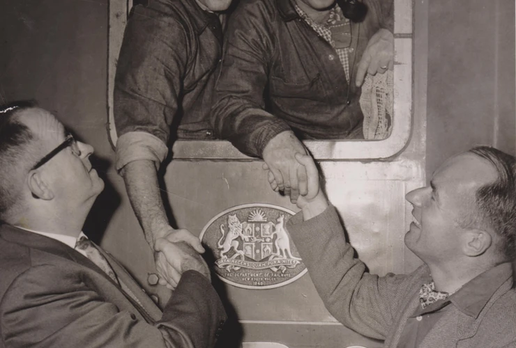

**After more than 100 years of changing trains at Albury, the completion of the standard-gauge connection to Melbourne improved travel conditions between the New South Wales and Victorian capital cities. The regular, standard-gauge operations began with a set of *Spirit of Progress* cars being delivered to Sydney on 15 April 1962, following which there was a set in each capital city to start the regular service the next day, allowing for one daily train in each direction.**

In association with the railways, the Australian Railway Historical Society’s NSW and Victorian divisions sold tickets for the *Spirit’s* delivery run to rail enthusiasts keen to see history made. Although the car set was diesel hauled out of Melbourne by Clyde GM S313 Alfred Deakin, the NSW Railways provided two 38 class steam locomotives at Albury (3830 and 3813) to haul the train into Sydney as a special. With a number of photo stops along the way to allow enthusiasts to capture the event, the train was 29 minutes late leaving Goulburn. Determined to make up time, the lead driver out of Goulburn, Chris O’Sullivan, drove hard, eventually arriving at Strathfield Station ahead of schedule. The train was held at Strathfield to wait for the timetable to catch up and it arrived at Sydney Terminal on time.

A project to capture the excitement of the event as part of the broader break-of-gauge story has included recording oral memories from three of the men who participated on that day — Malcolm Daly, 3830’s fireman out of Junee; Dave Thurlow, 3830’s fireman out of Goulburn; and Raymond Love, one of the enthusiast passengers on the train — and developing them into a short film documentary. The film was launched at the Thirlmere Festival of Steam in early March, but will become part of a small permanent exhibition with the headboard and other ephemera from that journey currently under development.

The interpretation planning that the Curatorial Committee has been working on is an effort to better connect our objects with the history they represent. A part of this reimagining of our interpretation is to find better ways to tell the personal stories that illustrate these connections. The retelling of the first standard-gauge *Spirit of Progress* run is the first in a planned series of short video documentaries that tell the story of NSW transport history.

Last change at the border: passengers changing trains (and gauge) for the last time at Albury Station. -Railway Resource Centre, Australian Railway Historical Society, NSW Division

Fireman David Thurlow (left) and driver Chris O’Sullivan (right) in the cab of 3830 at Sydney Terminal, shaking hands with the two ARHS organisers on the successful and on-time completion of the delivery run of the Spirit of Progress. -C. Cardew, Dave Thurlow Collection

*This article was originally published in the autumn 2019 edition of Roundhouse magazine. Written by Jennifer Edmonds, Heritage & Collections Manager.*
