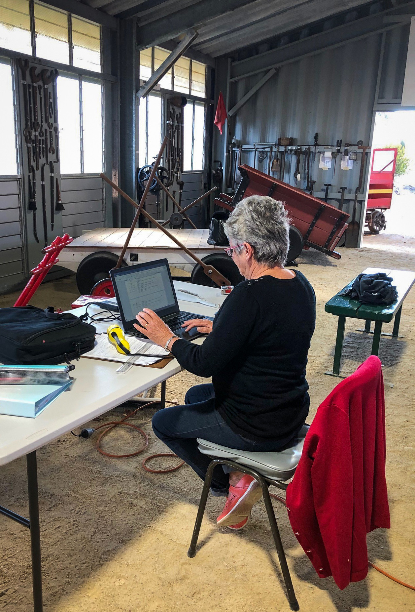

**When Tenterfield Station was closed to traffic in 1989, staff didn’t believe the closure was permanent. They walked out leaving everything intact, thinking they would return to their jobs in the near future.**

Now in the custody of the volunteer Tenterfield Heritage Railway Station group, these items make up a significant part of the entire collection on display at the museum. Although it was known the items existed, the collection had not been catalogued, which is a requirement of the contract Transport Heritage NSW (THNSW) has with Transport for NSW.

Consultant Margot Jolly was engaged to work with the volunteers at Tenterfield to catalogue their collection and provide data to be entered into the larger database. Part of her remit was to provide training and support to the volunteers, allowing them to continue cataloguing their own collections and new acquisitions as they arrived.

Lois McGuinness is one of the volunteers who engaged with the project.

“I started participating in the cataloguing project to give Margot a hand and very soon was hooked on it,” she said. “As I was enrolled in a computer course at our local TAFE, it piqued my interest in continued learning. Cataloguing has given me another interest.”

Lois explains that she has found the experience priceless, as it has taught her patience and piqued her curiosity and a thirst for more knowledge.

“I have learned that keeping exact records are an important part to running a museum,” Lois stated. “Being aware of what relevance items have to the museum, where they have come from and what they bring to the museum is also very important.”

Lois McGuinness cataloguing objects in the trike shed.

“The whole project has shown me how everything in this museum has a story,” she shared. “Our wonderful volunteers breathe life back into objects that have been forgotten for so many years. Each project then becomes a living story of the rail history in Australia and our area. Cataloguing puts objects into that story. Keeping a record of each item allows you to display them so they fit into each little bit of history.”

The project has given Lois a new understanding of the objects in the care of the museum and an appreciation of not only the obvious tales they tell, but also some of the less obvious ones.

“Every object that we catalogue becomes a favourite as I think of what story it could tell me,” she said. “The badges that the workers would have worn tell of the hours and courses they have done to attain them. The tools they worked with tell of the physical toll on their bodies and the photos tell of the hardships many endured. I love them all and am so glad to be part of this story.”

*This article was originally published in the winter 2019 edition of the sector report.*
