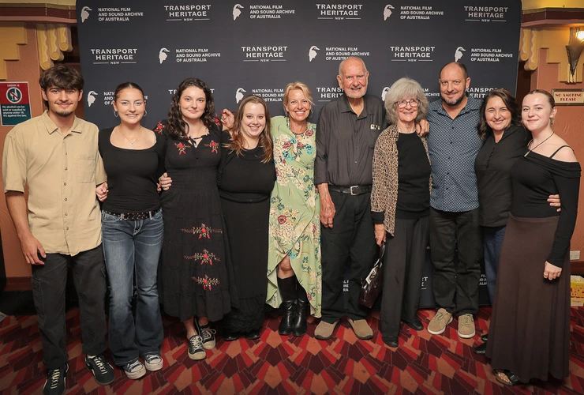
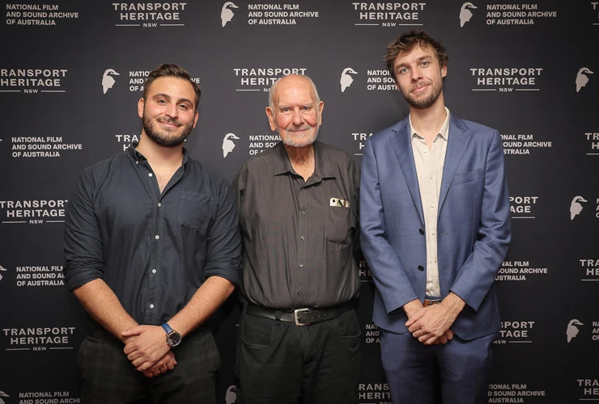

**Transport Heritage NSW (THNSW) was proud to partner with the National Film and Sound Archive of Australia (NFSA) to mark the 50th anniversary of *A Steam Train Passes*—widely regarded as Australia’s finest railway film.**

This cinematic milestone was celebrated with two sold-out screenings at Sydney’s Hayden Orpheum Picture Palace on 2 April and the NFSA’s ARC Cinema in Canberra on 6 April. The opening night featured a special appearance by the film’s original director, David Haythornthwaite, who introduced the screening.

Film Director David Haythornthwaite introduces A Steam Train Passes on 2 April 2025.

Audiences were especially captivated by a brand-new 27-minute documentary produced by THNSW and directed by Steve Chestney of Viewix, which explores the making and enduring legacy of *A Steam Train Passes.* The short documentary features interviews with original filmmakers Anthony Buckley AM, Dean Semler AM ACS ASC, and George Dreyfus AM.

It also includes insights from acclaimed director George Miller AO and several passionate railfans who witnessed the production. Among them are David Oram, David Honer, Dale Budd OBE—who reflects on the struggles of steam preservation in the early 1970s—and former train driver Graeme Kirkby.

Watch A Steam Train Passes: 50 Years On trailer

Adding to the evening’s rich historical offering, NFSA Curator Jeff Wray presented rare 38-class locomotive footage from the NFSA’s Jim Powe Collection, accompanied by live commentary. This unique segment offered a compelling glimpse into New South Wales’ rail heritage through the lens of one of Australia’s most esteemed rail videographers.

THNSW extends its thanks to everyone who joined us in celebrating this cinematic treasure—including representatives from Transport for NSW, Sydney Trains, ABC, National Archives of Australia, *The Sydney Morning Herald*, the Australian Society of Cinematographers, artist Paul Mac, and director Peter Weir (*Dead Poet’s Society*, *The Truman Show*).

***THNSW is currently in discussions with the NFSA regarding additional screenings in the second half of 2025. Stay tuned for updates and future announcements!***

