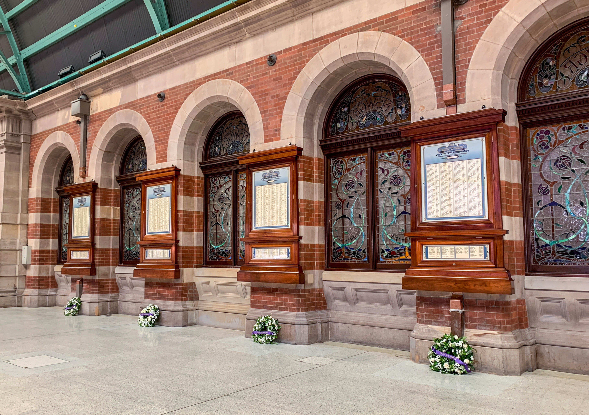

**If you’ve walked through Central Station in the past few months, you may have noticed four beautifully conserved honour boards mounted on the sandstone wall on the Grand Concourse.**

They were created by the NSW Government Railways and Tramways to immortalise the railwaymen who lost their lives in WWI through service to their country. Of the 8,477 railwaymen who enlisted in the Australian Imperial Forces and served in Expeditionary Forces during the First World War, 1,214 lost their lives.

The honour boards were originally installed in the Grand Concourse in 1916, but removed in the late 1950s and placed in storage. At some stage during their storage, they suffered from insect attack and got wet, resulting in significant damage to the timber cases and paper rolls.

The boards are part of the State-Owned Heritage Collection that Transport Heritage NSW (THNSW) was given responsibility for managing in 2014. A review of their condition showed the honour boards would need substantial intervention before they could be returned to public display. Funded by Transport for NSW (TfNSW), THNSW was able to contract art conservators Art and Archival in Queanbeyan to stabilise and replicate the paper rolls and decorated glass, while furniture conservators Anton Büchi and Sons repaired and refinished the cabinets, returning the boards to their original glory.

The beautifully conserved and re-installed honour boards.

**Official unveiling**

Sydney Trains’ Heritage Unit advocated for and coordinated the reinstatement of these significant boards into their original location. On Thursday 8 November 2018, Sydney Trains, NSW TrainLink and THNSW hosted an official unveiling at Central Station, where the four honour boards were reinstated in their original location for public viewing and ongoing commemoration.

After hearing a variety of historic songs from the NSW Railway Band, Howard Collins OBE, Chief Executive, Sydney Trains and NSW TrainLink, welcomed hundreds of special guests and bystanders to the unveiling.

Jennifer Edmonds, Heritage & Collections Manager, THNSW, and the manager of the project, shared a background story about the project and acknowledged some of the guests related to the men listed on the honour boards.

Dale Budd, Board Director, THNSW, closed the ceremony by sharing a biography of one of the railwaymen. He then officially transferred care and custody of the honour boards to Sydney Trains and the people of NSW by handing over a set of keys made for the boards to Sydney Trains Chief Executive Howard Collins.

After the ceremony, guests were invited to the new Eternity café in Central Station for light refreshments and networking.

The core team that worked to make this project and event a success.

**NSW Railways Remembers**

Biographies of the railwaymen memorialised on the honour boards can be found on the NSW Railways Remember website: **www.nswrailwaysremember.com.au**.

To bring a sense of connection to the names on the board, THNSW contracted the Australian Railway Historical Society (ARHS) to research each individual and write a brief biography, including the men’s railway and war service. The website is searchable by name.

THNSW is appreciative of the efforts of all who were involved in this project, including Sydney Trains, NSW TrainLink, ARHS, Art and Archival, and Anton Büchi and Sons. We would also like to acknowledge TfNSW, who funded the project through the Independent Funding and Advisory Panel.

A detailed story of the Central Station WWI honour boards can be found on page 38 of the winter 2018 edition of *Roundhouse*.

**Biography: James Watson**

This is one of the 1,214 biographies located on the NSW Railways Remember website:

*James Watson was born on 30 June 1894 in Lewisham, NSW. On 3 March 1911 he joined the NSWGR&T as an Apprentice Fitter in the Locomotive Branch, based at Eveleigh. On 30 June 1915, as was normal practice at the time, his services were dispensed with when his apprenticeship was completed. He was re-employed by the railways on 19 July 1915 as a fitter in the Locomotive Branch, based at Eveleigh, and on 6 August 1915 was released from duty to join the AIF at the rank of private.*

*He embarked on SS ‘Makarini’ in Sydney for Egypt on 5 April 1916, arriving at Suez on 2 May 1916. A week later he embarked at Alexandria, bound for the battlefields of France and arrived at the 1st Australian Division Base Depot at Etaples on 20 May 1916. On 25 May 1916 he was assigned to the 1st Anzac Entrenching Battalion, although the unit did not officially come into existence until 6 June 1916. The role of this unit was to provide reinforcement infantrymen with exposure to combat conditions by undertaking engineering works near the front line. The aim was to improve their training before being posted to front line infantry battalions.*

*On 11 July 1916, James was transferred to the 1st Infantry Battalion after which, according to official records, on 21 July 1916 he was killed in action at Pozieres and was buried in the vicinity of Pozieres.*

*James is commemorated at the Villers-Bretonneux Memorial, Villers-Bretonneux, Picardie, France.*

Visit **www.nswrailwaysremember.com.au** to review the full database of biographies.

*This article was originally published in the summer 2019 edition of Roundhouse magazine.*
