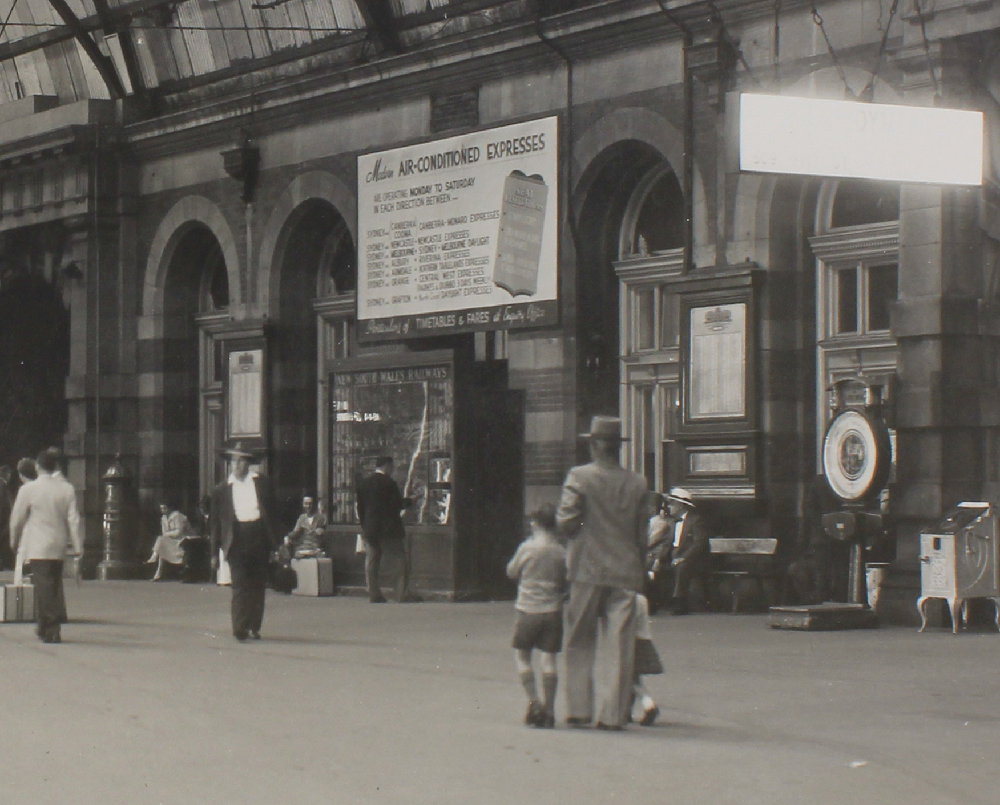
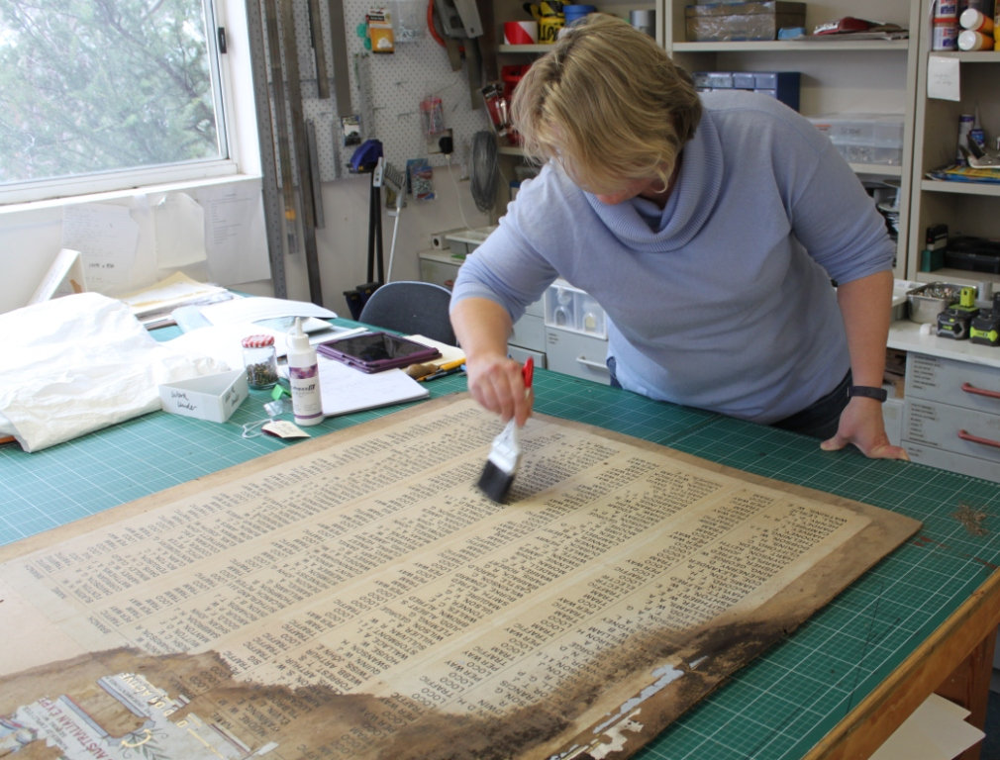
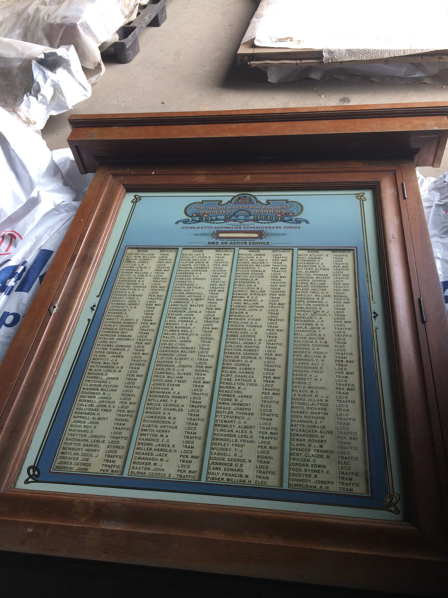

**A set of honour rolls made by the NSW Railways to commemorate the 1,200 railwaymen who died serving their country during WWI is the subject of a major current THNSW conservation and research project.**

The rolls were displayed on the concourse at Central Station until (we believe) sometime in the 1960s. The information surrounding their subsequent location has been sketchy, but they became part of the State Movable Heritage Collection stored at North Eveleigh, moved to Chullora for storage and were eventually handed over to THNSW for care.

The rolls are four sets of two timber cases with back-painted glass doors, framing the names printed on heavy paper glued to a thin backing board.

The honour rolls in their original location on the Central Station concourse in 1958. -Sydney Trains

At some point during their lives, the rolls have been subjected to water ingress, resulting in mould growth across the paper that has in some cases completely obscured the names. Silverfish and other insects have also made their homes inside the cases, eating the ink off the paper. One paper roll was missing completely, presumably removed and never replaced. Finally, the decorative paint on the glass has been damaged in many instances, with substantial areas where the paint has been lost from the original design.

Working with the Sydney Trains Heritage Unit, we are aiming to return them to permanent display at Central Station, which has its own set of complications. The paint and the ink on the paper are susceptible to fading caused by UV, and glass in any publicly accessible area that sees so much traffic each day is of course at risk of breakage, whether by accident or intent. To mitigate these risks, our scoping brief for the conservation works for these rolls included stabilisation and consolidation of these original components, and their removal and replacement with replicas. The originals will be conserved and packed for long-term storage and put away for safekeeping as part of the State Movable Heritage Collection. To protect the new glass from breakage, a thinner sheet of glass than the originals will be used, and a sheet of clear acrylic will be inserted between it and the front of the case to take the force of any impact. Should breakage occur, it should only be the acrylic insert that needs replacing and not the decorative painted glass behind it.

A paper conservator is using dry cleaning techniques to carefully lift the layers of accreted dust, mould and insect deposits from one of the paper rolls. You can see where the paint has come off the glass and adhered to the board on the bottom left of the image. -Art and Archival

A specialist art conservation company has been engaged to carry out these works, as well as effecting repairs to the timber cases. The artwork on the original glass has been mechanically cleaned and the remaining paint has been consolidated in place. The paper rolls have been dry cleaned and stabilised, and the names obscured by mould or insect damage have been identified under UV light, while collaboration with the Australian Railway Historical Society team in Redfern has allowed the names on the missing roll to be identified. Methods of replicating the original artwork on the glass have been trialled and a technique has been chosen from supplied test pieces. Additionally, the ARHS has identified four further names that the Railways acknowledged should have been on the rolls in their own records, but were never actually added. These four names will be added in a space available at the end.

The case keys were missing, so new keys have been manufactured and the locks have been refurbished. The blackwood cases have been cleaned and, where required, areas are being refinished with French polish. The conservators advise they can see clear indications of a previous repair to the cases, which have been done in Queensland maple and stained to match the original timber. Two cases were missing their mounting plinths, and replacements for these are being made, while major chips in the cases are being repaired with blackwood. As with all such work, one of the challenges is in retaining evidence of age and use through the wear and patina on the objects, while returning them to a complete condition for display.

While one of the boards remained intact and in very good condition (above), the others were in various states and stages of deterioration.

The second part of the project involves a short biography of each of the men, 1,214 in total, to be made accessible online in a searchable format. The ARHS/NSW has been contracted by THNSW to carry out the research work, and although the aim was originally to have 200 biographies completed on the database by November, the ARHS reports it is well ahead of that target already with over 400 biographies completed. Each story is unique and a paper conservator is using dry cleaning techniques to carefully lift the layers of accreted dust, mould and insect deposits from one of the paper rolls. You can see where the paint has come off the glass and adhered to the board on the bottom left of the image. Art and Archival heartbreaking, and helps bring to life the sacrifice made by these men, providing an extra dimension of engagement and understanding to the physical objects themselves.

The aim is to have the boards completed and returned to display at Central Station in time for the 100th anniversary of Armistice Day in November 2018.

*This article was originally published in the winter 2018 edition of Roundhouse magazine. Written by Jennifer Edmonds, Heritage & Collections Manager.*
