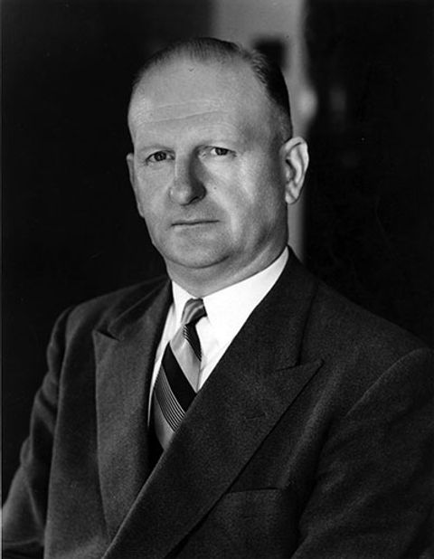

**During the latter part of 2018, the Board of Transport Heritage NSW approved the recognition of four now-deceased supporters of the NSW Rail Transport Museum, now known as the NSW Rail Museum.**

**The four gentlemen referred to assisted in the formation of the museum during its early years and never received official recognition in the form of life membership, principally due to the fact that conferring of that honour had not been established at that time.**

All four are deceased and it was felt that the time has come to acknowledge the work of this group of early supporters and volunteers.

Official recognition was recorded on 24 November 2018 during the 2018 Annual General Meeting of Transport Heritage NSW held at the NSW Rail Museum. The four supporters are:

* Neal McCusker CBE, NSW Railways Commissioner, 1956-1972
* Douglas Patterson
* William McNiven
* Peter Berriman

It is planned to provide the membership with details of the assistance and support given by these four gentlemen. This issue of *Roundhouse* presents the first of the four stories of these Champions of Heritage Transport, that of Neal McCusker.

Neal was born in 1907. In 1923, he joined the NSW Railways as a Junior Porter at Byrock, 177 miles west of Dubbo, in western NSW. At the time, Neal’s father, John McCusker was Station Master at Byrock.

Neal rose through the ranks in the NSW Railways and was appointed as a Station Master in 1927. By 1942, had attained the rank of Staff Inspector. In 1950, he was appointed as Executive Officer to Reg Winsor who in 1952, was appointed Commissioner for Railways. Following Reg Winsor’s resignation in 1956, Neal McCusker reached the highest position in the NSW Railways – Commissioner for Railways. He was awarded a CBE in 1959.

Neal McCusker was well-known for his modernisation programs during his time as Commissioner, including the replacement of four-wheeled goods vehicles with bogie vehicles and his determination to replace steam locomotives with diesel-electric and electric locomotives. Even though he brought about major improvements to most aspects of the railways during his tenure, he officially sanctioned community efforts to preserve historic NSW railway rollingstock, artefacts and documents.

In the early 1960s, Neal McCusker gave a nod of approval to the (then) ambitious plans by a small group of young rail enthusiasts to set up a NSW railway museum. At one time, he was quoted as saying he would prefer to see organised preservation rather than ad-hoc and random preservation in parks where vandalism and the weather would eventually lead to the item being scrapped.

In 1967, five years after the formation of the NSW Rail Transport Museum, Commissioner McCusker approved the indefinite retention of twelve steam locomotives in operating condition. As a final gesture before his retirement as Commissioner, Neal McCusker officially opened the NSW Rail Transport Museum at Enfield on Sunday 22 October 1972.

Neal McCusker retired from the NSW Railways in late 1972 and passed away in July 1987.

The NSW Rail Transport Museum (later NSW Rail Museum) owes its existence to the encouragement and approval by former Commissioner for Railways, Neal McCusker. It is fitting that he be recognised for his support by being nominated a ‘Champion of Heritage Transport’.

*This article was originally published in the summer 2019 edition of Roundhouse magazine. Written by Ray Love OAM, Life Member.*
