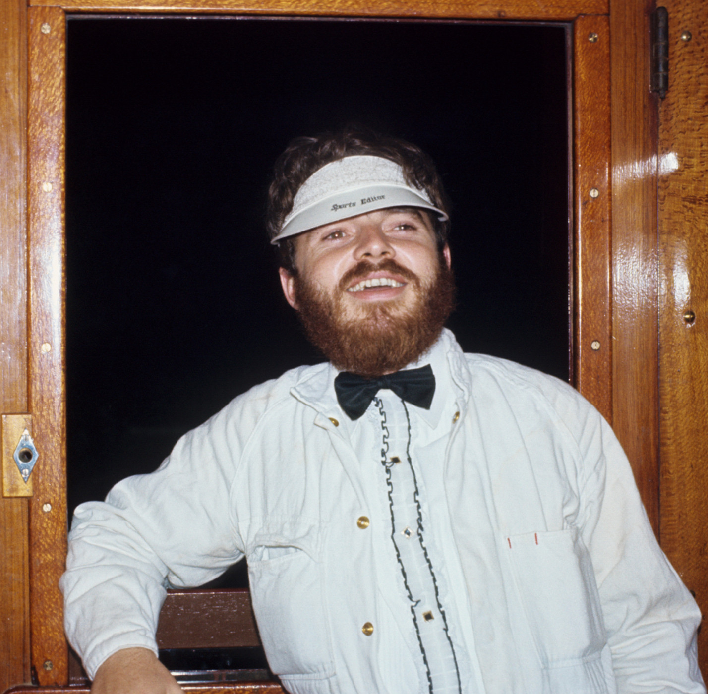

**Following the recognition given by the creation of this new award at the 2018 Annual General Meeting, the following essay acknowledges the contribution made by William (Bill) McNiven towards the operation of the NSW Rail Transport Museum (now NSW Rail Museum). This is the third award made in this category.**

Bill had a life-long interest in railways. In the 1960s, he was president of the Shore School Railway Club and started organising steam train tours while still in his teens.

Bill joined the NSW Rail Transport Museum (NSWRTM) in March 1965 and served in many different capacities during his time, including assistant publications officer, member of the publications committee, tours officer and, most importantly, president of the organisation.

Bill became president in March 1984. At this time, the museum had a membership of approximately 2,300 members. It was running a small office in Burwood, a retail outlet at Thirlmere and opening the museum for public visitation.

Showing the other side of Bill, this photo shows him with his sports editor hat on during life member Dale Budd's bucks night. The occasion was organised by Bill in December 1970 with a 30T to Hornsby. -Dale Budd

Probably the museum’s most challenging undertaking was maintaining a fleet of locomotives for the purpose of conducting heritage tours. The facilities available for fleet maintenance were very primitive, with even the floor of the engine shed not being completely concreted. During this time of running a programme of steam tours, the museum did not have the benefit of a water column or turntable on site. It did have a small paid staff, but no regular government funding with which to pay them.

In addition to maintaining the heritage fleet, the museum was mindful of its obligation to preserve its exhibits, but this was no easy task at that time, as there was no roof cover over the whole site. Efforts were also being made to bring certain exhibits up to exhibition standard. Also, on 20 November 1983, locomotive 3801 was taken to the State Dockyard for rebuilding by the Hunter Valley Training Company.

One of the museum’s greatest assets was a large, active and dedicated volunteer workforce. However, while active and dedicated, not all the workforce was dedicated to the same objectives, which led to competition for available resources.

Obviously, under these circumstances the position of president was not for the faint hearted. Despite this, Bill voluntarily took on the position of president even though there was no prospect of him ever receiving any financial reward for the difficult task he undertook. The years of Bill’s presidency was from 1984 to 1987 (inclusive), which were years of advancement and intense activity for the museum.

A most surprising achievement during the term of Bill’s presidency was that the NSWRTM secured contracts for the restoration of exhibits owned by the Powerhouse Museum (Museum of Applied Arts & Sciences). Even while this contract work was undertaken, the NSWRTM was able to support an incredibly intense steam-powered tours programme for the entire duration of Bill’s presidency. From time to time, it also provided locomotives and/or rolling stock for film work.

Despite this intense programme of restoration, operation and maintenance of heritage rolling stock, the museum did not neglect its duty to be a place of education. The *Small & Miscellaneous Exhibits* display was opened on 15 July 1984 and group visits became very popular.

During the years of Bill’s presidency, in addition to the events outlined above, 5910 was both returned to steam and repainted, the turntable was installed, the water column was brought into operation, static restoration was carried out at a rate not since replicated, additional bays of roofing cover were financed and erected, the museum at Thirlmere commenced opening seven days per week and the museum computerised its accounting system.

While some of these achievements were projects coming to fruition after years of previous effort, the amount of progress in the years 1984 to 1987 is, in retrospect, truly amazing.

Following his departure from the executive, Bill continued his active service by contributing towards a number of restoration projects up until his untimely death.

He must have, at times, been under both physical and emotional strain. That he was able to hold the organisation together, and for it to prosper to the extent that it did under his leadership, surely makes William James McNiven a champion of heritage transport.

*This article was originally published in the winter 2019 edition of Roundhouse magazine. Written by Gil Wheaton and Allan Leaver, Life Members, THNSW.*
