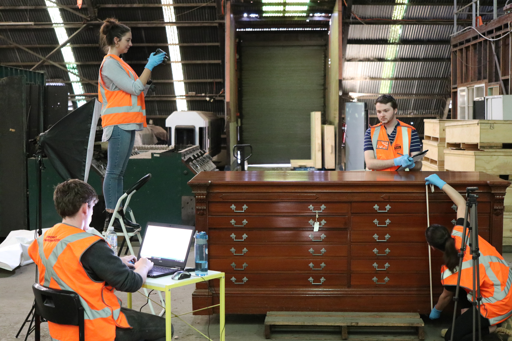

**Transport Heritage NSW (THNSW) is currently undertaking an internship project with students from three universities – University of Sydney, Macquarie University and Australian National University. These students are pursuing a variety of degrees, including museum and cultural heritage studies, archaeology, and history, and have been participating in a collection condition reporting project within the RailCorp Movable Heritage Collection stored in the Igloo building at Chullora.**

The group is assisting with objects handling and movement, basic object cleaning, research, photography and report writing, as well as gaining valuable museum registration and conservation experience. The students have also had the opportunity to use EMu, THNSW’s collection management system. EMu is a database used by many leading museums in Australia that enables users to process, store and utilise museum collection information.

Condition reporting involves analysing museum objects and describing both present damage and the object’s current state of preservation. For instance, an artwork may have mould or a metal object could have signs of corrosion. The students’ role is to assess an individual object, report its condition on a standard form and support their assessment with photographs. This information is then entered into EMu for the object’s record.

University students conducting object condition reporting at Chullora. From bottom left to right: Jacob Kiefel, Caitlin McCormack, Thomas Romanis and Emily Webb.

One participant, Caitlin McCormack, describes her experience in more detail.

“I never expected my internship would require me to be so many things. In the last month, I’ve been a photographer, a seamstress, a carpenter, a removalist and (of course) a condition reporter. Only a few weeks in and I feel like a jack-of-all-trades. However, it’s without a doubt that I still have so much to learn from Chris about housing, protecting, archiving and conserving the collection, particularly in such a challenging environment.”

Caitlin is currently undertaking a Masters of Museum and Heritage Studies at the University of Sydney. In addition to her duties at the Igloo, she has travelled to the NSW Rail Museum at Thirlmere to gain further collections experience.

If you are interested in participating in this internship project, please contact Chris Fielder, Collections Officer, on **(02) 4683 6818** or at **chris.fielder@thnsw.com.au**.

*This article was originally published in the winter 2019 edition of Roundhouse magazine. Written by Chris Fielder, Collections Officer.*
