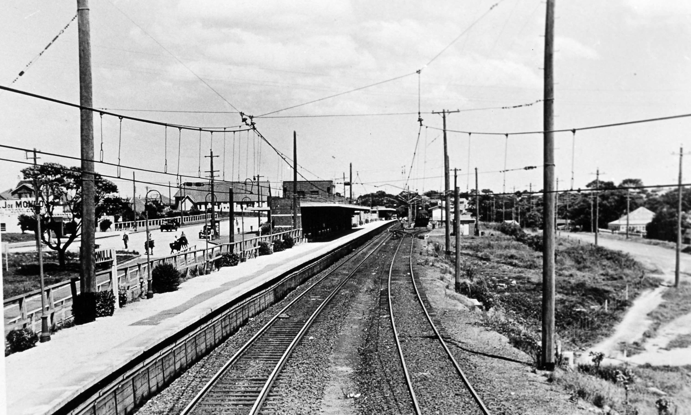
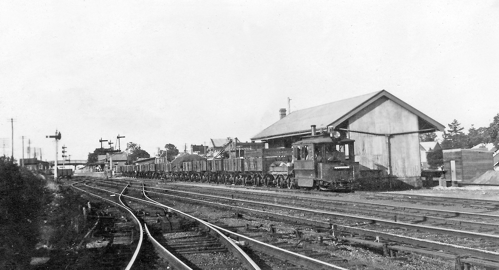
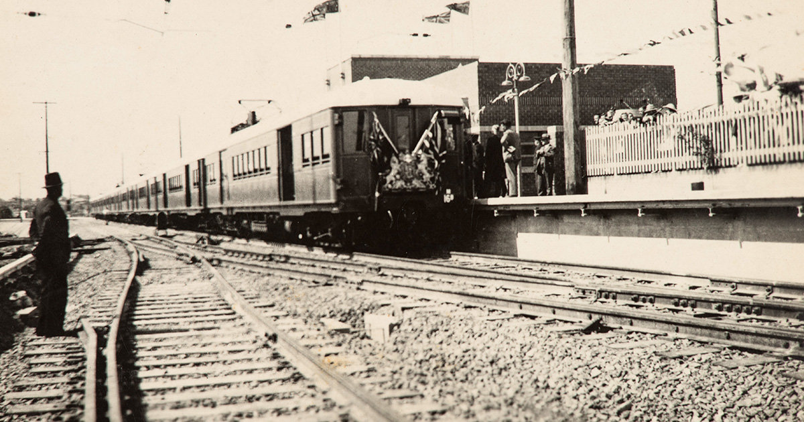
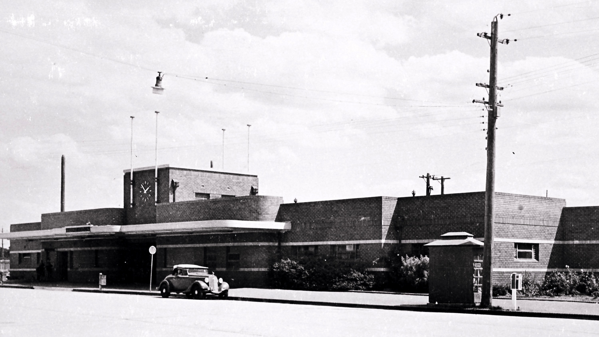

### The Cronulla railway line is celebrating 80 years of service to Sydney’s southern suburbs. It provides passengers with a railway line to the only beach serviced by rail in the metropolitan area.

###

**The heavy rail line replaced a steam tram, which opened in 1911 and closed in 1932. The line services similar locations to the original steam tram, but on a different alignment.**

The line branches off the Illawarra railway line immediately south of Sutherland Station and contains double track throughout, with all stations having island platforms except for Cronulla. Cronulla Station has a long platform, which is interestingly numbered as two platforms, capable of holding two eight-car trains and three stabling sidings.

The double-length platform at Cronulla was built to cope with large holiday crowds and originally designed to accommodate five trains.

### In the beginning

In the early 1900s, the beach areas around Cronulla became popular with day trippers and holiday makers. The government also began development of residential subdivisions between Sutherland and Cronulla, and horse-drawn omnibuses started servicing the route. However, they did not have the capacity to satisfy the weekend trade. A Sutherland-Cronulla Tramway League was formed towards the end of 1900 and a petition was forwarded to Parliament urging the construction of a tramway in the area.

The suggested route commenced at the southern end of Sutherland Station, proceeded north-east to the Princes Highway, east along the Kingsway, then south past the site of the present rail terminus to Shelly Park in the centre of Cronulla. Approved by a Parliamentary Subcommittee on Public Works in 1908, the single-track line with four stations and a goods siding was opened on 12 June 1911 at a cost of £37,505 (approximately $75,000).

The line was serviced by a steam- powered tram motor and up to three compartment-style tramcars. Goods wagons were also part of the tram and serviced sidings along the route. A connection between the tramway and the main south coast line was provided so that goods wagons could be exchanged.

Sutherland goods yard with a tram motor shunting goods wagons for delivery along the Cronulla line. Eveleigh Press.

The starting point of the tramway was on what is now Old Princes Highway, almost opposite Boyle’s Hotel. The tramway office is still standing and the Sydney Tramway Museum hopes to use the building when they are able to extend their line from the museum into Sutherland.

The single-track line ran parallel to the South Coast railway along the highway towards Sydney. It swung east around the Council Chambers thence on its own right-of-way on the southern side of the road. It traversed the Kingsway for its full length, through what are now Gymea, Miranda and Caringbah, to Cronulla. At Cronulla, the line swung by a gradual curve into Cronulla Street, through the main shopping centre, past the future Cronulla railway station, then via Waratah Street and Ewos Parade to a balloon loop terminal at Shelley Park in South Cronulla.

Additional tramcars were borrowed from the Kogarah-Sans Souci steam tram system on busy weekends. At peak weekend times, an additional tram motor was used to assist trams back to Sutherland. Before the additional motor was provided, it was common for the tram to stall on Miranda hill, requiring the assistance of male passengers to get it moving.

Crossing loops were provided between Auburn Street and Acacia Road, Miranda (near the corner of Kiora Road), Caringbah (near the intersection with President Avenue) and Woolooware (near the corner of Dolans Road and Hughes Street). Goods sidings were provided at Caringbah, Woolooware and in Cronulla Street near the intersection of Nicholson Parade and Waratah Street. Private sidings were later added at Brickworks in Kirrawee and Miranda Co-operative Society.

Running time from Sutherland to Shelley Park was only 35 minutes for the 11.9km journey. This included passenger pickups and set down, as well as safe working procedures.

Thousands of Sutherland Shire residents flocked to vantage points along the line to welcome the first electric train on 16 December 1939. In this photograph, the train has arrived at the terminus in heart of Cronulla just a short walk from the beach and ferry services to Bundeena and Audley. Sutherland Shire Libraries.

Extension of the electrification of the south coast line from Oatley to Sutherland saw trams scheduled to run at hourly intervals during off peak times and half- hourly during peak times. Goods traffic increased to over 8,000 tonnes during this period.

During 1927, a proposal to electrify the tramway was put forward, but nothing came of it.

By 1932, the Cronulla tramway had closed. Competing bus services had begun to operate with unrestricted competition. By this time, the tram line was so full with services that trams often ran late due to holdups at the crossing loops, causing passengers to miss their connections to the city or south coast at Sutherland. The line suffered large losses in its later years and the effect of the Great Depression forced it to cease its services. The last passenger service operated on 3 August 1931. The goods service continued until 12 January of the next year.

Although the closure of the tramway allowed railway planning to go ahead planning for the replacement railway line suffered various delays in the 1930s due to funding issues. The line’s construction competed with the proposal to electrify the Illawarra line to Waterfall and there were disputes over the point at which the line would connect to the main line. Two early proposals to join the line at Como and north of Sutherland Station were rejected. Local residents were also concerned that the railway would increase Council rates in the Cronulla area. Despite the delays, Parliament finally approved the line on 2 March 1936 and a route with five new stations was surveyed that would connect with the main line at the southern side of Sutherland Station.

A roadside view of the Cronulla Station building in 1940. The station building, like all those on the Cronulla Line, was built in Inter-war Functionalist style. The station at Sutherland also has similar style buildings, which were added at the same time as the station was redesigned for the opening of the Cronulla Line. Apart from more modern cars, the scene has not changed very much. The clock is still working, there is only a single modern telephone box and the post box and rubbish bin have been upgraded. Sutherland Shire Libraries

The estimated cost of building the line, including land resumptions, was $828,000 and the new line was opened on 16 December 1939 by the Governor, Baron Wakehurst, during a large ceremony at Cronulla Station. The line was electrified from its opening date.

Although crossing loops were installed at Caringbah and Gymea stations when the line was opened, the single-track line prevented the expansion of services to the Cronulla peninsula. In the 1980s, it was decided to duplicate a 3.5km section of the line between Gymea and Caringbah, with Gymea, Miranda and Caringbah all receiving island platforms. The new section was opened on 15 July 1985. In the 2000s, as part of the Rail Clearways Program, the two remaining single-track sections were duplicated. Woolooware and Kirrawee stations were upgraded, the Cronulla yard reconfigured and the branch line resignalled. The new track opened on 19 April 2010.

A proposed railway station near Sutherland Hospital has been discussed in the community. A 2002 joint study between Sutherland Shire Council and the NSW Government Railways was rejected and estimated to cost approximately $35 million. In 2014, a proposal for the station was designed, costing $20 million, which included two side platforms, street access and a direct ramp to the hospital, and involved an additional minute of travel time. In December 2014, Sutherland Shire Council again asked the NSW Government to consider building such a station. No progress has been made on the request.

In July 2019, a new bridge replaced the narrow road bridge over Gannons Road, Caringbah. Over one weekend, the old bridge was removed and a new pre-cast concrete structure was put in place.

### References

*The Steam Tram in Australia and New Zealand*, Bruce McDonald, Eveleigh Press, 2019.

*Railways (and Tramways) in the Sutherland Shire*, Peter Neve, Sutherland Shire Council, undated.

*This article was originally published in the spring 2019 edition of Roundhouse magazine. Written by John Casey, Roundhouse Editor.*
