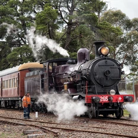
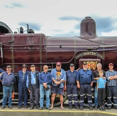
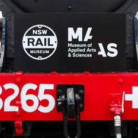

**After a 3-year mechanical overhaul in partnership with the Museum of Applied Arts & Sciences, locomotive 3265 returned to steam following a special ceremony held at the NSW Rail Museum on Saturday 24 November.**

The engine completed its first passenger trip from Thirlmere Station to Buxton and return with THNSW members and special guests on board.

It also operated during the NSW Rail Museum’s final day of steam on Sunday 25 November, hauling hundreds of guests along the loop line.

It’s important to note that locomotive 3265 received a full restoration completed by the staff and volunteers of the then Powerhouse Museum steam team in 2009. Since then, it has travelled far and wide, creating the need for a recent mechanical overhaul.

Thank you to all the staff and volunteers who worked together to return 3265 to steam for the enjoyment of the community.

[To read about the history of 3265, visit the MAAS website.](https://collection.maas.museum/object/87855)

