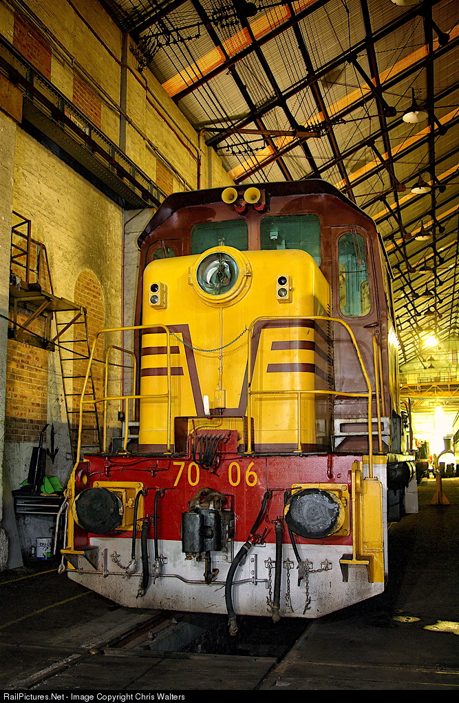

**Part 3: Acquisition & Restoration of 7006**

**Although the last day of 70 class operation was 11 September 1986, the manager at Port Kembla instructed staff to keep 7006 available should it be required to fill in as emergency backup. This meant that prospective buyers were kept away from any steps to acquire this locomotive.**

This situation ended in mid–1989 when the seven remaining 70 class locomotives located at Port Kembla were put up to public tender for their purchase. Both the Dorrigo Steam Railway & Museum (DSR&M) and Emu Bay Railway (EBR), along with the NSW Rail Transport Museum (NSWRTM), had expressed interest in acquiring some of these locomotives.

Records indicate that 7001, 7004, 7005, 7006 and 7010 were sold as a result of the tenders to Simsmetal Ltd. Locomotives 7003 and 7007 were sold to EBR. Following negotiations with EBR over the supply of parts, DSR&M ended up with 7007, 7008 (purchased previously) and 7010. This left 7004, 7005 and 7006 owned by Simsmetal.

Just prior to when scrapping was due to commence by Simsmetal at Port Kembla, the NSWRTM approached the scrappers with an offer to purchase 7006. The offer was accepted and on 26 March 1990, David Hinde and Michael Holden of United Hydraulics, Wollongong, became the owners of 7006. The stipulation was that the locomotive had to be removed from Port Kembla by 31 March 1990, as scrapping was due to commence on 2 April 1990.

Because the locomotive had been kept available as an emergency backup, it was still nearly complete. Oil and water were added, and a set of batteries were put together (mostly from 7004) and installed. The engine completed a test run and was declared safe to move.

Following an inspection of the siding track at Yallah, the track grooves were cleaned out and repairs to the access gate were completed on 30 March 1990. The locomotive was delivered by a local member/driver and inspector to the former Electricity Commission siding at the Yallah substation on 31 March 1990, where it joined 4306, which was already under restoration at that site.

A condition of the access to Yallah siding was that the NSWRTM had to vacate the siding should it be required for the delivery and removal of substation power transformers. Notice to this effect was received mid-April, stating that the siding would be required for a transformer delivery during the final week of May 1990. On 12 May 1990, the locomotive hauled 4306 to Albion Park Rail, where 7006 ran around 4306, then proceeded to the BHP Rail workshops at the Port Kembla Steelworks. The locomotives were placed into storage until 4 August 1990 when they were returned to the Yallah siding and work area where restoration work resumed.

Further access was required over 7 - 9 January 1992 when a power transformer was programmed to be delivered by road. It was necessary to move both locomotives out of the compound for access of the new power transformer, then return the locomotives to the compound each night. They were stored outside the compound fence during daylight hours.

**Restoration of 7006**

Following the arrival of 7006 at Yallah, a full assessment of the work required was carried out. This work was all to be completed before the locomotive could be relocated to Thirlmere.

**Drivers Cab:** Test and repair all control stand gauges; install battery voltmeter; install and commission ignition switch; fit replacement speed recorder; repair windscreen wiper motors; install and commission low oil shutdown alarm; install and commission engine running hour meter; install floor to short hood interior; fit access door and lock to short nose compartment; install and wire light in short hood; manufacture a 32V battery charger, install it inside short hood and connect to battery; wire 240V charger supply to external power connect socket; fit brake valve exhaust manifolds to exhaust brake air under floor; overhaul driver’s seat frames; paint and re-upholster; replace cab ceiling light fittings; fit control stand gauge light and glare shroud, and set to work; repair brake system air leaks; repair and refit cab windows; overhaul and test brake valves; fit baffles to base of control stand; sand and repaint control stand; replace damaged wall lining panels in the cab; repair, sand and repaint the cab interior; repair cab floor timbers; repair and re-hang cab doors; repair and set to work cab door locks; replace cab door seals; repair sander valve; remove and repair cab stove, and refit after repair; fit new labels to all control stand gauges and functions; install radio and power converter to top of dashboard; fit heat shrink plastic covering to all brake handles.

**Body Refurbishment:** Degrease engine room, radiator compartment and inside of the long hood; repair all rust affected doors and body panels; repair long hood door catches; repair multiple unit socket on short end; fit exhaust flap to top of engine muffler exhaust; refurbish all body panels, cab panels, cab roof, short and long end roof and panels; walkway and exposed frame sections needle gunned to remove old paint and rust scale; treat cleaned surfaces painted with metallised primer/undercoat; clean and repair battery box interiors and lids; paint battery box interiors with bituminous paint; replace step light fittings and set to work; remove radiator screens for repair; replace screen sections where necessary and prime and repaint; paint and line the body; apply the numbers.

**Operational Systems:** Degrease engine and transmission; repair brake hanger and brake shoe bushes, and replace one faulty brake hanger; repair oil cooler oil leak; repair brake system air leak; install de-sander air valves and hoses; replace worn out radiator hoses; repair damaged air lines and wiring connections; repair leaking fuel lines; repair air and fuel lines; all compressor and cooling fan couplings checked for correct operation and any out-of-specification wear.

**Completion and delivery**

All the above work was completed by the end of April 1993. On 5 June 1993, the locomotive completed a test run to BHP Port Kembla and return. All operating systems were checked during and after the run. All systems operated without any problems.

On 19 June 1993, engine 7006 was moved to BHP Port Kembla to prepare it for delivery to Thirlmere. All engine, compressor and transmission oils were replaced. All filters were cleaned or replaced, and the air filters were serviced.

On 16 July 1993, engine 7006 was coupled to some empty coal wagons and taken to Mount Kembla Colliery for a test run under load. Everything worked well apart from a problem that arose with the train brake. The fault was found to be a faulty brake feed valve. The valve was replaced with a spare from the BHP Rail Workshops and the brake function was normal following repairs.

On 14 August 1993, locomotive 7006 was delivered to Thirlmere, travelling via the Unanderra - Moss Vale line and on to Picton via the main line, where it switched to the loop line for the final run to Thirlmere. The locomotive disgraced itself by derailing one wheel as it passed through the museum gates. It was re-railed quickly and entered the museum to commence its life in preservation.

Having arrived at Thirlmere, 7006 was donated to the NSW Rail Transport Museum by David Hinde and Michael Holden of United Hydraulics, Wollongong.

The NSWRTM is also very thankful for the support of the Electricity Commission of NSW (later Pacific Power, then TransGrid) for providing access and support on their rail siding at the Dapto Substation at Yallah. The siding was removed not long after 4306 vacated the premises in 1995, as all future transformer movements were done by road transport.

**Restoration statistics**

There were 22 members who contributed to the restoration of 7006 at Yallah. Their names and the extent of their individual contribution are listed in the table below. Special mention must be made to Gary Woodward who was the project leader and main driving force behind the work group. Gary was also provided with the use of his employer’s work van on the project, which assisted greatly when specialist services and tools were required. Mention must also be made to John Knotek who provided the technical and manual skills for the project. The author provided the entire liaison between the NSWRTM and siding owners, as well as arranged for the loan of specialised equipment from the Electricity Commission when required.

This total of man hours does not account for the many hours spent in off-site planning and organising.

**7006 Restoration Project Workers List**

* Arends, Malcolm - 6.25
* Costigan, Jim - 52.00
* Edwards, Les - 1.50
* Estell, Don - 3.25
* Hinde, David - 61.00
* Holden, Mike - 53.25
* Howarth, David - 72.00
* Howchin, Phil - 56.75
* Hunt, Kevin - 2.00
* Knotek, Charlie - 48.25
* Knotek, John - 317.25
* Leabetter, Stephen - 93.50
* Leaver, Allan - 170.75
* Martin, Jim - 3.50
* Merrett, Bruce - 29.25
* Mosman, Dick - 5.00
* Parkinson, Bill - 30.00
* Peacock, Ken - 13.50
* Sinclair, Bill - 207.25
* Thomas, Mark - 4.25
* Williamson, Vaughn - 16.00
* Woodward, Gary - 427.00

Total man hours = 1,673.50

**7006 in preservation**

Locomotive 7006 saw little use following its arrival at Thirlmere. Because of the condition of the track within the yard at Thirlmere, the locomotive derailed a number of times, so it was set aside while ex-BHP locomotive D1 was used as shunter.

In early 2008, a request was received from the Powerhouse Museum Rail Division (PHM) located at the Large Erecting Shop at Eveleigh for the loan of a small shunting locomotive. The other tenant of the site, 3801 Limited, was unable to provide shunting services, hence the request. The NSWRTM responded with an offer to loan 7006, which was accepted. The locomotive was used to position locomotives at Eveleigh that were being restored by PHM. Following the return to operation of locomotives 3265, there was little need for 7006 to remain, so it was returned to Thirlmere.

Locomotive 7006 was loaned to the Powerhouse Museum for use at Eveleigh Workshops during the restoration of steam locomotive 3830. It is seen here inside the Large Erecting Shop on 17 April 2008. -Chris Walters

When work commenced on repairing steam locomotive 3830 at Thirlmere in 2012, it was realised that it was not possible to shunt the 38 on the turntable with locomotive D1, the then current shunter. An effort was made to return 7006 to service. It had deteriorated considerably since it returned from Eveleigh. So, in 2013, Max Blundell, assisted by the roundhouse staff and volunteers, performed a top overhaul on the engine, which involved the replacements of many engine parts. Body repairs were carried out and a new timber floor was fitted. Unfortunately, when the engine was started, the glow plugs failed due to incorrect wiring. Prolonged operation of the starter motors resulted in both starters failing as well. The locomotive was then set aside pending further investigation.

In 2016, some of the original restoration team from Yallah, led by Gary Woodward, met at Thirlmere to evaluate the work needed to return 7006 to operation again.

It was found that the glow plug ballast resistor had shorted out, allowing 32 Volts to be connected to the 24 Volt glow plugs, thus burning them out. A cheaper source of 24 Volt glow plugs was located in the United States. These were purchased and the wiring was modified via a relay to limit the supply to 24 Volts, thus ensuring the integrity of the plugs in future operation.

Both starter motors were removed and rebuilt, tested and refitted to the engine, and new batteries were purchased and fitted to replace the original second-hand batteries that came with the locomotive in 1990.

Once the engine was successfully started, the rest of the locomotive could be tested for correct and reliable operation. Many hydraulic hoses had developed leaks and were subsequently replaced. There were a number of air and water leaks that were attended to and all of the instrument gauges tested for correct and reliable operation.

A replacement set of air horns were sourced, as the original horns had been stolen by enthusiasts following the locomotive’s return from Eveleigh. These were overhauled and fitted. The radio console and power supply fitted at Yallah was removed, as this radio operated in a frequency band no longer used by either the railways or the museum.

A significant oil leak developed in the oil cooler. Once this was eventually repaired, the locomotive was declared fit for service. Since being placed in operation, the engine oil and filters have been replaced and a manufacturers service of the hydraulic transmission has been carried out.

Locomotive 7006 has already proved its usefulness as roundhouse shunter at Thirlmere, as it handles all of the shunting tasks with ease. It is far better suited for these shunting duties than using a main line unit. The roundhouse staff have completed repairs to the body and repainted the locomotive exterior. Once the signwriting has been completed, the cabin will be refurbished and a set of replica builder’s plates will be fitted. At completion of the work, it is expected that 7006 will give many years of reliable service, demonstrating the role that it was originally designed for.

**Credits**

*The information for this essay was sourced from the members’ sign-on and work record book used at the Yallah work site. Life Member Gary Woodward who led the project also assisted with filling the information gaps.*

*Photographs were sourced from the ARHS/nsw Resource Centre, Peter Neve, Chris Stratton, Gary Woodward, David Howarth via the Illawarra Group Collection and the author, Allan Leaver.*

*Locomotives 7006 and 4306 remain as a living testimony to the enthusiasm and dedication of the members of the Illawarra Group who, over nine years, were able to restore to operation two diesel locomotives.*

*This article was originally published in the autumn 2019 edition of Roundhouse magazine. Written by life member Allan Leaver.*
