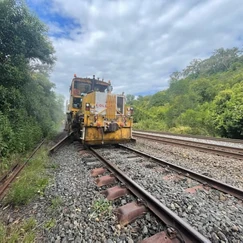
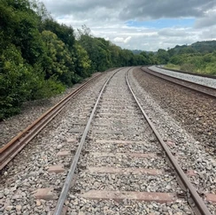
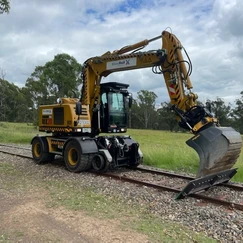
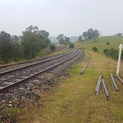
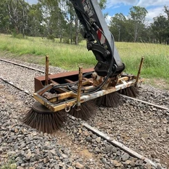
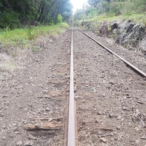

**Recent extreme weather in March and April impacted many homes and businesses in the local region, including Transport Heritage NSW (operators of the NSW Rail Museum).**

In March, in partnership with Wollondilly Shire Council, we made the unfortunate decision of postponing the much-anticipated [Thirlmere Festival of Steam](http://thirlmerefestivalofsteam.com.au), which will now take place on 25 and 26 June 2022.

At the same time, a significant embankment failure occurred at Picton, severely impacting ARTC’s corridor, including THNSW’s connection to the main line. ARTC have undertaken a significant program of emergency work to reconstruct the embankment and the track’s formation, including over 10,000 tonnes of rock being brought in to stabilise the area.

Further extensive work is required to ensure THNSW’s branch line can be reopened. It is currently anticipated that works will be completed, and the line reopened on 15 May. This emergency work has concentrated efforts and resources and some aspects of the Loop Line’s upgrade project were necessarily paused.

**Recent works**

Works completed up until just before the extreme wet weather included:

* Track sweeping, to remove excess ballast between Buxton and Colo Vale.
* Rerailing some 2.5km of rail between Maldon and Thirlmere.
* Track resurfacing of the newly re-railed section between Maldon and Thirlmere.
* Architects for the station precincts along the Loop Line will soon be appointed. First draft designs for the station precincts will be shared in the next two months for community feedback.

**Upcoming works**

The following works will take place on the Loop Line over the next month or so.

* Delivery of second-hand (recycled) sleepers from Northern NSW.
* Set-up of laydown (or material stock pile) areas in the rail corridor at nominated locations near Hill Top and Colo Vale railway stations.
* Repair of corridor access roads for maintenance vehicles between Hill Top and Colo Vale.
* Further geotechnical and bridge analysis between Hill Top and Colo Vale.
* Ordering of brand-new rail turnouts.
* Track re-sleepering from Buxton to Colo Vale is due to commence in May.

> Any residents directly affected by upcoming works will be notified via letterbox and on social media in advance of these works commencing.

If you have any questions about the project, please reach out to Transport Heritage NSW via:

* [**loopline@thnsw.com.au**](mailto:loopline@thnsw.com.au)
* **1300 11 55 99**
