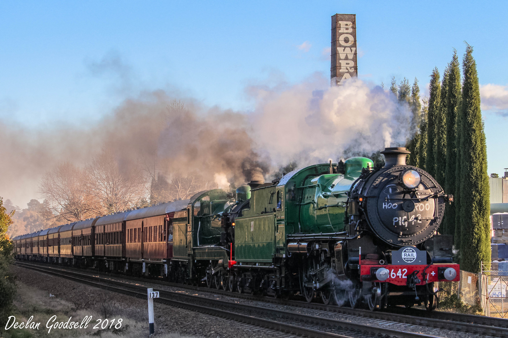
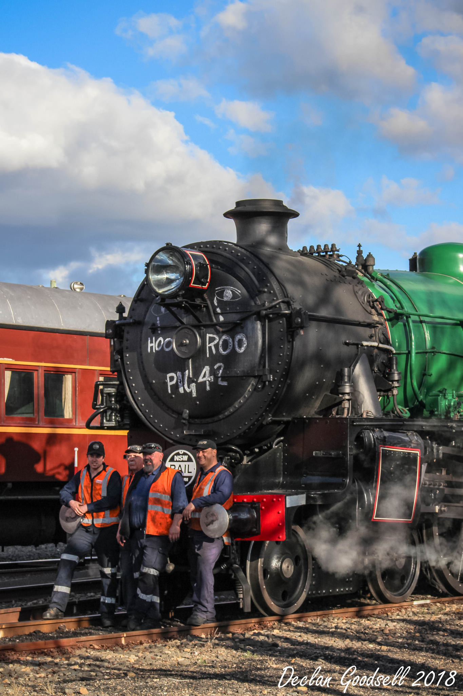

**At precisely 9.42am on 1 July, Goodwin Alco’s no. 4403 and 4490, in classic streamlined back-to-back, departed Sydney Central Station hauling 11 carriages. This day tour was an excursion to Southern Highlands for the purpose of paying a farewell tribute to our much loved and reliable workhorse, locomotive 3642.**

The trip was diesel hauled from Sydney to Picton for a change of motive power from diesel to steam, where recently overhauled 3526 teamed up with 3642 and double-headed the service from Picton to Moss Vale. This trip would be 3642’s last mainline run before being taken out of active service and undergoing a major overhaul. With 3526 recently reactivated into service after its five-year overhaul, this was almost a symbolic passing of the baton between the two engines.

Utilising the up refuge at Picton, the trainset with the two 44s stopped short of the siding and detached from the train before proceeding ahead to the Thirlmere loop line and returning to the museum light engine. Once the diesels were clear, the 35 and 36 exited the up refuge to attach onto the standing train before continuing the uphill journey to Bowral and Moss Vale.

Passengers and lineside photographers were treated with the amazing sight and sounds of the two 4-6-0 express passenger engines, as they climbed their way through the highlands. Lifting from a standing start after completing a drop off stop at Bowral, the sounds of both steam engines melodically echoed throughout the area as the train charged through Burradoo on the final stretch to Moss Vale.

Conveniently, Moss Vale yard has watering facilities provided on sidings clear of the mainline. This allowed the steam engines to be replenished for the return journey, as well as utilise the triangle junction, allowing the two steam engines to face back to Sydney. Before departing Moss Vale on the return trip, 3642 was marshalled to the lead with 3526 trailing. Afterwards, and before the two engines rejoined the trainset, the crew of 3642 upheld a long-standing tradition of an era ending. A simple message was chalked on the firebox – *‘hooroo 3642’*.

The same locomotive swap at Picton occurred on the return journey and the two 44 classes returned the train into Sydney later that evening.

**About the 36 Class**

Designed to be able to operate non-stop for distances of up to 100 miles (161 kilometres), the first of the 36 class entered service in 1925. Nos. 1 to 10 were built by the NSW Government Railways at Eveleigh, while the remaining 65 were constructed by Clyde Engineering. An interesting quirk saw the Clyde-built locomotives finished before the NSWGR-built engines, which meant that 3610 was the last of the class to enter service.

The 36 class locomotives were originally fitted with round-top boilers, which gave them a somewhat porcine appearance, and this, coupled with difficulties in firing their narrow fireboxes and the regular repairs required to the boilers, led to the nickname 'Pig'. Most of them were re-boilered with Belpaire fireboxes and given new style cabs to match during their service lives, although the nickname remained.

With the 36 class came the introduction to the NSW railways of the 'turret' style tenders, which gave the crews better vision when travelling in reverse.

Locomotive 3642 entered traffic in January 1926 and was withdrawn from active service in November 1969 before being retained for the NSW Rail Museum.

**The Future for 3642**

Following the recent return to heritage service of locomotive 3526, locomotive 3642 can now be retired from regular main line operations. It is currently being considered for major overhaul, subject to funding and future fleet requirements. In the meantime, 3642 will be maintained in a serviceable condition so the engine can be utilised for occasional events, particularly at Thirlmere.

*This article was originally published in the winter 2018 edition of Roundhouse magazine. Written by Fred Sawyer, Rail Operations Coordinator.*
