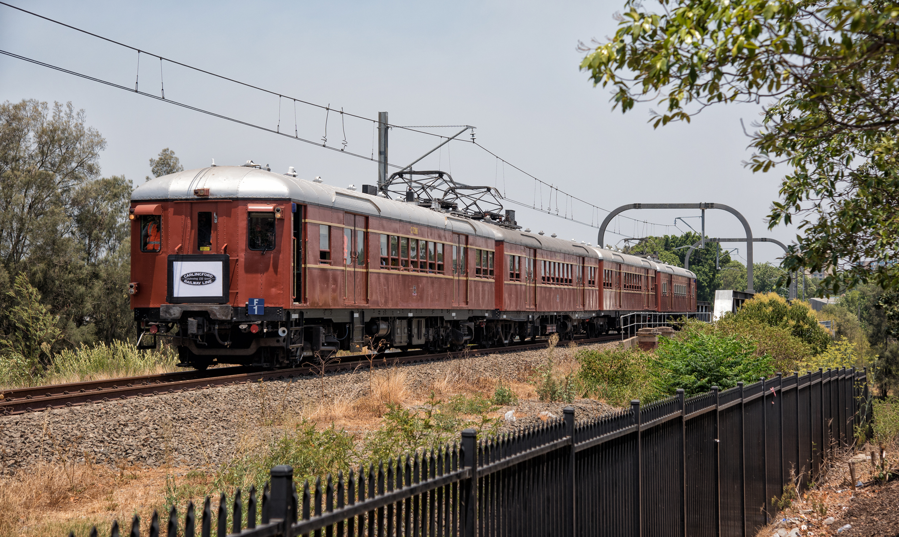
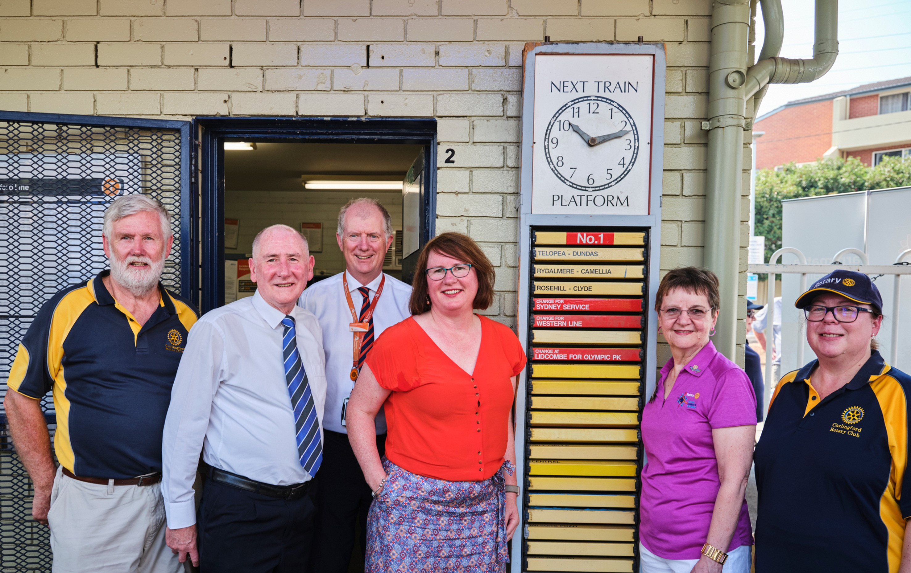
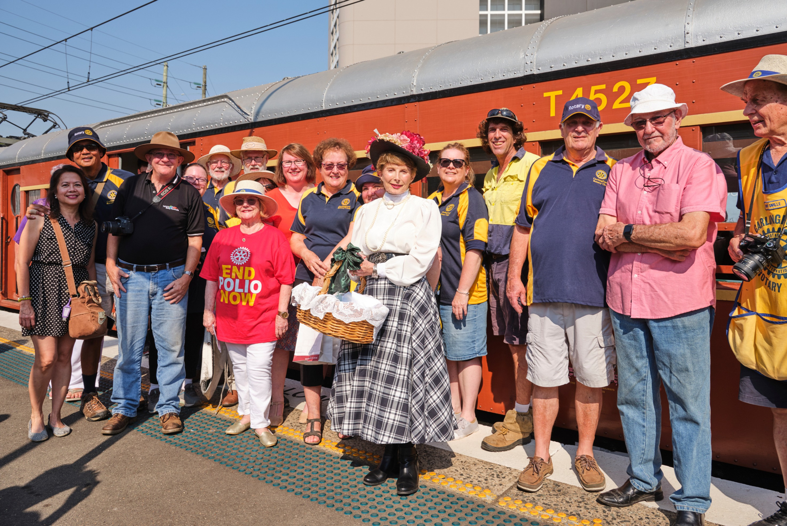
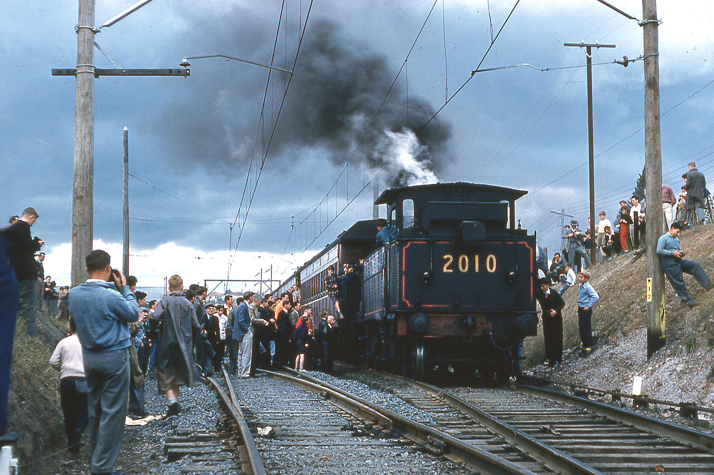
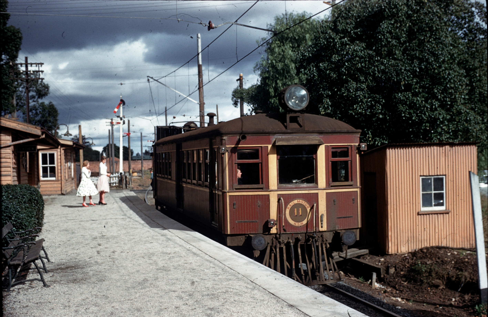
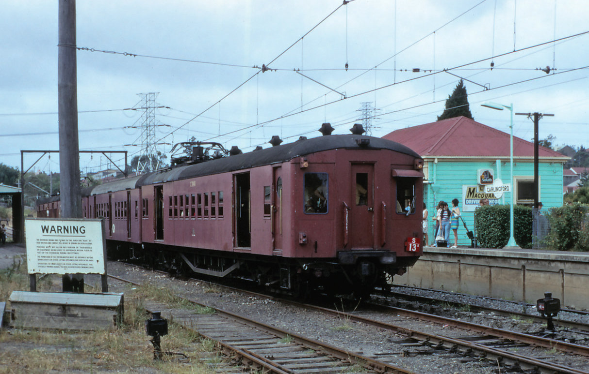

### Transport Heritage NSW and volunteers of Historic Electric Traction assisted Sydney Trains in farewelling the T6 Carlingford Line on Saturday 4 January 2019 – the line’s final day of operation.

**Vintage electric F1 at the Farewell to Carlingford Line event on 4 January 2020. Photo by Steve Burrows.**

Sydney Trains Chief Executive, Howard Collins OBE addressed the media and local community to pay tribute to those who have kept the line running, as it permanently

closed to make way for construction and conversion to the new $2.4 billion Parramatta Light Rail.

“While we are always working towards having the most modern and frequent public transport network possible, we are also extraordinarily proud of our rail history in NSW and passionate about conserving and celebrating its heritage.

> “I would like to thank the hundreds of railway men and women who have worked tirelessly to keep people along the Carlingford Line moving for over a century and I am sure many Sydney-siders will today be reflecting on their own memories of travel on the T6 Line.”

The final day of operations featured free rides for public on vintage electric set F1 as well as heritage displays and live music at Carlingford.

Lord Mayor of Parramatta Bob Dwyer (second from left), Sydney Trains Chief Executive Howard Collins OBE (third from left), and Parramatta Councillor Donna Davis with members of Carlingford Rotary Club. Photo by Warwick Baker for Sydney Trains

Customers riding on F1 were encouraged to give a gold coin donation, with all proceeds going to the NSW Rural Fire Service.

Hundreds of rail enthusiasts then gathered for the final train service in the early hours of Sunday 5 January. The last train to depart Carlingford for Clyde was at 1.45am and operated by Millennium set M30.

Community members and the Carlingford Rotary Cub in front of F1 vintage electric. Photo by Warkwick Baker for Sydney Trains.

### A brief history of the line

The railway line to Carlingford was originally planned as two private railways, Bennett’s railway from Clyde to Rosehill and Sandown, and Simpson’s railway to Dural with the first section opened as far as Carlingford.

Having just constructed Rosehill Racecourse, John Bennett was keen to encourage more visitors by train. Following agreement from the NSW Government, a new platform at Rosehill

opened in November 1888. That same year, Bennett constructed the Sandown Line: a branch line from Camellia Junction, just north of Rosehill Station, to service the industrial area along the banks of the Parramatta and Duck Rivers.

The final day of steam on the Carlingford Line on 8 August 1959. Photo by Dale Budd OBE.

A few years later Simpson built his private railway extending from Rosehill to Carlingford, primarily to carry oranges and their growers to Sydney, as well as to service property subdivisions to the north. This private railway opened in April 1896 at a cost of £43,192. Stations along the line included Rosehill, Subiaco, Victoria Road, Kissing Point Road and Pennant Hills.

Railmotor CPH 11 pauses at Camellia Station during 1959 to pick up two passengers. Photo by Australian Railway Historical.

Both the Bennett and Simpson lines failed to prosper and by the end of 1896, both railways

were in the hands of the mortgagee, the Bank of New Zealand.

On 18 June 1899, the Government offered the bank £20,000 for the two railways. Eventually,

the price was fixed at £22,500 and the lines were transferred to the Government on 1 August 1901. At this time passenger services recommenced and many of the stations were renamed – Subiaco to Camellia, Victoria Road to Rydalmere, Kissing Point Road to Dundas, and Pennant Hills to Carlingford.

Four car single deck suburban set S13 waits in the run round siding at Carlingford for the return of its passengers during a tour in March 1975. Photo by John Youngman.

Telopea Station was added in 1925 after petitioning from locals; and the line was electrified to Rosehill in 1936 and then to Carlingford in 1959. Simpson’s idea of extending the line onwards to Castle Hill and Dural never happened.

During World War Two, Ambulance Trains staffed by Australian and United States Armed Forces personnel operated to Rosehill where patients would transfer to road ambulances for transport to Concord Repatriation Hospital.

While most of the stations along the line have been remodelled in subsequent years, heritage listed Dundas Station still represents the line’s early history as the last intact privately built and owned station building in the NSW passenger network.

For more information on the new Parramatta Light Rail project, visit [parramattalightrail.nsw.gov.au](http://www.parramattalightrail.nsw.gov.au).

*This article was published in the summer 2020 edition of Roundhouse magazine. Written by David Bennett, Marketing & Commercial Services Manager.*
