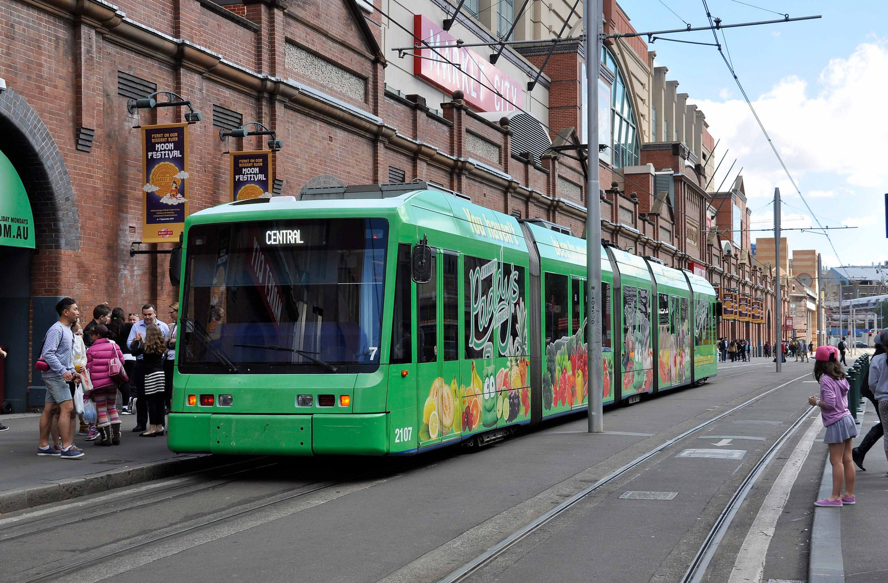

**With the assistance of Transport for NSW (TfNSW), a Variotram has been acquired to join the State Movable Heritage Collection – the latest piece of rolling stock to be added and the very first tram to be included into this significant collection.**

Sydney’s Variotrams heralded a game changing step forward in tram design and technology when introduced in 1997. They were the first ‘low floor’ trams in Australia; Melbourne did not receive its first imported examples until 2001.

Sydney once had the second largest tramway network in the British Commonwealth. Along with many cities in the English speaking world, it scrapped its last trams in 1961 in favour of buses.

Under a ‘Better Cities’ programme, the NSW Government took the initiative, together with the Commonwealth Government, to fund the reintroduction of trams (or light rail) on a short starter line from Central Station to Wentworth Park, utilising part of a disused railway goods line. The chosen vehicle, the Variotram, built in Australia, was derived from a prototype of European design. It required major redesign to meet Sydney conditions, such as use of stainless steel, enhanced air conditioning and alterations to negotiate the gradients and curves around Central Station.

When introduced into service, the five-section articulated Variotrams were the longest trams in Australia at 28.9 metres. This led the way to a trend towards trams much longer, and therefore with higher capacity, being introduced elsewhere in Australia. Seven were built and operated successfully for 17 years before being retired.

The success of the Variotram on the starter line resulted in two service extensions on the same line. This led to a decision to build a new line along George Street and to the Eastern suburbs, as well as other proposals for lines elsewhere in the state and Canberra.

Being the first of the second generation of tramcar introduced in Sydney, the Variotram is an integral part of NSW’s transport history. It warrants preservation as part of the narrative in major tramway design developments no less than the first generation of electric trams introduced on George Street in 1899 or the large capacity ‘toast-racks’ of 1908.

Tram 2107 was the last of the fleet in service and was deemed the most reliable. Therefore, it has been chosen for preservation in the State Movable Heritage Collection.

The tram will be placed in the custody of the South Pacific Electric Railway, and displayed and operated at the Sydney Tramway Museum (STM) at Loftus.

STM volunteers have already begun the process of preparing the tram for relocation from its current storage place at Penrith to Loftus, and are working with transport company Deugro and THNSW to effectively move the almost 30-metre-long vehicle.

*(Edited extract from the Statement of Significance provided by the Sydney Tramway Museum volunteers.)*

*This article was originally published in the winter 2018 sector report.*
