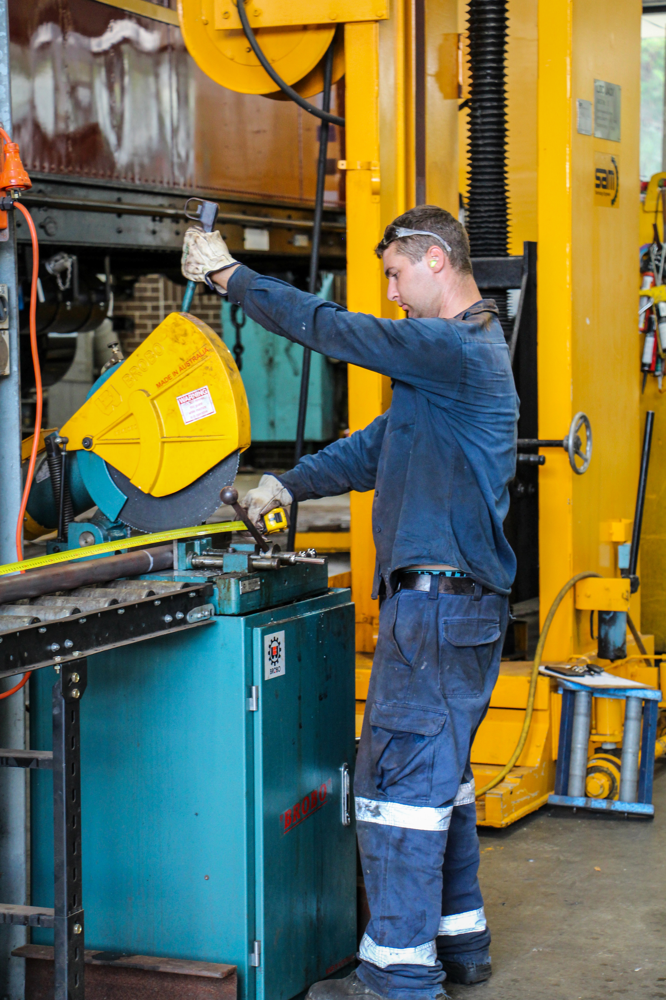
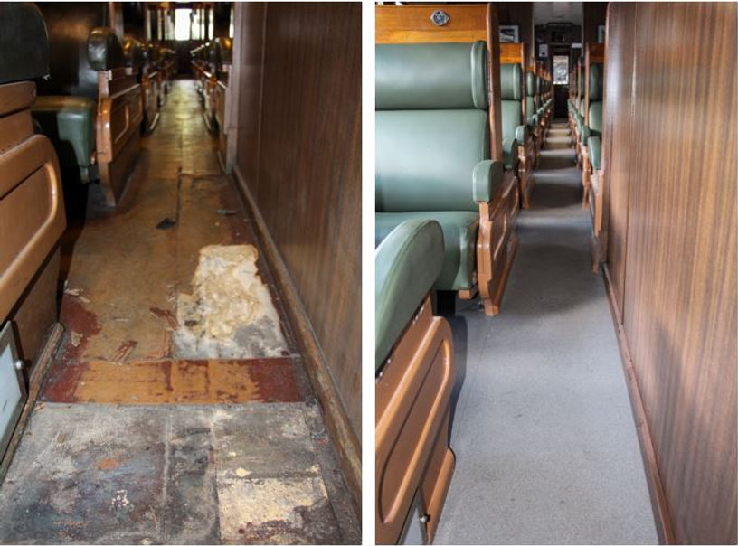
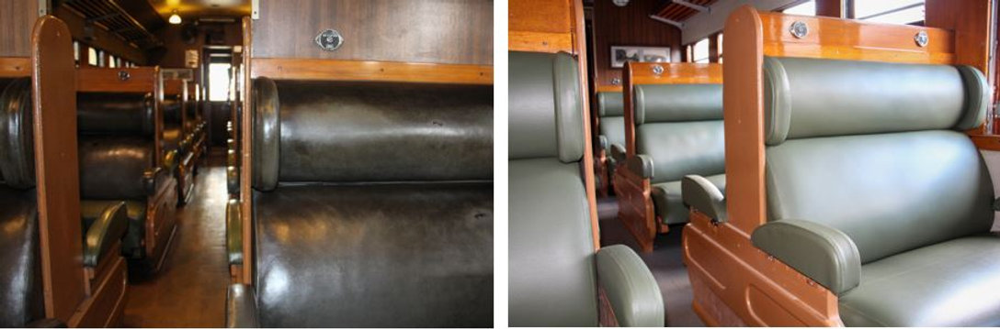

**Staff and volunteers have been busy with summer inspections and repairs. Here’s an update of our progress at time of writing.**

**STEAM LOCOMOTIVES**

Locomotives 2705, 3016, 3526 and 3642 have undergone boiler and annual inspections, which are now complete. Locomotive 3642 is being maintained operational for specific events.

**Locomotive 3265**

Work was undertaken on the regulator valve of locomotive 3265 over the Christmas period to address the continual blow through and lack of pilot valve lift that became evident during initial operation.

Additionally, the leading bogie continued to give trouble with elevated bearing temperatures during the trials. A decision to strip and rebuild this was made and the work was completed within one week. One final trial remains prior to 3265 operating its first trip to Maitland in a few weeks’ time.

**Locomotive 6029**

The old firebox tubeplate was removed from locomotive 6029 prior to Christmas, allowing a template to be made to accurately cut the new plate for fitting. Due to access restrictions for welding, several different weld preparations were required, with sections between each weld prep requiring a transition from one prep to another all while maintaining a weld root gap of 3mm.

The new tubeplate was successfully welded in during early March and preparations are almost complete to allow retubing to start. Our aim is to complete these works by the end of April.

**DIESELS**

**Locomotive 4201**

All parts are now on site at the roundhouse in Thirlmere to allow a planned engine rebuild, which will commence shortly.

**Locomotive 4306**

A traction motor overhaul is underway at UGL Broadmeadow.

**Locomotive 4520**

Work on locomotive 4520 has had to take somewhat of a back seat while we work through our annual summer program of inspections and repairs, but should recommence around the end of April.

**Locomotive 7006**

The internal cab painting of locomotive 7006 is still in line to be completed, following recent repaint and body repairs to this engine.

**CARRIAGES**

We are nearly all the way through our annual inspections on the carriage fleet, with the Aurora fleet now underway. All roofs on our operational cars were resealed and repainted as part of this process.

**HN 2197**

Repairs to the floor of this car soon escalated to a complete interior overhaul. The old floor and carpet coverings were stripped, all seats dispatched for recovering, new tables ordered, and the interior surfaces of the car stripped and painted.

Following this work, our flooring contractor laid new flooring and fitted new carpet to the internal roof corners.

Our car builder, Dave, along with staff and volunteers have been making excellent progress with repairing/replacing all manner of damaged and missing items, including trims, brackets, etc. The car is due to be completed by the end of March.

This vehicle will set the benchmark that we’ll endeavour to produce as we work through our fleet one-by-one over the next few years.

HN 2197 floors before and after interior overhaul.

HN 2197 seats before and after interior overhaul.

**HFS 2017**

Not much physical work has occurred on HFS 2017 over the summer period due to repairs/inspections being undertaken on our operational fleet. A fair amount of work has been carried out obtaining materials for this project, which will recommence shortly.

**BS 2076**

The rebuilding of this vehicle’s bogies and running gear is due for completion by the end of March.

**CPH 18**

The program of work on CPH 18 has increased significantly due to the condition of several items once we stripped it down. With our current workload, this project has been worked on when resourcing has allowed.

CPH 27, on hire from Canberra, has handled all our summer operations on the loop line while we complete this work.

**RMS 2358**

Work is underway on the kitchen replacement and is due to be completed by June.

**PHN 2363**

The replacement voltage regulator has arrived and has been fitted. It was tested with the van and is now preforming nicely.

*This article was originally published in the autumn 2019 edition of Roundhouse magazine. Written by Ben Elliot, Fleet Maintenance Manager.*
