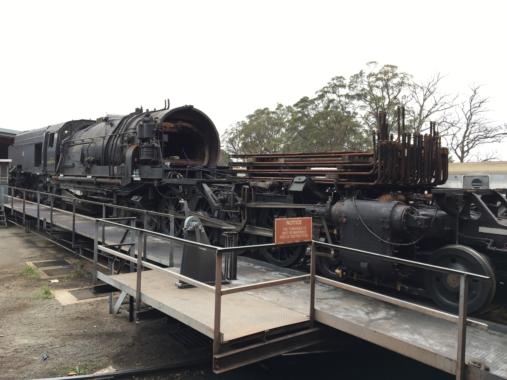
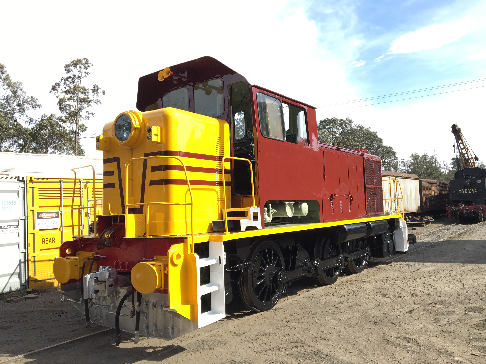
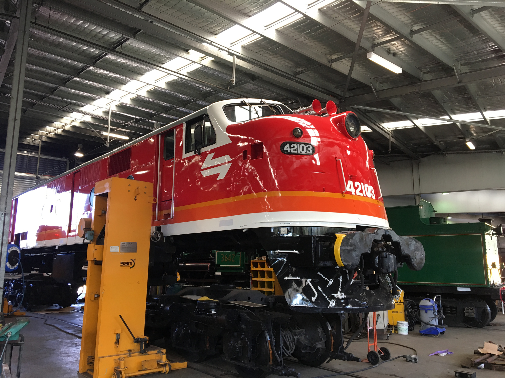

**Staff and volunteers have been keeping busy maintaining the heritage fleet.**

**STEAM LOCOMOTIVES**

**Locomotive 2705**

Locomotive 2705 has been stripped for an annual boiler inspection. No major items currently require attention.

**Locomotive 3016**

This engine has also been stripped for an annual boiler inspection.

**Locomotive 3265**

Engine 3265 was able to commence trial operations on the loop line in late October. These proved successful, resulting in the locomotive being relaunched into service on 24 November 2018.

Following completion of the ICE radio installation, we commenced main line trials, which are still ongoing.

**Locomotive 3526**

Some minor work was undertaken during early December, which was tested successfully during trial with 3265 to Glenlee in mid-December. It is now stripped in preparation for its annual boiler inspection.

**Locomotive 3642**

The firebox was stripped out during November to allow NDT and thickness testing to occur. During this time, significant repairs were carried out to the ashpan, which is showing its age due to corrosion. The remainder of the boiler has been stripped and washed out in preparation for its annual boiler inspection.

**Locomotive 6029**

Significant work is underway on 6029 to enable the replacement of the firebox tubeplate. The owners and a large team of volunteers have successfully stripped the locomotive of its front water tank, smokebox front and internals, and have removed all the boiler tubes (supported by the workshop staff).

A new tubeplate is being manufactured locally and is due on site before Christmas. A new set of tubes are on order and due to arrive on site in late January.

Additionally, four new bull rings have been cast and will be machined and fitted.

We expect this work to be completed by late March or early April, allowing the locomotive to re-join the operating fleet.

Beyer Garratt 6029 on the turntable at Thirlmere showing the amount of preparation required to undertake the current program of works.

**DIESEL LOCOMOTIVES**

**Locomotive 4201**

We’re still awaiting the arrival of parts to commence the engine rebuild.

**Locomotive 4306**

A traction motor overhaul is underway at UGL Broadmeadow.

**Locomotive 4520**

As reported in the spring 2018 edition, a large program of works was required on locomotive 4520, which have now commenced. The engine hood has been removed and the generator disconnected and lifted out. Significant corrosion repairs are underway around the cab area.

A large amount of the air system pipework is being replaced due to evidence of corrosion, particularly in areas where this passes through steel sections of the body and frame.

Electrically, Col Parry is inspecting everything to identify any issues that need rectification. Additionally, new Drawgear assemblies are being purchased and fitted.

Locomotive 4520 was subject to a complete top end overhaul in 2014 and requires only routine servicing. Like all projects, the scope on this continues to grow as we progress. We are confident, however, that work will be completed by early to mid-2019.

**Locomotive 7006**

Our contractor completed external painting of locomotive 7006 in late September. Only the external application of signage remains to compete this aspect. Also, we still have to complete the cab interior.

Diesel hydraulic locomotive 7006 outside the paintshop after the completion of its repaint.

**Locomotive 42103**

This locomotive was hired to undertake operations for us to Seymour during September. During its pre-trip inspection, an issue was discovered with No.5 traction motor that required repair before the engine could operate again.

Work has been undertaken to lift the locomotive and remove the offending wheel set, which was dispatched to Progress Rail in Port Augusta for rectification works. This returned to Thirlmere in early December, which allowed the locomotive to be reassembled and tested successfully.

Diesel-electric 42103 lifted to allow repairs to the No.5 traction motor.

**CARRIAGES**

All vehicles are currently undergoing the annual inspection process and having any deferred work attended to during time of writing. Additionally, some roof works will be undertaken on several vehicles as they come through. There are some 30 odd vehicles to be worked on throughout the next several months.

**N Cars**

We are currently looking at a program to undertake some works internally on our three N cars, which are looking tired. This can hopefully progress in the next few months.

**HFS 2017**

HFS 2017 is the subject of a complete strip and rebuild. The external roof covering has been removed due to its poor condition and is to be replaced. External body corrosion is in the process of being cut out and repaired.

Internally, one end has been completely stripped out. Rewiring is underway and new ceiling panels are being manufactured and will be fitted. All timber surfaces are being stripped and prepped for recoating. Additionally, the veneer timber inlay panels are being replaced. All this work will be finished with the laying of new floor coverings.

A full mechanical overhaul is also required before completion.

**BS2076**

This car has been under overhaul by North West Coach Builders throughout the last few years. During November, it was inspected and hauled to Thirlmere to allow the completion of bogie and wheel work, which is scheduled to be undertaken in January. This car will initially replace MCA 2, which is due for inspection and other works.

**CPH 18**

CPH 18 has been relocated to the workshop to enable the completion of its five yearly inspection works, which should be completed to allow it to resume loop line operations sometime in mid-January.

**MHN 2364**

Work was completed in time to allow MHN 2364 to operate on two Seymour charters during November. The vehicle was rewired, bogies and brake system overhauled, and the body chemically cleaned to remove years of baked on grime. We purchased and fitted this vehicle out with racking to allow the quick storage of passenger luggage, which proved to be highly successful. It is now available for future charter work as required.

**RMS 2358**

We have had contractors in to assess and scope the work required to undertake repairs on the kitchen. This, along with the mechanical work required, should commence in March.

**PHN 2363**

Some issues with the voltage regulators became evident on PHN 2363’s last operation. One generator set has had a new one fitted and we are awaiting arrival of the replacement for the second generator set.

The last two sleeping cars in this program of works have returned from Lithgow from the current round of retention tank fitting works. This now gives us four vehicles in the Aurora fleet that have been fitted.

*This article was originally published in the summer 2019 edition of Roundhouse magazine. Written by Ben Elliot, Fleet Maintenance Manager.*
