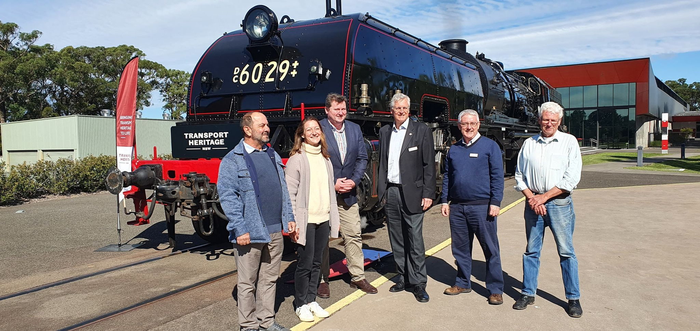
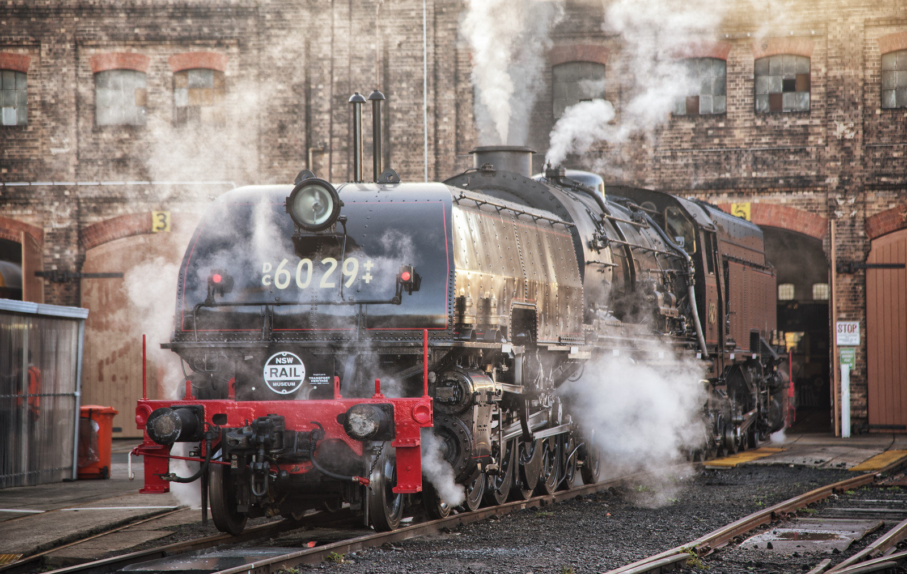

**Transport Heritage NSW members today welcomed news Australia’s largest operating steam locomotive, Beyer-Garratt 6029, has been secured by the NSW Government to form part of the Transport Heritage NSW fleet.**

State Member for Wollondilly, Nathaniel Smith, and Parliamentary Secretary for Small Business, Lou Amato, joined Transport Heritage NSW (THNSW) Chair, Rob Mason and CEO, Andrew Moritz, at the NSW Rail Museum to unveil the new rail heritage asset to members and volunteers.

Mr Smith said the Beyer-Garratt 6029 steam locomotive was a significant and much welcomed heritage asset for the THNSW fleet as it is prepared to return to active service as an attraction at major railway heritage events across the State.

“This steam engine is an outstanding example of rail engineering of yesteryear and illustrates the fabulous work of THNSW volunteers and previous owners over the years to maintain it as a reliable, working asset,” Mr Smith said.

“The Beyer-Garratt 6029 entered service in 1954 and was a reliable work horse of the fleet in NSW travelling more than one million kilometres before it was removed from regular service in 1972.

“This type of dedication and enthusiasm to restore and maintain pieces like the Beyer-Garratt 6029 ensures they remain a part of our moving history which rail heritage enthusiasts can enjoy for decades to come,” Mr Smith said.

Mr Moritz said the acquisition of this steam engine was important to THNSW, as it not only complemented and provided operational back up to the historical and much loved Locomotive 3801, but was popular with the public and THNSW members.

“Not long after it was first retired from service, the steam engine was gifted to the Australian Railway Historical Society (ARHS) ACT Division and moved to the Canberra Railway Museum,” Mr Moritz said.

“Between 2007 and 2015 ARHS ACT volunteers spent hundreds of hours to restore the engine and as a result, 6029 was returned to operation.

“In 2017 the locomotive was saved by a private syndicate of rail fans who purchased 6029 and relocated it to the NSW Rail Museum, in Thirlmere, where THNSW has operated the engine under agreement with the previous owners ever since,” he said.

Mr Amato said it was fabulous to see the 68 year old heritage steam engine being returned to the people of NSW as a tourist attraction and showcased at major historical rail events.

“THNSW has the knowledge and skills to maintain the locomotive for generations to come, this is a wonderful gift to all rail enthusiasts,” Mr Amato said.

> The Garratt will return to the main line, with a special long weekend of steam train rides in Bathurst from 11—13 June 2022. Full details and tickets will be available on the THNSW website from Monday 9 May.

**About Beyer-Garratt 6029**

Based on the successful design by Herbert Garratt, these locomotives were manufactured by Beyer, Peacock in Manchester UK, and imported to NSW specifically for coal haulage.

The last steam locomotives introduced into NSW, the first of the class did not enter service until 1952. The original order for 25 locomotives was augmented by a second order for 25, which the railways tried to cancel a portion of due to the successful introduction of the 40 Class diesel locomotives. This resulted in a total of 42 of the 60 Class Garratts in service and nearly five locomotives’ worth of spare parts. Despite the desire of the railways to reduce the order, there were 60 Class Garratts still in service even after the 40 Class diesels had all been retired from traffic.

Because of their length and the few turntables in the system with the capacity to turn them, they often ran in reverse, and from 1958 a number of them were fitted with a second set of controls to allow the driver to face the direction of travel when travelling ‘bunker first’, denoted with a ‘DC’ painted on the buffer beam.

Locomotive 6029 entered service in April 1954, receiving its dual control in February 1959. It was withdrawn from service in 1972, having travelled just under 100,000 km during its working life. It was returned to service by the Australian Railway Historical Society (ACT Division) in 2014 and purchased by a small consortium of steam locomotive enthusiasts in 2017. In 2022, the locomotive was secured by the NSW Government for the State's heritage transport collection, managed by Transport Heritage NSW.
