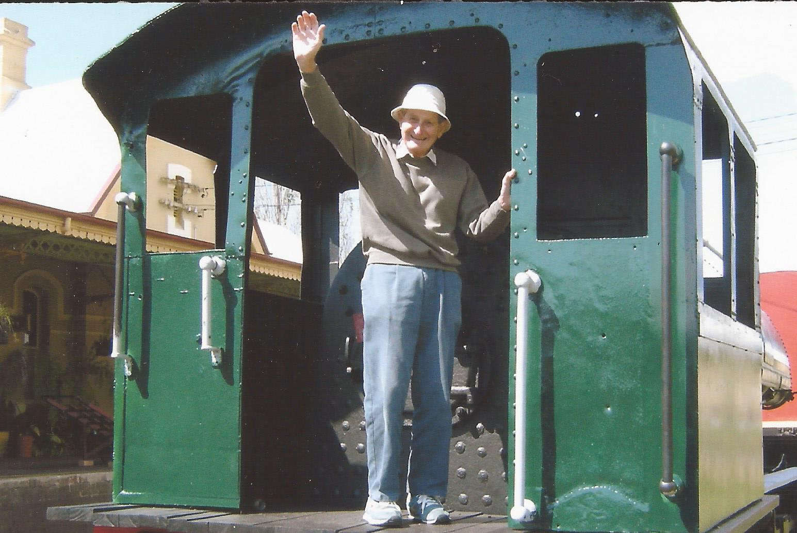

**Learn a few bits and pieces about Frank Newman, Vice President, Tenterfield Railway Station Preservation Society.**

**Tell us about your position and what you do at the Tenterfield Railway Station Museum?**

I am currently the Society’s vice president and help the executive team with matters relating to planning, administration, and control of the various maintenance work and projects we have in hand. This includes things such as grant applications, heritage impacts, and liaison with departments and other organisations in the heritage field. I seem to have fallen into this role because of my working life with Local Councils and what was then known as the Roads and Traffic Authority.

**How did you get started at the museum?**

My brother, Geoff, has been a long standing member of the group. When I visited the museum in the past, he always invited me to help in various ways, including simple machining jobs in my home metal-engineering workshop.

I was an inactive member for many years and welcomed the chance to get more involved when I came to live in Tenterfield five years ago.

Frank and 'Tilly'.

**Have you worked with community or heritage groups before Tenterfield?**

When I retired early during the purges of public service in the 1990s, I went to live in Port Macquarie. It has a very rich heritage as the site of the country’s second mainland settlement. I got involved with one heritage site, the Douglas Vale vineyard, which is a surviving relic of the extensive wine making done in the area in the 19th century.

I did a similar job there that I do here at Tenterfield, and even served on the Hastings Council Heritage Committee for a short period. I later moved to Tamworth and helped a group maintain and improve the 19th century pipe organ in the heritage listed St John’s Anglican Church.

**What has been the most notable project you have worked on?**

I think this would have to be our demountable Trike Display building. The administrative and technical challenges were quite significant, including a full year of struggling to get many required approvals. Making sure that erection of the structure went to plan and setting-up our extensive trike and railway tools displays was, and still is, a most interesting project.

**What is your favourite object in the collections and why?**

I like the heritage listed buildings and precinct best. It is the reason for our Society’s existence and is a well-preserved example of what is now a very rare piece of 19th century infrastructure.

**Are there any challenges facing your organisation you could tell us about?**

In smaller towns, enlisting volunteers is always an ongoing challenge. Also, because our whole precinct is heritage listed, we seem to have continual difficulty in convincing both the site owners and the Office of Environment and Heritage that our intentions are honourable. At times this leads to a real sense of frustration for volunteer members who are solely interested in looking after the asset, making sure that it is properly maintained as a heritage site. Sometimes it is difficult to maintain enthusiasm under such conditions even though we do enjoy the full support of our local council.

**Why do you believe museums and heritage organisations are valuable in today’s world?**

Our visitors keep telling us how much they value being able to see how things were and how they were done. Many can see how this relates to life today and have a better understanding of the world we live in. Museums such as ours can be a major tourist attraction in town and add significantly to the local economy.

*This article was originally published in the winter 2018 sector report.*
