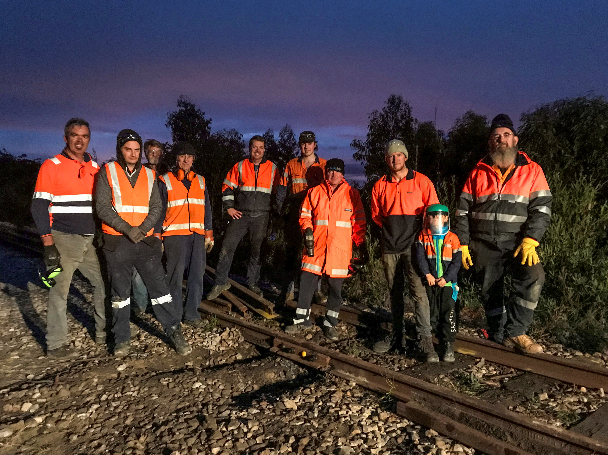

**Sunday 8 June was a momentous day at Zig Zag Railway. After over eight months and thousands of hours worked by volunteer members, the track had been relayed across the big embankment. A large section of the track was removed in May last year to facilitate repairs to the embankment by a local contractor following a wash away that occurred in late 2012, roughly 12 months before the devastating October 2013 Blue Mountains bush fires.**

The ceremony, posted on the railway’s Facebook page, comes as the group is planning to celebrate the 150th anniversary of the opening of the Great Lithgow Zig Zag on Saturday 19 October this year.

Zig Zag Railway volunteers pose for a celebratory photo.

Further down the line, repairs continue on steam and diesel locomotives, plus passenger carriages and wagons that will be used to re-train crews once the new track is lifted and packed.

Meanwhile, on the other side of Clarence tunnel, work continues on the restoration of the former Clyburn water tank that is being refurbished as part of a Transport Heritage NSW grant project. This has turned out to be a much bigger job than anticipated. As one volunteer put it, “It’s almost a case of lifting the whistle and replacing everything underneath.”

If you’re interested in becoming involved, please contact the railway on 1300 ZIG ZAG.

*This article was originally published in the winter 2019 edition of the sector report.*
