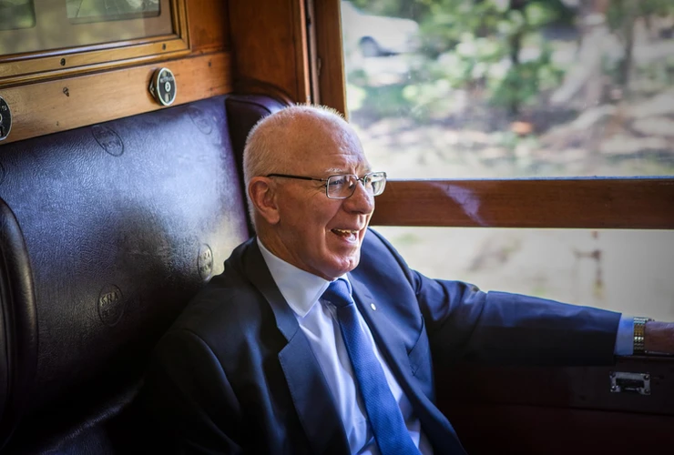
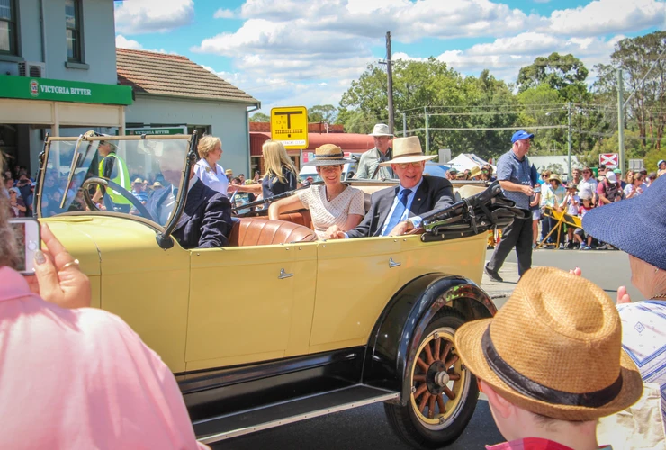

**Special guests His Excellency General The Honourable David Hurley AC DSC (Ret’d), Governor of New South Wales, and Mrs Linda Hurley attended the 30th annual Thirlmere Festival of Steam to show their support and acknowledge the community.**

Upon arrival, His Excellency and Mrs Hurley boarded a heritage steam train for a 45-minute ride along the Thirlmere Heritage Railway to Buxton and return with Andrew Moritz, CEO, Transport Heritage NSW, and Howard Collins OBE, Chief Executive, Sydney Trains and NSW TrainLink, and THNSW Board Director.

The Governor and Mrs Hurley were introduced to the community when they led the grand parade in a vintage car and enjoyed a light lunch with event sponsors, local leaders and VIP guests at the NSW Rail Museum.

One of the most significant and memorable aspects of their visit was the ability to view the Governor-General’s and State Governor of NSW’s carriages. Jennifer Edmonds, Heritage & Collections Manager, THNSW, led a tour of each carriage for the Governor and a few select guests. To protect the soft furnishings and delicate timberwork inside, these carriages are not open to the public, who can only view them from the outside, which made these tours particularly exceptional.

Additionally, touring the Governor-General’s carriage was of particular significance to His Excellency, as he will become Australia’s 27th Governor-General in June 2019.

**Governor-General’s railway carriage**

One of the most luxurious in Australia, the Governor-General’s carriage was built at the Eveleigh Railway Carriage Workshops, Sydney, in 1901 for the use of the newly appointed Governor-General of Australia, the Earl of Hopetoun, John Adrian Louis Hope Hopetoun (1860 – 1908). It is one of five special cars built between 1891 and 1920 by the New South Wales Department of Railways for the exclusive use of royalty, governors-general, governors, premiers and the railway commissioners.

The carriage is internally divided into three sleeping suites, a dining room, galley, attendants’ quarters and observation room. The interior decoration includes 311 individually hand-carved timber panels of polished English oak and Australian cedar depicting botanical specimens of NSW and fluted pilasters. There are etched glass panels featuring Australian flora, fine carpets, gold-tinted velvets, silk drapes and Morocco leather and upholstery. All metal fittings were gold plated; it was reported that 14 gold sovereigns were melted down to provide gold for this purpose.

The carriage is currently displayed at the NSW Rail Museum on loan from the Museum of Applied Arts & Sciences. For more information about this carriage, visit www.maas.museum.

**State Governor of NSW’s carriage**

In 1911, Eveleigh Railway Carriage Workshops built a new State Car, coded SG. It had three bedrooms and two bathrooms for use by the governor, his wife and aides, a dining area and a small lounge.

Fittings were comfortable, practical and homely rather than lavish, and it became a favourite among governors and a familiar sight throughout the state. Governors frequently travelled to country celebrations in this carriage attached to overnight mail trains.

Sir Roden Cutler, the longest serving governor (1966–1981), was the last to use it regularly through the 1970s.

His Excellency enjoys a steam train ride along the loop line. -Trys Eddy Photos

His Excellency and Mrs Hurley lead the grand parade.

*This article was originally published in the autumn 2019 edition of Roundhouse magazine.*
