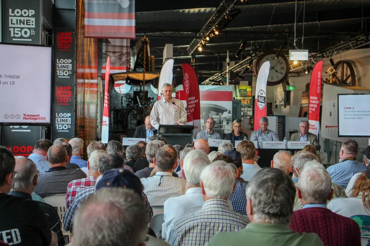

**Our Annual General Meeting 2018 was held on Saturday 24 November at the NSW Rail Museum. Here are the meeting highlights:**

**Congratulations to our new life members**

Life membership is the highest honour we can bestow on a member. It is awarded for outstanding contribution to THNSW. This year, the Board of Directors recommended 13 people for this award.

Congratulations to our new life members:

* **Geoffrey Allerton**
* **George Baias**
* **Bruce Coxon**
* **Robert Dickey**
* **Alan Driscoll**
* **Peter Dudgeon**
* **John Fisher**
* **Brett Fitzpatrick**
* **John Knotek**
* **Terry Matchett**
* **Bernie McTackett**
* **Leon Rudd**
* **Jeffrey Snedden**

**Tribute to champions of heritage transport**

The introduction of a new award program recognised four Champions of Heritage Transport. An honour board will forever live inside the NSW Rail Museum and acknowledge the tremendous contributions specific individuals have made to advancing the heritage transport cause within the state of NSW.

Congratulations to the following award recipients, and thank you to the family members and friends who accepted certificates on their behalf:

* **Peter Berriman**
* **Neal McCusker CBE**
* **William (Bill) McNiven**
* **Douglas Patterson**

**Reappointment of directors**

Alex Claassens was reappointed as an elected director for a further 2 years.

Company Secretary Brett Fitzpatrick announced that the Minister for Transport & Infrastructure, The Hon. Andrew Constance MP, has reappointed Rob Mason as THNSW Chair for a further 1-year term from 1 March 2019.

Brett also announced that the Board has re-elected Leann Meiers for a further 2-year term as a non-elected appointed director.

**A new constitution for THNSW**

The updated constitution was passed by a majority vote of voting members at the meeting and by proxy. [You can find the new constitution by clicking here.](https://www.transportheritagensw.com.au/who-we-are)

Thank you to all those who joined us for the AGM 2018.

