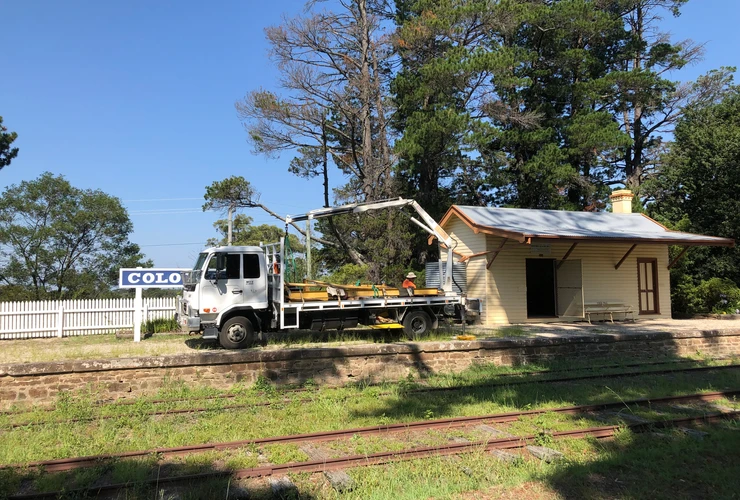
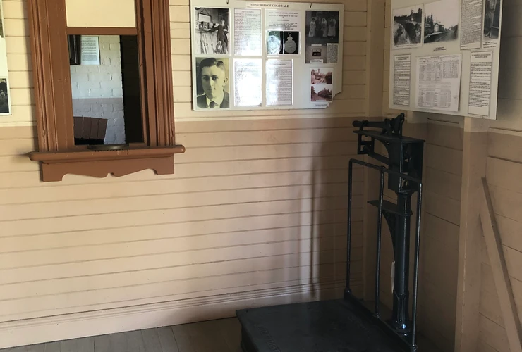

**Thomas**

**As anyone who has ever volunteered at a *Day Out With Thomas* (DOWT) event knows, the constant ‘puh-ooo’ of Thomas’ whistle all day can be wearing on the ears. Fed by a stationary air compressor, the air feeds the locomotive whistle fitted to 1803. After the very first Thomas event in May 2009, workshop staff fitted a restrictor to prevent kids from being able to simply haul on the whistle and keep it blaring, which has given our Thomas its distinct, breathless voice rather than the ‘peep-peep’ the real Thomas is famous for.**

According to feedback, our neighbours find Thomas’ whistle as wearing as the staff and volunteers. Ann Frederick, Creative Services & Public Programs Manager, arranged for a contractor to fit an electronic version to the cab actuated by the whistle ‘cord’, with the assistance of volunteer electricians Tony Eyre and Geoff Olsen, and John Gray from the workshop. This should make future DOWT events easier for us and our neighbours.

**Walschaerts Valve Gear Model**

A popular item at last year’s *Models and Miniatures* event was the working Walschaerts valve gear model from THNSW’s own collection. In an effort to continue improving customer experiences during normal business days, volunteer Rod Hawkes manufactured a new case from timber and Perspex to allow the model to go on permanent display. Additionally, volunteer Geoff Olsen sourced and installed a push button and timer to allow visitors to demonstrate the model for themselves. The model was positioned near 3820 in time for the Thirlmere Festival of Steam in early March.

**RBX 647**

In a huge milestone for the RBX reconstruction team, the roof of the carriage has been completed, with new canvas and Navy dressing applied. Sanding and painting of the car sides continues.

**MAM 907**

The volunteer team has been painstakingly cleaning back and re-varnishing the sleeping compartments of MAM 907 and was delighted to announce they have now started work on the very last compartment to be refinished. This work has not only been time consuming, it saw a few false starts as different methods to rework the existing, mould-damaged varnish were trialled but ultimately failed before the team experimented with various ways to remove damaged varnish and resurface.

One of the ten compartments will be left in untouched condition as a reference for the future.

**Scales for Colo Vale Station**

A set of platform scales donated to the museum last year has been put on permanent display within the secured waiting room of the historic Colo Vale Station building.

The original provenance of the scales is unknown. The donor had acquired them from a closed warehouse, but whether they had ever been used at a station in a previous life is unknown. The Avery scales are, however, similar to scales used by the railways at stations, and so the decision was made to acquire them to place them at the station.

Although complete, they were in need of some maintenance and a coat of paint, which was supplied by volunteer Peter Dudgeon, taking a break from MAM work.

While a more authentic display location would have been on the platform of the station, it was felt that, for security purposes, locating the scales inside the waiting room where they’re protected by a locked mesh door was a better option.

The scales were delivered and placed into the waiting room by hi-ab truck.

The scales in place inside the waiting room.

*This article was originally published in the autumn 2019 edition of Roundhouse magazine. Written by Jennifer Edmonds, Heritage & Collections Manager.*
