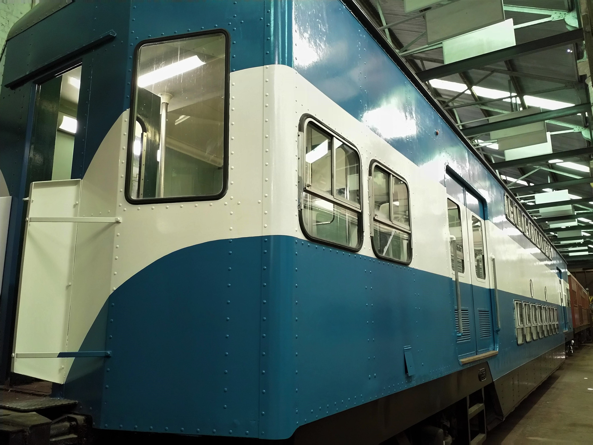

**Historic Electric Traction (HET) is progressing towards delivering 1955/1960 era set 'W3' to Sydney Trains for heavy maintenance and recommissioning later this year. With the assistance of funding approval towards painting, we are working to complete sufficient tasks to permit an extended deployment from our Redfern base. Our pace is measured and sustainable in the long term, with Tulloch trailer 4814 now feeding anticipation of the quality of the approved 1970s narrative for C3702, T4814, T4801 and C3708.**

T4814 looks resplendent in the shed and should look magnificent out in the daylight. -Glenn Percival/HET

*This article was originally published in the autumn 2019 edition of the sector report. Written by Glenn Percival.*
