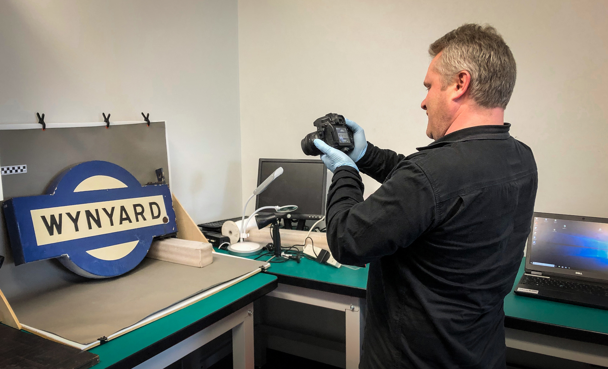
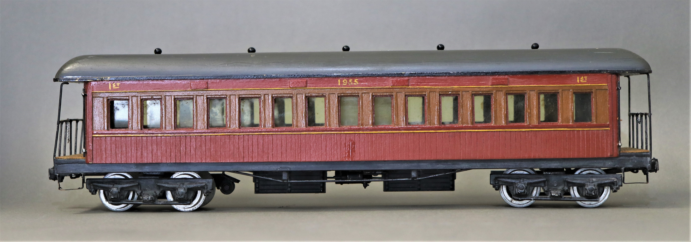

**Collection cataloguing is often one of those tasks museums put off. There’s always something more urgent to do. We somehow think we’ll get around to it another time or that we’ll always remember what the thing is, who gave it to us or why we collected it.**

Unfortunately, we often never get around to catching up the cataloguing, and a poor or non-existent catalogue can create huge problems for collecting institutions.

Cataloguing helps you understand what you have, where it is located (on display, in store, on loan) and what stories it tells. It helps you prioritise work and resources through understanding how important any given item is.

A record should include:

* Registration number – a unique and permanent number to ensure you can accurately identify the object from similar items
* Name of the object – so a quick search will help someone find it (i.e. luggage trolley)
* Description of the object – to allow someone reading the catalogue to develop a mental picture of what the object looks like
* Images from every angle
* Dimensions
* Manufacturing materials (copper, timber, glass) and/or manufacturing method (cast, wrought, blown)
* Hazardous materials (radium on watch dials, asbestos in lagging, lead in paint)
* Seller and purchase price OR donor information
* Any provenance or history available (where did it come from, who manufactured it, who used it)
* Distinguishing marks – makers marks on crockery or someone’s name written on a flyleaf, for example
* Condition and completeness

Chris Fielder, Collections Officer, cataloguing at the NSW Rail Museum.

Without this information, much of any collection has a reduced significance.

What happens when your catalogue is incomplete (or doesn’t exist)?

* You acquire multiple examples of the same thing
* You don’t acquire something you should because you think you already have one or that the object you currently have is in better condition
* You can’t find something when you want it
* You have no idea what an object’s provenance is and what stories it can tell, meaning it’s ultimately not interpretable
* You interpret it incorrectly
* You have similar items in the collection, but can’t identify which is which
* You can’t identify when something has been stolen or misplaced

A template cataloguing worksheet can be downloaded from Museums & Galleries NSW ([**www.mgnsw.org.au/sector/resources**](http://www.mgnsw.org.au/sector/resources)) to get you started. The Small Museums Cataloguing Manual, published by Museums Australia Victoria ([**www.mavic.asn.au**](http://www.mavic.asn.au/)), gives great ‘how to’ information and can be downloaded free of charge. You can also contact THNSW by emailing [**sector@thnsw.com.au**](mailto:sector@thnsw.com.au) for advice from our collections officer.

**CASE STUDY: The Brown Lounge**

The NSW Railways and Tramways mass produced items to help them run their extensive networks. As a result, many of the objects in our collections are simply examples of items that illustrate a way of working or travelling rather than something that tells a particular story in its own right. Understanding where an item might have come from and who might have used it can help us tell a more in-depth story, but is not always possible.

However, sometimes there are items in our collections that don’t seem to be an example of anything we can tell a story about.

The State-Owned Heritage Collection has numerous items of unprovenanced furniture, some of which we can make educated guesses about. There is an unprovenanced lounge suite, however, that we can speculate about, but really have no idea.

The suite comprises two, three-seater brown vinyl lounges of a style and material that make us think 1950s or 1960s. Were they perhaps somewhere in the Chief Commissioner’s office? In his actual office or in a reception room perhaps? Maybe they were part of the furniture in Transport House and had nothing to do with the Commissioner himself. Perhaps it has nothing to do with the railways at all.

Without the history behind the lounge, we can’t put it on display anywhere and be sure we’re telling an accurate story. We also can’t deaccession it in case information comes to light later that it is an important piece of furniture. In the meantime, we have this item that takes up space in the store, takes up resources keeping it clean and in good condition, yet has no interpretive potential that we know of.

If we had the records showing why it was acquired into the collection and where it came from, we would have a better idea of how to appropriately display and interpret it.

**CASE STUDY: The Lumby Models**
 
Some time ago, we were contacted by the descendent of a donor to the THNSW collection. He claimed his grandmother had donated his grandfather’s garden railway models nearly 30 years ago. Since we didn’t have them on display, he wanted them returned.

Apart from the fact that a donation means it has been handed over and there is no further claim on the item by the donor or their relatives, any collecting institution is embarrassed when someone wants to see an item they can’t find or identify. It’s especially embarrassing when there is some family connection to the items (in this case, his grandfather had scratch built the models) and they have been donated in the interests of ensuring they go to a good home and are kept safe.

We have scant records of donations from that long ago. Often, people would simply drop objects off at the front counter as they were passing through and no paperwork was filled in. There was a volunteer in charge of small exhibits, but the process for accepting or not accepting something is no longer clear to us all these years later. We had no way of identifying the items, whether they had in fact been received by this organisation or what might have happened to them in the intervening years. The big upgrade at Thirlmere from 2007 to 2011 caused enormous upheaval on site and saw many items moved, stored, discarded and misplaced. Although a team of external volunteers were engaged by the railways to help us catalogue and pack, they had been given no real formal training on cataloguing and their lack of knowledge about the subject matter meant that the cataloguing (often a single line item on a sheet of paper) was misleading or misinformed. Now we were being asked to find something in store we couldn’t identify, couldn’t prove we had ever received and didn’t know whether we still had.

In this instance, our collections officer was able to identify the models because the case they were packed in luckily had the original owner’s name written on it. Without this stroke of fortune, however, it would have been almost impossible for us to identify which were the models in question, and even if they still existed.

*This article was originally published in the winter 2019 edition of the sector report. Written by Jennifer Edmonds, Heritage & Collections Manager.*
