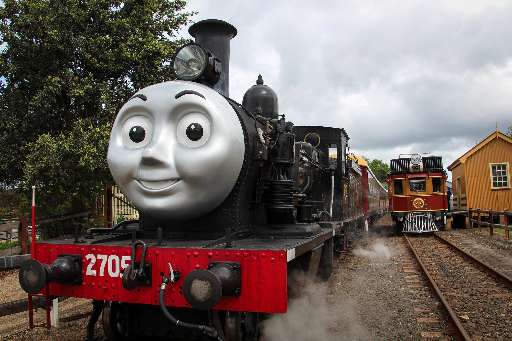

**Many museums, cultural institutions and venues around the world have been doing great work in recent years to make their sites, buildings, exhibitions and events more inclusive of a broader range of visitors. There is a growing understanding and awareness of the many ways in which a person can be wholly or partially excluded from an experience: blindness, low vision and colour blindness can make it difficult to read labels; deafness or hearing impairment can prevent a visitor from hearing audio in museum exhibits or safety announcements; visitors in wheelchairs or with limited mobility may not be able to physically access exhibits because the labels are positioned too high or the space around an exhibit is too narrow; language barriers or disorders such as dyslexia can make reading labels and signs difficult; and sensory processing and communication difficulties associated with autism spectrum disorders can make visiting public spaces challenging and stressful.**

Late last year, I (Ann Frederick) approached Autism Spectrum Australia (Aspect) for advice on how to make our site and events more inclusive of visitors on the autism spectrum. We started with *Day Out With Thomas* for a number of reasons. Firstly, the Thomas events account for the largest portion of visitors to the museum annually. Secondly, we already knew anecdotally that many visitors to the museum are on the autism spectrum. Finally, we had received feedback over the years from parents of children on the spectrum letting us know that there were challenges for them attending the event. For all these reasons, *Day Out With Thomas* was the most obvious place to start to create a more autism-friendly experience.

Lauren Rolfe, Project Officer for Autism Friendly Australia, attended one of the Thomas events last year to do an initial assessment. She also arranged for families with children on the autism spectrum to attend the event and give us honest feedback about what worked for them and what didn’t. Based on that feedback and existing research, Lauren developed an inclusion strategy for us that recommended some additions, adaptations and extra resources for the event.

We ran our first autism-friendly *Day Out With Thomas* event in May 2019. Staff and volunteers from Aspect attended the event to provide support and assistance to both our own team members and to visitors. Feedback from the event has been very positive and we are now looking at making our regular museum experience more autism-friendly as well.

*This article was originally published in the winter 2019 edition of Roundhouse magazine. Written by Ann Frederick, Creative Services & Public Programs Manager.*

Day Out With Thomas events provide the largest number of annual visitors to the NSW Rail Museum. Popular activities are under way at the station on a recent Thomas day. Visitors in the 'quiet carriage' are given pre-warnings of the whistles of the steam trains.

**Autism-friendly Day Out With Thomas**

Attending *Day Out With Thomas* is an exciting chance to explore the magic of Sodor – a childhood dream for many. However, despite this interest, attending events at the museum can be challenging for many visitors on the autism spectrum. Events can be overwhelming due to the unpredictability, noise, lights, crowds and misunderstandings of other people.

When considering the environmental adjustments and supports for *Day Out With Thomas* events, it was important to ensure they authentically reflected the experiences of people on the autism spectrum. We (Aspect) asked a family with two children on the spectrum to attend the event and provide their feedback. The family enjoyed their time at the museum, however, found it difficult to navigate the day due to a number of factors.

The family provided feedback that a major factor impacting their experience was hearing the loud and unpredictable noises of the Thomas whistle, steam train whistle and railmotor bell. This caused fright and worry for the children. Equally difficult was navigating the crowds in the museum space. The family was incredibly excited to ride the miniature trains and climb aboard Thomas and eagerly anticipated riding on the steam train to Buxton. The challenges they experienced included not knowing how long the train trip was and when they might be able to get off, queuing and waiting, and navigating crowds. The family indicated that it was difficult to choose which activities they wanted to do and where to go in the museum space. For the family, coming to community events are important and provide an opportunity for connection, but quite often the attitudes of people around them can negatively impact their experience, leaving them feeling judged and excluded.

Creating an autism friendly event involved a number of relatively simple adjustments and supports:

* A **social story** providing an overview of the day, what activities they might do and important information about where to go, how long activities would be and if there would be crowds. Social stories are stories with pictures that are used to increase predictability of an activity and prepare someone for what to expect. The *Day Out With Thomas* social story is available for anyone to access at any time, sitting permanently on the event page on the NSW Rail Museum website.
* A customisable **picture schedule** allowing children and their parents to plan their day and make choices about which activities they would do. This is also available on the event webpage.
* A ‘**quiet space**’ for visitors to use if they need a break. This tent is private and has cushions and sensory toys that help with regulating the senses and enables individuals to join back in when they are ready.
* A **map** to help with wayfinding and indicate where there might be crowds, loud noises, queues and, importantly, quieter spaces.
* **Signage** at activities to indicate anticipated **wait times.**
* A designated **quiet period scheduled** in the museum where exhibition sounds are switched off.
* A **quiet carriage** on the steam train, providing a quieter and less crowded space for guests on the autism spectrum.
* **Sensory tubs** containing noise cancelling headphones, fidget toys and books provided to guests riding on the steam train.
* **Pre-warning** of the steam train whistle given to guests in the quiet carriage. The carriage attendant lets passengers know when the train is approaching the level crossings or station. The attendant also wears their own set of headphones providing a visual cue to guests that it is time put them on if needed.
* A **staff briefing** each day to train staff in the supports available. This was also available as a recorded webinar for staff to access at a convenient time.

Public feedback from the day was overwhelmingly positive. One mother with a child on the autism spectrum said, “I feel so welcome and at home at this event.” Another family was thankful for the initiative: “Attending these events can be difficult for our child. The social story is fantastic and has helped us to plan and we have been able to ride on the steam train in the quiet carriage, something we haven’t attempted to do before.”

While working in partnership with the staff and volunteers at the NSW Rail Museum, I have witnessed a team who were inquisitive, willing, welcoming and genuinely wanting to support positive experiences for all visitors. It is rare that established spaces and events make significant changes, but the museum showed a willingness to do everything possible to make the experience as welcoming and inclusive as possible. They approached the event with creativity when working in the unique space and no recommendation was seen as too difficult or something that couldn’t be solved. Importantly, the museum has embraced feedback from members of the autism community to continuously improve future *Day Out With Thomas* events.

*This article was originally published in the winter 2019 edition of Roundhouse magazine. Written by Lauren Rolfe, Project Officer, Autism Spectrum Australia.*
