**In the winter 2018 edition of *Roundhouse*, we looked at the [suburban tank locomotives](https://www.thnsw.com.au/post/preserved-nsw-suburban-tank-locomotives) on display at the NSW Rail Museum. This time we’ll focus on industrial and construction tank locomotives, some of which are housed at the NSW Rail Museum and others in the care of separate museums and organisations.**

**Jack**

Jack was one of four 0-4-0 locomotives built in 1907 by Krauss & Company in Munich, Germany. The three sister engines were named Dulcie, Robin and Archie.

Jack was used on the construction of the Burrinjuck Dam on the Murrumbidgee River and ran over the 26-mile (42km) line from Goondah to the dam site.

It was a typical European locomotive and incorporated many features peculiar to continental locomotives, including Stephenson link motion, which operated the steam valves of the cylinders. Jack was fitted with an American-type diamond chimney in an attempt to eliminate the danger of bush fires along the route.

When construction of the dam was complete, Jack was sold to a Mr. Sloman and found its way to the Farleigh Sugar Mill 11km north-west of Mackay in North Queensland, where it was used in the cane fields until the early 1960s.

When the company withdrew the locomotive from service, they donated it to the NSW Rail Museum. It arrived at the museum’s temporary site at Petersham in December 1966, and was overhauled and displayed at the 1969 Royal Easter Show.

Jack was on display at Enfield until the museum moved to Thirlmere in 1975. The locomotive was displayed outside the front office for many years, identified as Archie. Some years ago, research by the Light Rail Society discovered that the nameplates of Jack and Archie had been fitted to the wrong locomotives. Therefore, the engine displayed as Archie for so many years was actually Jack.

Archie is on display near Burrinjuck Dam.

Jack was restored to working order by the Lake Macquarie Light Rail group and was officially launched on 23 April 2014 after 4,400 man-hours of effort and over $100,000 worth of parts and labour. Jack can be seen running at their site near Toronto, NSW.

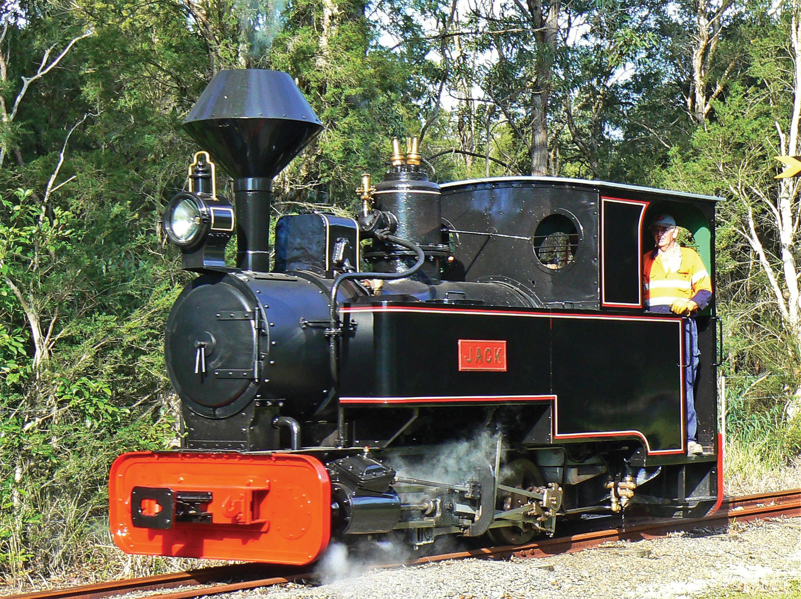

Jack in operation at Lake Macquarie, near Toronto. -Ian McNeil

**Alison**

Alison is a 0-4-0 saddle tank locomotive manufactured by Andrew Barclay & Company in Glasgow in 1923.

Unnamed, she served the Silicate Construction Company of London for a short period before being purchased by Goninan & Company, an engineering firm in Newcastle, NSW.

Later in 1923, the locomotive was sold to the Wickham & Bullock Island Coal Company and taken to their private railway from Bellbird Junction to Cessnock No.1 Colliery at Kalingo. The coal industry was badly affected by the bank depression of the early 1930s and the locomotive was sold to Lysaght Proprietary Limited as a yard shunter at their sheet metal rolling plant adjacent to the Newcastle steelworks of Broken Hill Proprietary Limited. During its time with Lysaght, the locomotive was given the name Alison.

During 1937-38, Lysaght established a second rolling mill near Cringilla, adjacent to the Australian Iron & Steel Company, together with a network of private sidings. The sidings were connected by a short section of line owned by the Department of Railways to the Exchange Sidings of the Australian Iron & Steel Company located near Cringilla Station.

Alison was sent to Cringilla to work the transfer traffic from Lysaght to the Exchange Sidings. Before arrival at Cringilla, the engine was overhauled at the Granville Workshops of Clyde Engineering. A new boiler was fitted during the overhaul.

With the introduction of diesel locomotives, Alison was laid aside and, in 1972, Lysaght presented the locomotive to the NSW Rail Museum as a static exhibit.

Alison was relocated to the Richmond Vale Railway Museum at Richmond Main Colliery on 9 November 2009 and placed on display within the colliery grounds.

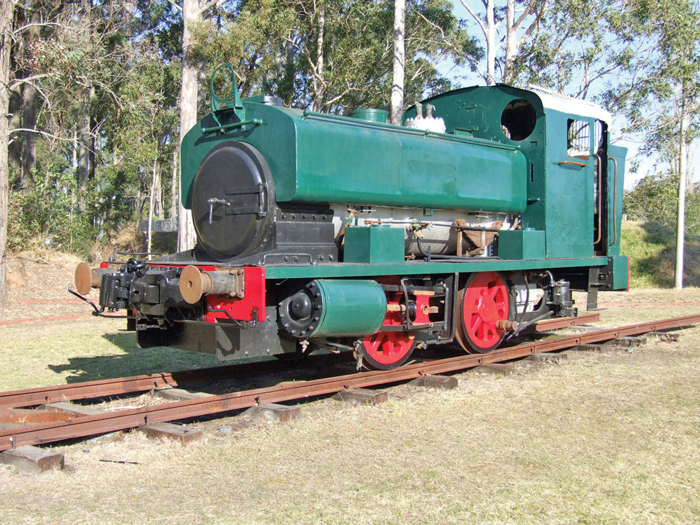

The cosmetic overhaul of Alison is nearing completion in this scene taken at Richmond Vale Railway in 2014. -Graham Black

**Kathleen**

Kathleen, an 0-4-0 tank locomotive, was imported new by Lysaght Proprietary Limited in 1921, having been built by Avonside Engine Company of Bristol in the UK. Kathleen was put to use at the Lysaght sidings in Newcastle where she also served the sidings of Ryland Brothers, a wire netting and nail manufacturer that was established in 1919.

The NSW Railways delivered wagons for Lysaght and Ryland Brothers to the Morandoo Exchange Sidings at Port Waratah. The wagons were taken by BHP locomotives and placed on the feeder line. Kathleen and Alison then picked up the wagons and delivered them to Lysaght and Ryland Brothers.

In December 1964, Kathleen was moved to the Cringilla works of Lysaght and used as a shunting locomotive until it was withdrawn. The engine was then moved to Enfield for preservation as a static exhibit in October 1972. In 1984, Kathleen was placed on long-term loan with the Richmond Vale Preservation Co-operative Society Ltd.

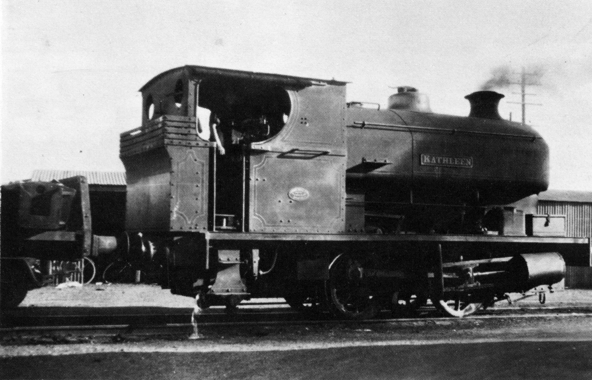

Kathleen waits for her next round of duties at Lysaght Newcastle plant in 1933. -A.N. Thompson, NSW Rail Museum Collection

**0-4-0 Industrial Tank Locomotive No.1**

The Metropolitan Water and Drainage Board imported two 0-4-0 engines to assist with the construction of the water storage reservoirs at Potts Hill, near Regents Park in western Sydney. They were numbered ‘1’ and ‘2’ by the water board.

Built in 1912 at the Vulcan Iron Works, Wilkes Barre, Pennsylvania, USA, these locomotives were a typical American workhorse that were an economic purchase.

No.1 was sold in 1921 to the Emu & Prospect Gravel Company for use on their private railway at Toongabbie.

In 1924, it was transferred to the company’s gravel pits at Emu Plains where it replaced the horse-drawn haulage over the light railway to the metal crushers.

During a flash flood on the Nepean River in 1942, No.1 was pushed onto its side by the force of the water. The cab was damaged and had to be rebuilt.

No.1 was set aside in January 1962 as a standby engine, then replaced at Emu Plains by the ex-Broken Hill Proprietary Company’s No.16. Railway operation ceased at Emu Plains in March 1967 and No.1 was purchased by the Steam Tram and Light Railway Preservation Society and taken to Parramatta Park.

Arrangements were made between the Steam Tram and Light Railway Preservation Society and NSW Rail Museum in October 1971 to swap No.1 for ex-NSW Railways 1022. Emu Gravel No.1 is now on loan to the Tenterfield Railway Museum. It has been restored as a static exhibit.

No.2 was scrapped in 1960.

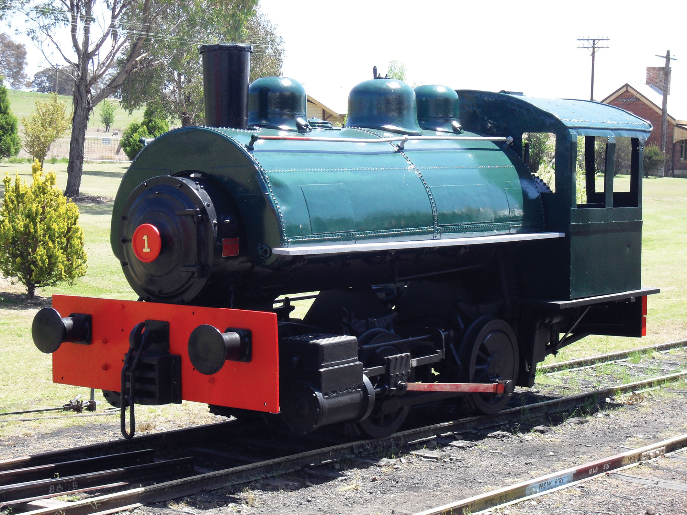

Vulcan Iron Works saddle-tank engine Emu Gravel No.1 now resides at Tenterfield. No.1 underwent restoration and repainting by volunteers at Tenterfield. The finished locomotive stands on display opposite the historic railway station. -THNSW Collection

**Bronzewing**

Bronzewing was an 0-6-0 locomotive built in Sydney by the Clyde Engineering Co. along with a sister engine named Brolga. Brolga was delivered in 1936 and Bronzewing in 1937. Additional locomotives were ordered over the next few years. Barradine and Burrawa were built by Clyde, while Bellbird, Badger and Bantam were built at the steelworks during the Second World War, bringing the fleet of locomotives up to seven.

When the steelworks were moved to Port Kembla in 1927, the fleet of tank engines in use was transferred. Unfortunately, these locomotives were undersized for the work at Port Kembla and a larger engine was ordered from the US builder Porter Locomotive Company. This was commissioned in 1930.

These locomotives were the backbone of the fleet until 1950 when diesels were introduced. The 0-6-0 locomotives continued to be used until 1971 and they were maintained as standby locomotives until 1974.

Bronzewing was donated to the NSW Rail Museum in 1975 and is a static exhibit at Thirlmere today.

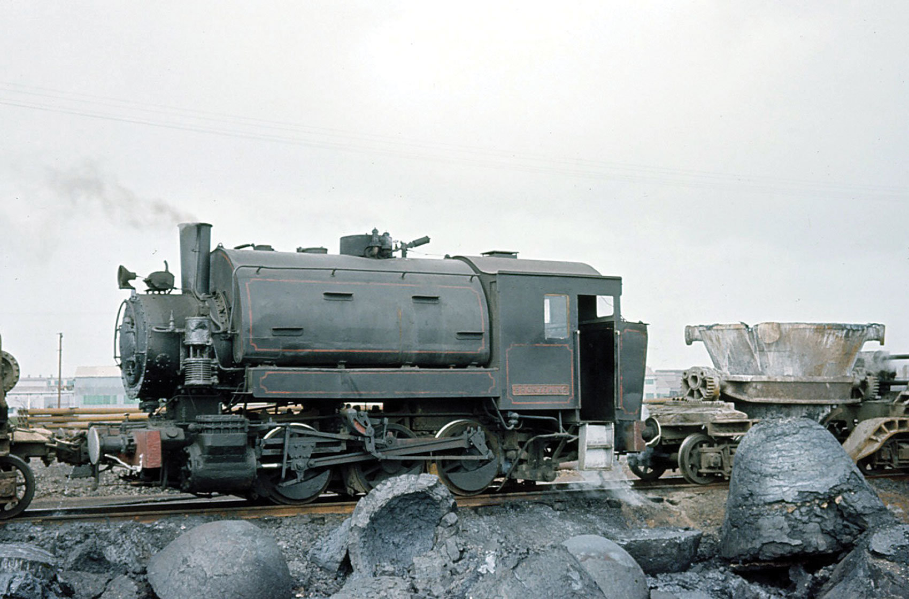

Bronzewing shunting ladles at Australian Iron & Steel Works, Port Kembla. -Graham Ahern

**J. & A. Brown’s No.4**

Although purchased by the NSW Railways in June 1872, Buck spent over 100 years in private employ. The 0-6-0 saddle tank was built by Kitson at the Airedale Foundry in Leeds for J. B. Watt. The locomotive came into the possession of John Alger & Son, the contractors for the construction of the Great Northern Railway extension from Parkville to Murrurundi.

In June 1872, the NSW Railways purchased the locomotive for use on Newcastle coal trains, where it worked coal trains for 19 years. The department assigned the number 20N to the locomotive. It finished its government service shunting at The Dyke. Buck was condemned in 1890, but J. & A. Brown rescued Buck by purchasing the engine on 27 May 1891 and added it to their roster as No.4, joining a similar Kitson locomotive No.3 hauling coal trains across the Hexham swamp. Nearing retirement, No.4 spent its later years at the Hexham Exchange Sidings and hauling coal wagons to and from the shipping staiths along the Hunter River.

No.4 was withdrawn on 19 May 1967 and set aside as being of historical interest. On 7 June 1973, Coal & Allied Industries called for tenders for the purchase and removal of surplus steam locomotives from the Hexham Exchange Sidings.

The NSW Rail Museum purchased Buck for preservation in August 1973, and repainting and restoration began in 2004. The locomotive was transferred to Broadmeadow during the Thirlmere site upgrade and is now on display at the Newcastle Museum in the former Honeysuckle Workshops.

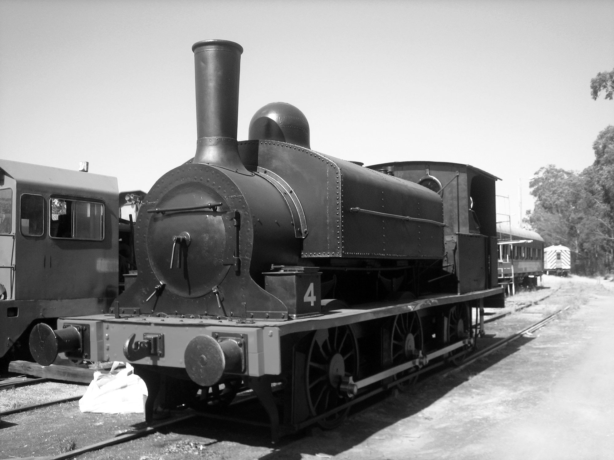

J. & A. Brown No.4 stands at Braxton following refurbishment and is ready for placement in the Newcastle Regional Museum at Civic. -Bruce Saunders

**J. & A. Brown’s 0-6-4 The Major**

The Major was built in England by Beyer, Peacock & Company in 1885 to operate the Mersey Railway at Liverpool. It was assigned the number ‘1’ and was one of eight engines providing services on the underground sections of the railway.

When the railway was electrified, No.1 was shipped to Australia, purchased by the Richmond Vale Railway and allocated the number 5 in their fleet. The Major served at Minmi before moving to Pelaw Main, where it carried out work hauling coal trains from Pelaw Main and Richmond Main collieries to the Hexham Exchange Sidings.

Between 1936 and 1939, No.5 was in use on the Abermain Railway and also saw service at the Stanford Main Colliery Sidings at Paxton.

In August 1973, No.5 was purchased from Coal & Allied Industries Limited by the NSW Rail Museum.

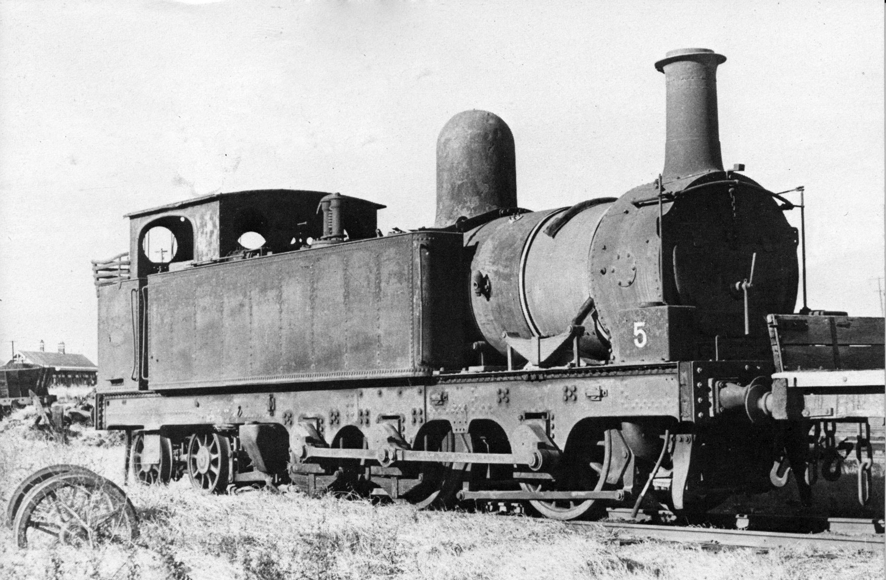

The Major awaits rescue at Hexham Exchange Sidings in 1973. -Bruce Dawbin, NSW Rail Museum Collection

**BHP No.16**

No.16 in the Broken Hill Proprietary fleet was built by H. K. Porter & Company of Pittsburgh, USA, in 1920 and used to shunt the yard at their Newcastle Steelworks. It was assisted by a sister engine, No.12.

With the dieselisation of the BHP fleet, No.16 was sold to the Emu & Prospect Gravel Company at Emu Plains. No.16 received a check up at Morrison & Bearby at Carrington in January 1962 and travelled under its own steam with a brake van from Broadmeadow to Emu Plains.

When sold to the NSW Rail Museum in August 1967, the Porter was in good steaming condition. It is was used as a shunting locomotive at Thirlmere until the mid-1990s. It is currently on loan and on display at the front of St Marys RSL Club in Sydney’s western suburbs.

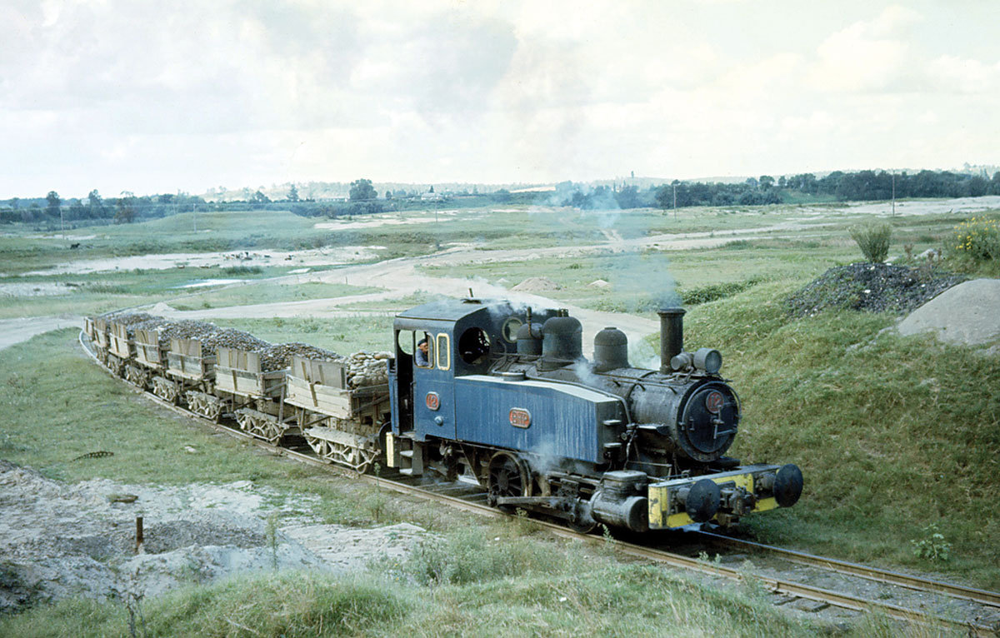

BHP 12, sister engine of No.16, hauls a train of gravel wagons along one of the lines at Emu Plains. -Graham Ahern

**Public Works Department No.79**

The NSW Public Works Department imported this 0-6-0 saddle tank locomotive to carry out shunting duties at Port Kembla. The order was placed with Robert Hudson of Gildersom Foundry, Leeds, in 1936, but the construction was undertaken by Hunslet Engine Company, Leeds, in 1938.

The engine landed at Darling Harbour and ran to Port Kembla under her own steam. At this time, it was painted black, set off with bright red coupling rods. No.79 had brass numbers attached to the lower side panels of the cab.

The little engine performed shunting duties around Port Kembla, shipping jetties and approach sidings, and also worked the various marshalling yards connected to the Government railways and the many private railways around Port Kembla.

In January 1949, the Public Works Department transferred its railway network to the NSW Railways and No.79 maintained its number under the Railways’ ownership. It continued to do the same work that it did under the Public Works Department.

In June 1963, No.79 was withdrawn from service at Port Kembla and moved to the locomotive roundhouse at Thirroul. The engine remained at Thirroul for more than a year before being towed to Enfield and set aside for preservation as a static exhibit. It was transferred to Thirlmere in 1975 and restored by the NSW Rail Museum’s Illawarra Division. It is still on display at the NSW Rail Museum at Thirlmere.

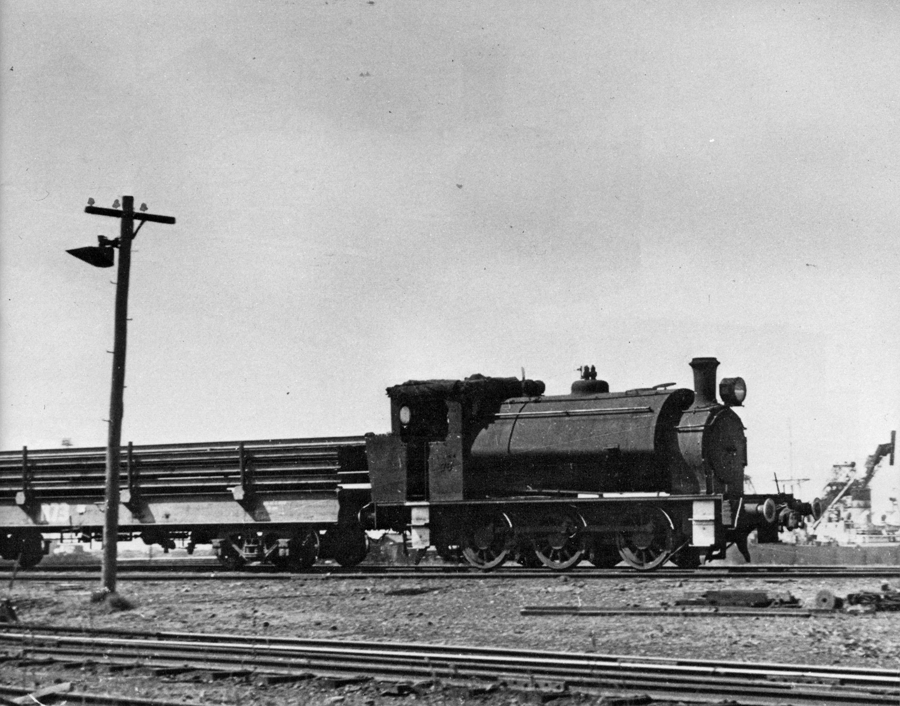

Public Works Department No.79 shunting the wharves at Port Kembla. -Peter Neve

**0-4-0 Tank Engine 1021**

A batch of five of these locomotives was imported by the NSW Public Works Department and assigned road numbers 59 to 63. They were constructed by Manning Wardle & Company of Leeds. They were to be used by the department on railway construction.

The engines were transferred to the Railway Department in 1917, where they were listed as 1212 to 1216 and classified as the F class (second series). Only one engine, 1212, was retained by the department. Three were disposed of to the Navigation Department and one was sold to Broken Hill Proprietary for their Newcastle steelworks, where it was given the number 11.

Locomotive 1212 was renumbered 1021 during August 1924. It was overhauled around 1929 at Cardiff Workshops and used as the workshop’s shunter.

In December 1949, it was used at the Enfield roundhouses for steam cleaning purposes. It was painted Royal blue at Cardiff in January 1952 and became the works’ shunter again. It had the name Cardiff painted above the road number on each side of the saddle tank.

By 1956, the engine was back at Enfield as a shed shunter, but by the end of that year it was carrying out similar duties at Broadmeadow. It was at Cardiff again in 1970 and sent to Enfield around January 1970.

Engine 1021 is currently used in a display at The NSW Rail Museum at Thirlmere, telling the story of a railway family.

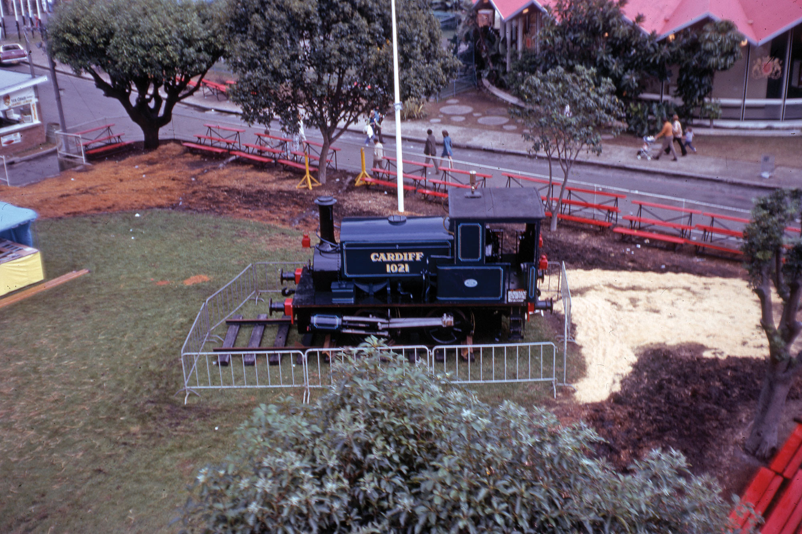

Locomotive 1021 on display at the 1974 Sydney Royal Easter Show. -John Youngman

**Steam Crane 1034**

Steam crane locomotive 1034 is one of a group of three purchased by the Railway Department from Dübs & Company of Glasgow, Scotland. The first was purchased in 1879, with two more in 1886. A fourth, larger version, was purchased from North British Locomotive Company, a firm which had taken over Dübs & Company.

Engine 1034 was the second of the group and was listed as No.38 on the machinery list when first put to work, being included amongst other workshop equipment. In February 1908, the number was changed to LO 4, and then the steam crane was assigned the number 1034 in August 1924.

When the engine went into service, it had shelter for the driver who had to undertake his duties irrespective of the weather conditions.

The engine spent much of its time at Eveleigh Workshops draped in ropes and lifting slings. When it did venture onto the suburban lines, it picked up iron mullock kibbles loaded with rubbish. The train consisted of a P class 4-6-0 tender engine, brake van, S truck to hold the rubbish, the crane engine, another S truck and the rear brake van. Three labourers rode in the S truck to manhandle the kibbles, while an engineman manipulated the swivelling mechanism on the crane locomotive. A guard rode in the rear van to supervise operations.

In later years, an open-sided canopy roof was erected over the footplate. Around 1964, a front plate, with two large circular windows, was fitted above the back plate of the firebox to give the engineman some protection.

No.1034 was withdrawn in 1969 due to leaking boiler tubes and other problems. At the time of withdrawal, it was painted green and set aside for preservation. It is currently on display at the NSW Rail Museum with a kibble bucket suspended from the crane jib.

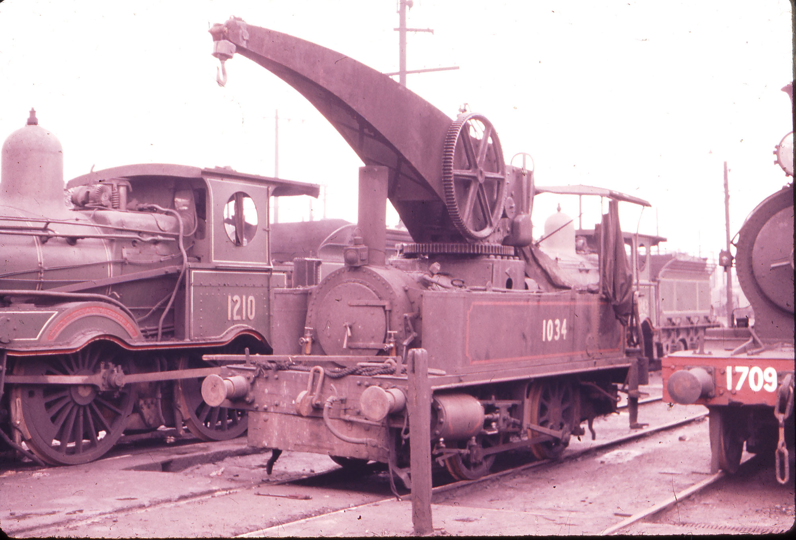

Steam crane locomotive 1034 is now part of the NSW Rail Museum display. -John Youngman

**NSWR 2-6-2 saddle-tank engine 2606**

Twenty I class (later 17 class) 2-6-2 saddle-tank locomotives were imported from the Glasgow firm of Dübs & Company in 1891. They received various numbers vacant from the withdrawal of earlier locomotives. In August 1924, they were grouped as the 26 class and numbered 2601 to 2620.

The original intention was to base the locomotive at Penrith to operate banking services, to Katoomba in particular. Limited water tank capacity and problems negotiating the numerous eight chain curves on the line hindered their work. Gradually, they were moved to yard shunting duties and banking assistance at Lithgow, Bathurst, Hornsby, Waterfall and Murrurundi amongst other depots. They were also used on coal trains to and from Newcastle.

The Illawarra line saw 16 locomotives working from Eveleigh Running Shed. Their duties included staging loads from Bombo to Waterfall and weekend passenger trains to and from The Royal National Park, while others banked South Coast passenger trains from Stanwell Park to Waterfall.

In later years they were used at Sydney Terminal Station to shunt carriages.

Locomotive 2606 was transferred from Enfield to Thirlmere in 1975. It was displayed in unrestored condition, with faded black livery and old road grime, until 1988 when it was given a quick clean and repaint to unlined black livery. It is currently in storage at Broadmeadow Locomotive Depot.

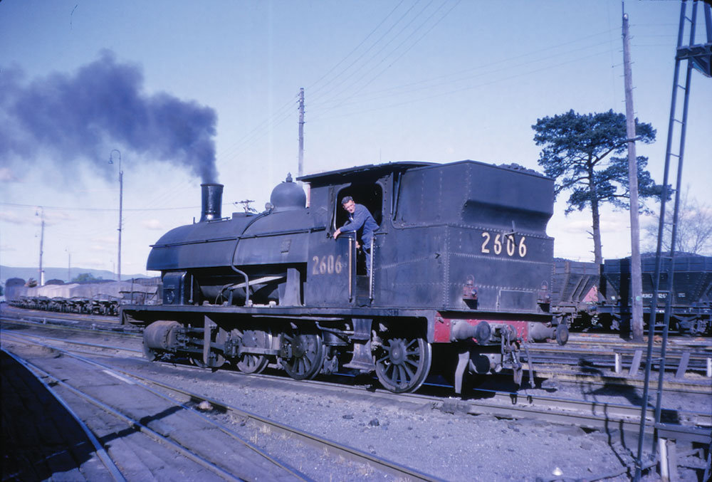

Saddle-tank locomotive 2606 carries out shunting duties at Bathurst during 1964. -John Youngman

**References**

Locomotive Guide, NSW Rail Transport Museum, 1976.

Iron Work Horses, Bruce Macdonald, Eveleigh Press, 2013.

An Eye for and I, Stephen Halgren, Byways of Steam, Eveleigh Press, 2017.

*This article was originally published in the summer 2019 edition of Roundhouse magazine. Written by John Casey, Roundhouse Editor.*
