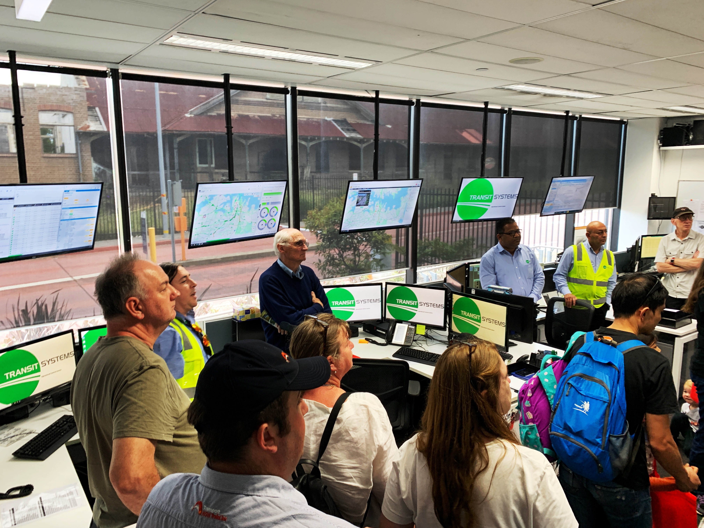

**Leichhardt Bus Depot celebrated 60 years of operation during a special open day at the Sydney Bus Museum on Sunday 18 November 2018.**

More than 500 people visited throughout the day to enjoy a range of heritage and modern transport. They had an opportunity to learn about the depot’s history, tour new state-of-the-art facilities and view an extensive collection of historic buses.

Ticket holders also had the option to take a vintage bus ride from the CBD to Leichhardt and return.

This celebration was proudly supported by Transit Systems, Transport Heritage NSW and Transit Graphics. Transport Heritage NSW aims to include more sector events in its promotional program where there is potential for high community engagement. If you’re an associate member of THNSW and planning a milestone event related to heritage transport, feel free to email [**communications@thnsw.com.au**](mailto:communications@thnsw.com.au).

Congratulations to Leichhardt Bus Depot for reaching this milestone and thank you to everyone involved in the celebration.

Visitors touring state-of-the-art facilities.

*This article was originally published in the summer 2019 sector report. Written by David Bennett, Marketing & Commercial Services Manager.*
