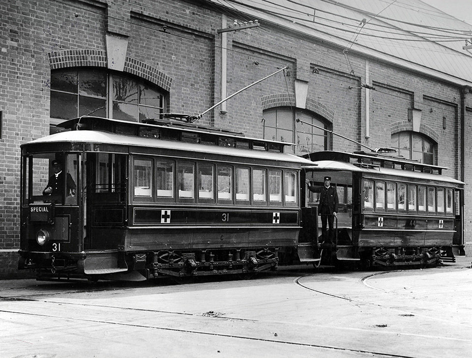

**The outbreak of the First World War had a dramatic impact on Australia, with large numbers of men rushing to enlist to serve their country. At the time, the NSW Railways and Tramways Department was the largest enterprise in the state, employing over 45,000 people.**

Over the course of the war, 8,447 men from the department enlisted, some of whom are pictured in this NSW Railway Unit image taken in April 1917.

By the end of the war, 1,214 men had died in service.

This ANZAC Day, we remember all who have served and died for our country.

Discover more at the NSW Railways Remember website which honours the contribution of the NSW Railways both at home and abroad during the First World War. [www.nswrailwaysremember.com.au](http://www.nswrailwaysremember.com.au/?fbclid=IwAR2ZrgWml2C7sUgm1EKD_kBuZJxIcNxQqvu1C4TKdxWz2Snzwlj_Va7NP88)

***Two C-class trams:*** *During the First World War, the Randwick Tramway Workshops converted two C-class trams to convey wounded returning soldiers from Woolloomooloo Wharf to Randwick Military Hospital (now Royal Prince Alfred Hospital). Image: NSW State Archives.*
