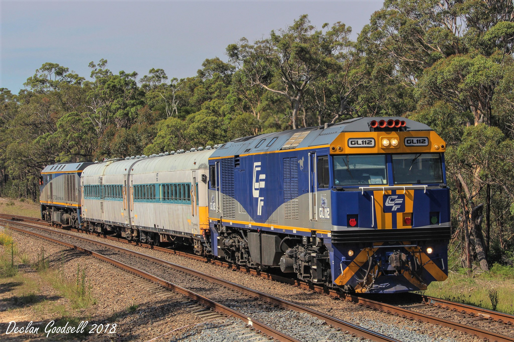

**The Lithgow State Mine Railway (LSMR) has acquired diesel railmotor set 623/723 from Transport Heritage NSW under a loan agreement, and applied for funding for state-owned assets to assist with reconstruction and remedial work to put into traffic.**

LSMR volunteers in conjunction with the Lithgow Railway Workshop had previously restored 661/726, which is now under a long-term lease arrangement with the Byron Bay Rail Road and operating a tourist service on 3km of track between Byron Bay and the Elements Resort. This railmotor set has been making headlines worldwide because of the solar power conversion the cars received, which was undertaken by the Lithgow Railway Workshop.

The Goulburn Railway Workshop was very keen to get involved with this restoration project. Once restored and operational, the set will relocate under its own power to its future home in Lithgow. 623/723 will operate on the State Mine Branch when regular services commence and will also be used on tours to regional destinations, such as Tarana, Kandos, Bathurst and the soon-to-be-reopened line to Rylstone.

We are working with the Kandos Museum to promote and operate a regular tourist service to Kandos and Rylstone. The state government, through the efforts of the member for Bathurst Mr. Paul Toole, made available $1.1 million to reopen the line between Kandos and Rylstone as an initiative to stimulate tourism in the region.

Rail car set 623/723 being transported from Thirlmere to Goulburn. -Declan Goodsell

The railmotor will connect with a Sydney Trains service from Sydney in the morning and a return service in the afternoon. While the cars are in Rylstone, a series of shuttle runs will operate between Kandos and Rylstone to give the locals an opportunity to ride the rails. LSMR has previously conducted a successful tour program from Lithgow to these western destinations with 661/723 prior to its relocation to Byron Bay and it was met with great support by locals and Sydneysiders alike.

LSMR was very pleased at the level of support THNSW had offered LSMR in its endeavours to secure this set of cars from the state collection and facilitate funding that has been made available for the restoration. Other entities to thank at this point include CFCLA, who supplied the locomotives for the car movement from Thirlmere to Goulburn, and of course the Goulburn Railway Workshop, for taking on the restoration. Also, Sydney Rail Services, under whose accreditation the move was undertaken, organised the necessary approvals for the movement.

*This article was originally published in the autumn 2018 sector report.*
