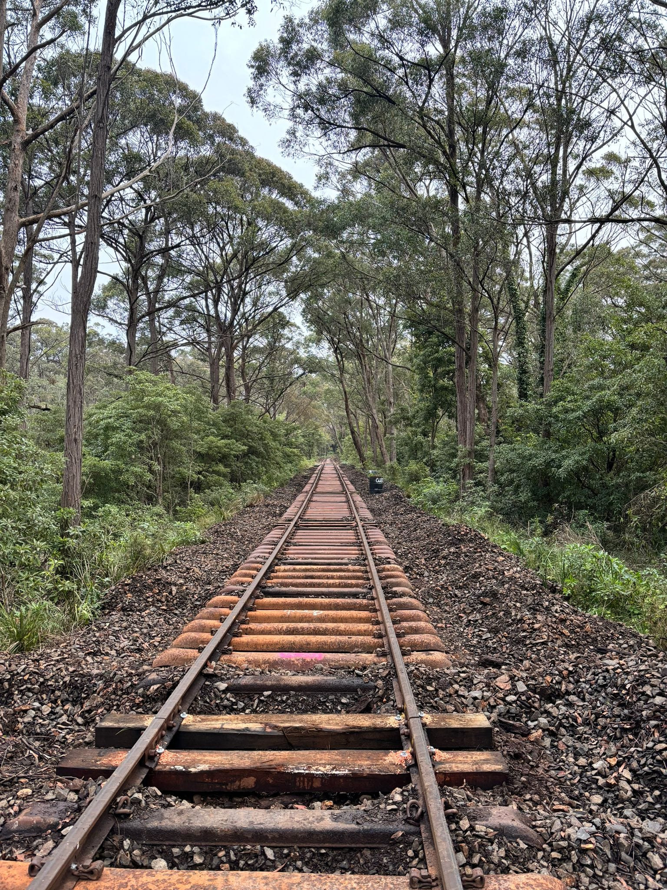

**Level crossing upgrades start Monday 19 August**

**Transport Heritage NSW will begin works next week to upgrade the railway track through five level crossings between Buxton and Colo Vale.**

**The upgrades are largely confined to the rail track infrastructure at each crossing to enable the safe passage of track maintenance vehicles and ready the track for future train operations. Works include removal and renewal of the railway track, road crossing surface and drainage through the level crossing.**

Works will take place over a two-week period between Monday 19 August and Friday 30 August inclusive. During the works, some temporary level crossing closures and traffic detours will apply.

To ensure the safety of the community and to minimise disruption, only one level crossing will be closed at a time, with traffic detours put in place. Temporary road plates will be installed to minimise closure time.

The full schedule of closures is as follows. *Please note, times listed are subject to change due to weather conditions or other unforeseen circumstances.*

**Fitzroy Street, Hill Top**

Monday 19 August, 7am - 7pm

Tuesday 27 August, 7am - 9am

Wednesday 28 August, 7am - 1pm

**Coates Road, Hill Top**

Tuesday 20 August, 7am - 7pm

Tuesday 27 August, 9am - 11am

Wednesday 28 August, 1pm - 7pm

**Railway Parade, Balmoral**

Wednesday 21 August, 7am - 7pm

Tuesday 27 August, 11am - 1pm

Thursday 29 August, 7am - 1pm

**Balmoral Village**

Thursday 22 August, 7am - 7pm

Tuesday 27 August, 1pm - 3pm

Thursday 29 August, 1pm - 7pm

**East Parade, Buxton**

Friday 23 August, 7am - 7pm

Tuesday 27 August, 3pm - 5pm

Friday 30 August, 7am - 1pm

Further upgrade works to the road pavement, line-marking and signage at these Level Crossings are planned to occur during a later stage of the Loop Line Upgrade Project.

**Initial resleepering works completed**

The first package of resleepering works are now complete between Buxton and Colo Vale.

More than 15,000 sleepers have now been installed along this 18.3km section of track.

Additional trackwork at Colo Vale Station has now commenced with works focussed on:

* Installation of a new turnout at the Colo Vale end of the rail yard.
* Repair of the existing turnout at the northern end of the rail yard.
* Replacing life-expired timber sleepers with steel sleepers.
* Installing track ballast on both the main line and crossing loop.
* Upgrading mechanical signaling equipment.

Once complete, this will enable locomotives to safely and efficiently run-around at Colo Vale, so they can make the return journey to Thirlmere.
