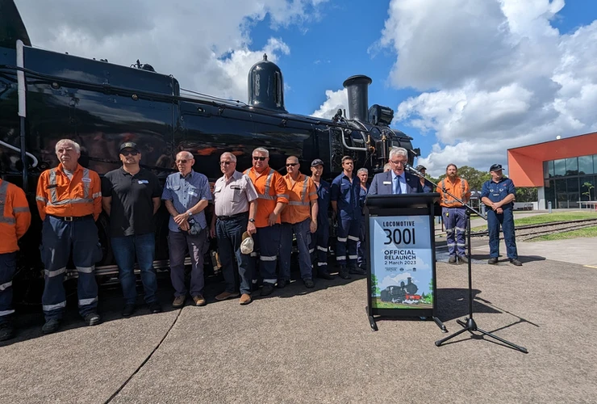
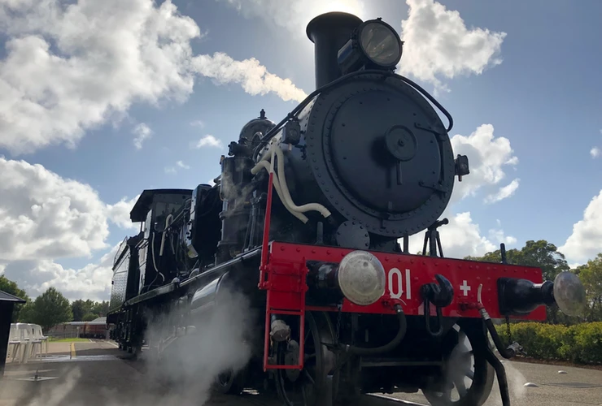

**Locomotive 3001 was returned to service during a special relaunch ceremony with THNSW members and invited guests at the NSW Rail Museum on Thursday 2 March 2023.**

The 120-year-old locomotive was officially relaunched by Member for Wollondilly, Nathaniel Smith MP, before the locomotive hauled its inaugural passenger service from Thirlmere to Buxton and return.

The return of 3001 will provide much needed additional fleet capacity for growing heritage train experiences at the NSW Rail Museum, particulary with the completion of the Loop Line Upgrade Project to Colo Vale in 2024.

You can read and watch further coverage of the occassion at the [ABC News website](https://www.abc.net.au/news/2023-03-02/locomotive-3001-returns-to-nsw-rail-museum-loop-line-restoration/102043256).

