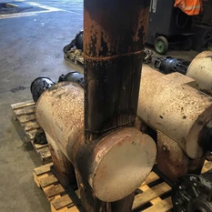
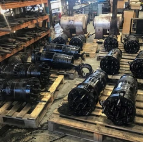
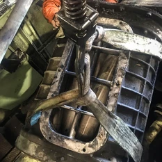

**During mid-2018, locomotive 4201’s engine was being inspected when issues were found with internal water leaks and small cracks in three of the 16 cylinder liners. Additionally, one of the water pumps showed signs of leakage.**

It was a long-held view during the bogie overhaul that the engine would need some love in the future, so the search began for 567C engine parts. Progress Rail (formally Clyde Engineering) were contacted and their immediate response was that they no longer carried spares for 567 engines. They offered to have 4201 sent to Cardiff Workshops and upgraded to a 645E series engine, the same as what is fitted to NSW 422 class locomotives. The cost of this work was nearly $300,000. Another option was for Progress Rail to simply supply the engine to THNSW for just under $200,000. Whilst not ideal from a heritage perspective, this upgrade would have at least meant spares were easier to source for future maintenance needs.

Morrison-Knudson Corporation came back with an option to exchange our 567C for a fully rebuilt 567C from their Mt Vernon Shops, while Drive Train Australia said they had parts in stock and had a US supplier who still made 567C engine parts.

**Project Scope**

4201 had last been through workshops at Chullora in 1980 for what would become its 125th anniversary rebuild and repaint. The engine was overhauled at that point, including a complete rewire and body and cab repairs/modifications.

The scope includes replacing all 16 cylinder liners, pistons, piston rings, cylinder heads, liner bore inserts, conrod thrust washers, conrod bearings and oil pee pipes. In addition to replacing those items, both oil and water pumps have been removed and sent for overhaul, as has the auxiliary generator.

A spare Gardner Denver WXE air-cooled compressor exists in our spares and is overhauled, so it will also be installed and the current compressor removed for overhaul.

A total clean down of the block has been undertaken, which has removed large sums of dirt that built up, mostly in the air boxes that provide ‘blown’ air from the roots blower into the cylinder liners. Both roots blowers will be replaced with two overhauled units held in stock.

The exhaust manifolds have been removed from the engine to facilitate installation of new gaskets to the exhausts and water return Y pipe, as well as enable cleaning around the valley of the engine.

Another reason to remove the exhausts is to rebuild the internal baffles that were cut out many years ago. No firm information is available as to why they were cut out, but experts in the field have said for a number of years it has made the exhaust sound chuffy. A set of mainfolds are in stock, having been removed off a spare engine, and will be used to replace the damaged units.

The engine work being done to 4201 will see it run for many years to come, as it basically restores residual life back into the locomotive.

As a side note, all members of THNSW’s diesel fleet are reaching a point where the residual life from previous NSWGR overhauls have run out. This has been the key reason for THNSW hiring locomotives from Craig Prior (42103) and CFCLA for numerous operations.

*This article was originally published in the winter 2019 edition of Roundhouse magazine. Written by Jeff Snedden, Diesel Locomotive & Carriage Maintainer.*
